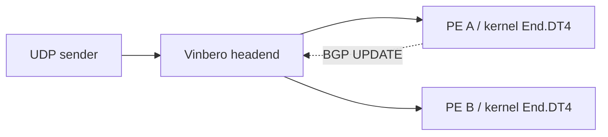

# BGP 更新の反映時間を測定する

同じ Vinbero binary と topology で、BGP の変更から転送先の切り替わりまでを比較します。
標準 Go で build した cplane plugin を測定対象にできます。

| MODE | BGP 受信後の処理 | headend の設定 |
|---|---|---|
| `builtin` | daemon 内の built-in applier が処理します | 単一 member の ECMP group を作成します |
| `cplane` | daemon 内の wazero が Go WASM example を実行します | plugin が直接 headend を宣言します |
| `relay` | 別 process の GoBGP speaker が RPC で反映します | RPC が直接 headend を設定します |

`inproc` は `builtin` の別名として使えます。cplane と builtin の差には queue、codec、
plugin の経路処理、host の検証、map の書き込みが含まれます。ECMP group の有無も異なるため、
差を WASM 単体の実行コストとして解釈することはできません。

## 構成を揃える



すべての mode で `10.0.2.0/24` の経路を一つ流し、SID を `fd00:a::100` から
`fd00:b::100` へ変更します。両 PE の customer address は `10.0.2.2` で共通です。
受信側は kernel End.DT4 を使い、eBPF plugin は登録しません。headend の XDP mode は
generic、統計と liveness prober は無効です。

cplane は [Go example](../sdk/examples/cplane-custom-behavior/README.md) を受信専用で登録し、
`headend` capability と `10.0.2.0/24` の scope だけを付与します。
claim できる private behavior `0xFE01` を広告し、builtin / relay は標準 End.DT4 の
`0x0013` を広告します。builtin の codepoint を plugin が claim する制約は変更しません。
この private codepoint の転送動作を End.DT4 と同じにするのは、この測定 topology 内の設定です。

plugin の登録・WASM の初期化・最初の BGP 収束は計測に含めません。初期 headend と
plugin の所有件数を確認し、receiver の socket を準備してから変更時刻を指定します。
計測中は state の polling を行いません。終了後に新しい SID、group の member、plugin の
health と再起動の有無を確認します。初期転送が実際に PE A に届いたことも capture で検証します。

## 実行する

Linux、Go 1.25.5、sudo、iproute2、ethtool、Python 3、util-linux と、kernel の VRF / SRv6 / XDP
サポートが必要です。BPF object と標準 Go WASM example は repository の成果物を使います。

```sh
make bench-rq1-build
make bench-rq1-test

make bench-rq1-bgp MODE=builtin TRIALS=30
make bench-rq1-bgp MODE=cplane TRIALS=30
make bench-rq1-bgp MODE=relay TRIALS=30
```

`bench-rq1-test` は時刻の対応付けと実際の送受信を検証します。共有 CI runner の処理速度を
合否条件にしません。計測 host の時間分解能も校正する場合は
`BENCH_CALIBRATE=1 make bench-rq1-test` を実行してください。

保存先と rate を指定する場合は script を直接実行します。`WORK` は実行ごとに新しい
directory を指定してください。既存の run や CSV は上書きしません。

```sh
sudo MODE=cplane RATE=100000 WORK=/tmp/rq1-cplane-run1 \
    ./bench/rq1/topo/run_bgp.sh 30
```

`VINBEROD`、`VBCTL` と `WASM` は絶対 path で差し替えられます。`WASM` を差し替える場合は
同じ scope、behavior と受信専用の契約に従う module を使ってください。比較する2条件には
同じ daemon binary を指定してください。計測前に `make cplane-example` で標準 Go artifact を
再生成できます。

各 run は固有の network namespace 名と resource state path を使います。
既存 namespace と衝突した場合は停止し、その namespace を削除しません。
終了・エラー・SIGINT・SIGTERM では自分が起動した process と topology を撤去します。
map pin と cplane store は無効なので、SID 永続化の fsync や復旧時間は測りません。
`cplane_plugins.enabled: false` は保存を無効にする設定で、WASM の実行自体は可能です。

## 結果を読む

保存先は最後に表示されます。

- `results.csv` に mode、trial と測定値を保存します。
- `run.json` に kernel、CPU affinity、binary / WASM の SHA-256、codepoint と条件を保存します。
- `status.json` に exit code と完了した trial 数を保存します。全 trial の成功を確認してから比較してください。
- `trial-N/` に packet の送受信 CSV、初期・最終 state、実際の変更 timestamp、設定とログを保存します。

`latency_us` の起点は送信側 GoBGP の Advertise 呼び出し直前です。BGP encoding と送信、
受信処理、map 反映、最初の新経路の probe 到着までを含みます。受信側 BGP UPDATE の
到着時刻から測った値ではありません。時刻は同じ host 上の namespace で共有します。

`lost` は変更後に送った probe のうち、どちらの receiver にも届かなかった件数です。
`misdelivered` は新経路を最初に観測するまでに、旧 PE へ届いた変更後の probe 数です。
`sample_gap_us` は到着間隔の median で、測定の分解能を判断する材料です。
設定した `RATE` を実際の観測間隔と同一視しないでください。

接続、登録、初期転送、更新反映、capture の検証が失敗した trial は正常な行として出力せず、
run 全体を非ゼロで終了します。それ以前の成功行と失敗した trial のログは保持します。
失敗を除外して高速な trial だけを集計しないでください。

これは単一路の更新反映時間を測る装置です。CPU / RSS の連続採取、大量経路の処理容量、
WASM 単体の時間、再起動時の復旧時間、実 NIC の最大 pps は別の測定が必要です。
実 NIC の転送性能は [TRex benchmark](../benchmark/README.md) を使います。
