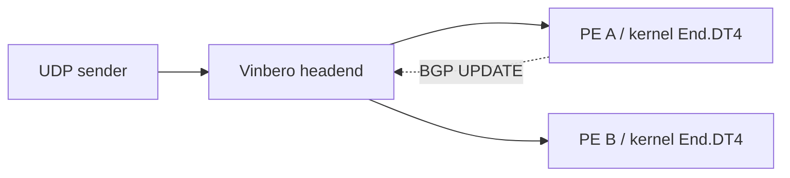

# BGP 更新の反映時間を測定する

同じ Vinbero binary と topology で、BGP の変更から転送先の切り替わりまでを比較します。
標準 Go で build した cplane plugin を測定対象にできます。

| MODE | BGP 受信後の処理 | headend の設定 |
|---|---|---|
| `builtin` | daemon 内の built-in applier が処理します | 単一 member の ECMP group を作成します |
| `builtin-idle` | 同じ Go WASM を登録し、builtin が経路を処理します | builtin と同じ ECMP group を作成します |
| `cplane` | daemon 内の wazero が Go WASM example を実行します | plugin が直接 headend を宣言します |
| `relay` | 別 process の GoBGP speaker が RPC で反映します | RPC が直接 headend を設定します |

`inproc` は `builtin` の別名として使えます。cplane と builtin の差には queue、codec、
plugin の経路処理、host の検証、map の書き込みが含まれます。ECMP group の有無も異なるため、
差を WASM 単体の実行コストとして解釈することはできません。
relay は順序を保つ単一 worker から RPC を実行します。queue の上限は256件で、overflow、
RPC の timeout、response 内の書き込み失敗はいずれも測定失敗にします。

## 構成を揃える



すべての mode で `10.0.2.0/24` の経路を一つ流し、SID を `fd00:a::100` から
`fd00:b::100` へ変更します。両 PE の customer address は `10.0.2.2` で共通です。
受信側は kernel End.DT4 を使い、eBPF plugin は登録しません。headend の XDP mode は
generic、統計と liveness prober は無効です。

cplane は [Go example](../sdk/examples/cplane-custom-behavior/README.md) を受信専用で登録し、
`headend` capability と `10.0.2.0/24` の scope だけを付与します。
claim できる private behavior `0xFE01` を広告し、builtin / relay は標準 End.DT4 の
`0x0013` を広告します。builtin の codepoint を plugin が claim する制約は変更しません。
この private codepoint の転送動作を End.DT4 と同じにするのは、この測定 topology 内の設定です。

builtin-idle は cplane と同一の WASM を読み込み、`vpnv6` だけを購読し、scope を
`10.0.254.0/24` に限定します。`0xFE01` を claim しますが、流す経路は builtin と同じ
vpnv4 / `0x0013` です。初期 replay が完了し、plugin の所有 headend が0件であることを
確認します。tick は cplane と同じ1秒周期で動きます。builtin-idle と builtin の比較では、
WASM の登録と定期処理がある状態で builtin の反映時間がどう変わるかを調べます。

plugin の登録・WASM の初期化・最初の BGP 収束は計測に含めません。初期 headend と
plugin の所有件数を確認し、receiver の socket を準備してから変更時刻を指定します。
計測中は state の polling を行いません。終了後に新しい SID、group の member、plugin の
health と再起動の有無を確認します。初期転送が実際に PE A に届いたことも capture で検証します。

## 実行する

Linux、Go 1.25.5、sudo、iproute2、ethtool、Python 3、util-linux、GNU coreutils、Git と、kernel の
VRF / SRv6 / XDP サポートが必要です。`ping6` も必要で、Debian / Ubuntu では `iputils-ping` が
提供します。Git checkout で実行してください。BPF object と標準 Go WASM example は repository
の成果物を使います。

```sh
make bench-rq1-build
make bench-rq1-test

make bench-rq1-bgp MODE=builtin TRIALS=30
make bench-rq1-bgp MODE=builtin-idle TRIALS=30
make bench-rq1-bgp MODE=cplane TRIALS=30
make bench-rq1-bgp MODE=relay TRIALS=30
```

`bench-rq1-test` は時刻の対応付けと実際の送受信を検証します。共有 CI runner の処理速度を
合否条件にしません。計測 host の時間分解能も校正する場合は
`BENCH_CALIBRATE=1 make bench-rq1-test` を実行してください。

## 3条件を交互に測定する

性能比較には suite を使います。既定では各条件3回の warm-up の後、30 block を実行します。
各 block は builtin、builtin-idle、cplane を1回ずつ含みます。6通りの順番を5回ずつ使い、
seed で並べ替えます。合計99試行です。`--blocks` は6の倍数で変更できます。

```sh
python3 bench/rq1/affinity.py suggest --daemon-cores 4 > /tmp/rq1-affinity.json
python3 bench/rq1/affinity.py validate /tmp/rq1-affinity.json
python3 bench/rq1/suite.py --affinity /tmp/rq1-affinity.json --plan
make bench-rq1-suite AFFINITY=/tmp/rq1-affinity.json \
    SUITE_ARGS='--work /tmp/rq1-session1 --seed 20260915'
```

CPU の候補は、daemon に4 core、sender、各 receiver、BGP sender に1 core ずつ割り当てます。
同じ NUMA node 上の別々の物理 core を要求し、SMT sibling の重複も拒否します。
JSON の `cpus` と `gomaxprocs` は host に合わせて調整してください。
候補の生成は CPU を予約しません。他の仕事や IRQ との競合は host 側で確認し、測定中の
build や graph 作成を避けてください。既存 process を終了する処理はありません。
各 process に適用した affinity、PID と `GOMAXPROCS` を試行ごとに記録します。

suite は最初に loopback で同じ probe を1秒間送受信して校正します。sender と receiver A
の CPU の集合に校正 process を固定します。既定の100k pps では到着間隔の median が15 µs
以下、p99 が50 µs 以下、実送信 rate が95k〜105k pps、損失・重複・未知 sequence・
負の受信遅延が0件であることを要求します。校正値は host の観測能力の確認であり、測定値から
差し引きません。校正失敗後に速い試行だけを選んだり、自動で rate を変更したりしません。

動作確認には次の command を使います。2 block、計6試行、10k pps、共有 CPU で実行し、
校正の速度基準は強制しません。各条件の転送・plugin health・capture の検証は行います。

```sh
make bench-rq1-smoke SUITE_ARGS='--work /tmp/rq1-smoke1'
```

suite の保存先も新しい root 所有の private directory に限定します。開始時の script、
binary、WASM を保存し、その snapshot だけで最後まで実行します。commit、dirty 状態、
tracked diff、使用ファイルの SHA-256、kernel、CPU topology、governor、実行順と時刻を
`suite.json` と関連ファイルに残します。dirty な checkout の commit だけでは実行内容を
復元できないので、snapshot と `source.diff` も保管してください。
各試行も binary と raw CSV を保持するため、99試行では十数 GiB の空き容量が必要です。
実際の binary size と rate から開始前に容量を見積もります。

失敗や SIGINT / SIGTERM が起きたら次の試行を始めず、子の後始末を待ちます。
子が回収できなかった namespace は、その子が作成した記録だけを使って再度回収します。
失敗・未着手の試行も予定どおりの行として `trials.csv` に残ります。自動再試行や再開はせず、
原因を解決した後は別の session directory で開始してください。

## suite の結果を集計する

suite は通信と後始末が終わった後に `trials.csv`、`summary.json`、`report.md` を作ります。
raw capture と `results.csv`、使用 binary、CPU 割り当て、初期・最終 state を照合します。
builtin と builtin-idle の転送設定は割り当て ID と owner を除いて一致を要求します。
元の成果物が欠けたり不整合があったりする試行も、理由付きの失敗行として残します。

図には Python の matplotlib が必要です。private directory を扱う例では、確認するための
copy を一般ユーザーに移してから集計します。copy 先は空の directory を使ってください。

```sh
mkdir -m 700 /tmp/rq1-report1
sudo cp -a /tmp/rq1-session1/. /tmp/rq1-report1/
sudo chown -R "$(id -u):$(id -g)" /tmp/rq1-report1
make bench-rq1-report WORK=/tmp/rq1-report1
```

`latency.png` と `latency.svg` は各試行の分布と実行順を表示します。warm-up は CSV に
残し、性能比較から除外します。各条件の中央値の95%区間と、同じ block 内の builtin との差の
中央値の95%区間は、block 単位の bootstrap 2000回で計算します。seed は実行順と同じ値です。
30試行から latency の p99 を主張しません。異なる日に繰り返す場合も session を別々に集計し、
日を跨いだ変動を確認します。

すべての試行が完了した性能測定で、校正と各試行の観測品質が基準を満たした場合だけ区間を
出します。smoke、失敗、送信 rate や到着間隔に問題がある session には記述統計だけを出します。
損失そのものは測定対象として保持します。`performance_usable` は転送損失が無い保証ではありません。
個々の試行では到着間隔の median / p99 / 最大値、新経路を観測する直前の間隔、実送信 pps、
送信予定からの遅れ、未送信の予定 slot 数も確認します。`old_after_first_new` は、新経路への
最初の到着以降にも旧経路へ届いた、変更後に送信した sequence の件数です。

## 単一条件の保存先を指定する

保存先と rate を指定する場合は script を直接実行します。`WORK` は実行ごとに新しい
directory を指定してください。既存の directory や symlink は拒否し、所有者だけがアクセス
できる権限で新規作成します。CSV も排他的に作成し、開いた descriptor にだけ書き込みます。
`WORK` の親は symlink を含まない root 所有の directory に限定します。一般ユーザーが
書き込める親は `/tmp` のような sticky directory だけを許可します。`OUT` を指定する場合も
新しい `WORK` の配下に限定します。
`run.json`、`status.json`、`affinity.json`、`topology-owned`、`instrument/`、`bin/`、`trial-*` は内部処理が
使うため、`OUT` に指定できません。

```sh
sudo MODE=cplane RATE=100000 WORK=/tmp/rq1-cplane-run1 \
    ./bench/rq1/topo/run_bgp.sh 30
```

`VINBEROD`、`VBCTL` と `WASM` は絶対 path で差し替えられます。`WASM` を差し替える場合は
同じ scope、behavior と受信専用の契約に従う module を使ってください。比較する2条件には
同じ daemon binary を指定してください。計測前に `make cplane-example` で標準 Go artifact を
再生成できます。

各 run は固有の network namespace 名と resource state path を使います。
namespace の排他 lock は root だけがアクセスできる `/run/vinbero-rq1/` に作成します。
既存 namespace と衝突した場合は停止し、その namespace を削除しません。
終了・エラー・SIGINT・SIGTERM では自分が起動した process と topology を撤去します。
setup が途中で失敗した場合も、記録した作成済み namespace だけを対象に再度回収を試みます。
map pin と cplane store は無効なので、SID 永続化の fsync や復旧時間は測りません。
`cplane_plugins.enabled: false` は保存を無効にする設定で、WASM の実行自体は可能です。

## 結果を読む

保存先は最後に表示されます。
成果物は root 所有で作成するため、`sudo cat /tmp/rq1-cplane-run1/results.csv` のように参照します。

- `results.csv` に mode、trial と測定値を保存します。
- `run.json` に kernel、CPU affinity、binary / WASM の SHA-256、codepoint と条件を保存します。
- `status.json` に exit code と完了した trial 数を保存します。全 trial の成功を確認してから比較してください。
- `trial-N/` に packet の送受信 CSV、初期・最終 state、実際の変更 timestamp、設定とログを保存します。
- `instrument/` に開始時点の script と設定 template を保存し、その snapshot を実行します。
  topology の共通 helper も含みます。
- `bin/` に実行する binary と cplane / builtin-idle mode の WASM を保存します。途中で元の checkout を
  再buildしても、以降の trial はこの snapshot を使います。

`latency_us` の起点は送信側 GoBGP の Advertise 呼び出し直前です。BGP encoding と送信、
受信処理、map 反映、最初の新経路の probe 到着までを含みます。受信側 BGP UPDATE の
到着時刻から測った値ではありません。時刻は同じ host 上の namespace で共有します。
送信ログに存在し、変更後に新経路へ到着した最初の probe を使います。変更前に送信され、
変更時点で転送中だった probe も含みます。

`lost` は変更後に送った probe のうち、どちらの receiver にも届かなかった件数です。
`misdelivered` は新経路を最初に観測するまでに、旧 PE へ届いた変更後の probe 数です。
`sample_gap_us` は送信ログに対応する変更後の到着間隔の median です。同一 sequence の重複は
最初の到着にまとめます。到着が2件未満の場合や、正の間隔を推定できない場合は trial を失敗にします。
時間の出力は µs 単位の小数3桁で、記録した ns を保持します。
設定した `RATE` を実際の観測間隔と同一視しないでください。

接続、登録、初期転送、更新反映、capture の検証が失敗した trial は正常な行として出力せず、
run 全体を非ゼロで終了します。それ以前の成功行と失敗した trial のログは保持します。
失敗を除外して高速な trial だけを集計しないでください。
受信処理のエラーと kernel timestamp の欠落も失敗にします。user space の時刻での代替はしません。
CSV の header、列数、数値、送信 sequence の重複も検証し、不正な行を除外して集計することはしません。

これは単一路の更新反映時間を測る装置です。CPU / RSS の連続採取、大量経路の処理容量、
WASM 単体の時間、再起動時の復旧時間、実 NIC の最大 pps は別の測定が必要です。
実 NIC の転送性能は [TRex benchmark](../benchmark/README.md) を使います。
