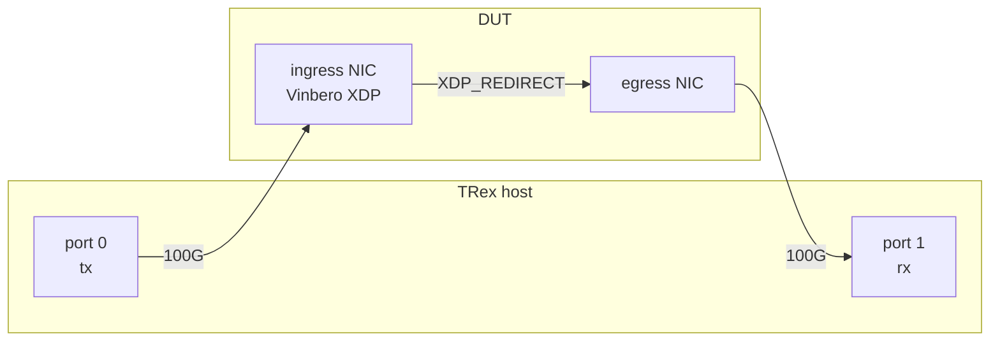

# Vinbero SRv6 データプレーン性能試験

TRex ハードウェア負荷試験機から実 100G 負荷をかけ、Vinbero の SRv6 転送性能を測定する harness です。固定負荷スイープで frame size ごとに一定の offered load をかけ、TRex の受信側 port で forwarding rate と loss を測ります。

## トポロジ



TRex port 0 が DUT の ingress NIC へ送信し、Vinbero が処理した packet を egress NIC から TRex port 1 へ返す snake 構成です。port 0 の `opackets` が offered load、port 1 の `ipackets` が forwarded load になり、両者の差が loss です。

## 前提

- DUT で `make build` 済みであること (`out/bin/vinberod`、`out/bin/vinbero`、ecmp シナリオでは `out/bin/vinbero-ecmpdemo` を使います)
- TRex host に ssh alias (`ocxma-trex`) で鍵認証ログインできること
- TRex host で stateless daemon が起動していること

  ```bash
  cd /opt/trex/v3.08 && sudo ./t-rex-64 -i --cfg /etc/trex_cfg.yaml -c 20
  ```

- DUT 側 NIC の MTU は setup が 3000 に揃えます。ice の driver mode XDP は multi-buffer 非対応の program だと MTU 約 3050 が attach の上限で、9000 では attach が `operation not supported` で失敗します。ingress 最大 1420B + encap でも 1500B 弱なので 3000 で足ります
- NIC の MAC address と IP 設計は `pipelines/common.sh` と `trex/vinbero_streams.py` の定数で一致させています。機材を変える場合は両方を更新してください

## シナリオ

| scenario | 経路 | ingress frame |
|---|---|---|
| `encaps-v4` | T.Encaps v4 headend (XDP) | IPv4/UDP |
| `ecmp` | ECMP path group 経由の headend (XDP) | IPv4/UDP (encaps-v4 と同一) |
| `end` | End transit (XDP) | IPv6 + SRH (SL=1) |
| `end-dt4` | End.DT4 decap + VRF lookup (XDP) | IPv6 + SRH (SL=0) + inner IPv4 |
| `l2-unicast` | H.Encaps.L2 (XDP) | VLAN tagged L2 frame (unicast) |
| `bum` | BUM flood (TC clone-to-self) | VLAN tagged L2 frame (broadcast) |

`ecmp` は `encaps-v4` との差分で ECMP hot path (group/live/path map lookup + weighted 選択) のコストを示します。なお ECMP 基盤の導入以降、headend は group なしでも flow hash を毎 packet 計算するため、`encaps-v4` の数字も ECMP 基盤込みの headend の数字です。

`bum` は登録した bd peer 数 N に応じて出力が入力の N 倍に増幅されます。`rx_mpps` は増幅後の値をそのまま報告し、`loss_pct` は `tx_opackets * N` を期待値として計算します。TC 経由は XDP より大幅に遅い想定のため、`PPS` を低め (例 1000000 から) に設定して段階的に上げてください。

## 実行手順

```bash
cd benchmark/pipelines

# 1. シナリオをセットアップ (NIC 準備 + vinberod 起動 + map entry 投入)
sudo -v && ./setup_dut.sh encaps-v4

# 2. ベンチ実行 (size sweep x reps、CSV は benchmark/results/ に出力)
./run_bench.sh encaps-v4

# 3. 集計
python3 ../analysis/stats.py ../results/encaps-v4_rep*.csv

# 4. 後始末
./teardown_dut.sh
```

パラメータは環境変数で調整します。

```bash
DURATION=30 REPS=5 PPS=50000000 ./run_bench.sh encaps-v4 64 512
PEERS=4 ./setup_dut.sh bum --peers 4 && PEERS=4 PPS=5000000 ./run_bench.sh bum
```

## smoke 確認 (計測前のデータプレーン疎通)

計測用 config は `enable_stats: false` です。経路がただしく通っているかは stats を有効にした config で低レートを流して確認します。

```bash
./setup_dut.sh encaps-v4 --stats
PPS=1000 DURATION=5 REPS=1 ./run_bench.sh encaps-v4 64
../../out/bin/vinbero -s http://127.0.0.1:8082 stats show
../../out/bin/vinbero -s http://127.0.0.1:8082 stats slot show --all
./teardown_dut.sh
```

REDIRECT カウンタが送信 packet 数と一致し、`rx_ipackets` が `tx_opackets` とほぼ一致すれば疎通しています。確認後は必ず stats なしの config で取り直してください (stats 有効時は per-packet カウンタ更新のコストが乗ります)。

## 測定方法の詳細

- flow 分散は 32 本の静的 stream (source address 可変) で行います。TRex の field-engine VM は SRH を再パースできず frame を壊すため、SRH 入り frame は必ず scapy + raw `pkt_buffer` の静的 stream で組みます
- `bpf_fib_lookup` は neighbor 未解決だと packet を落とすため、TRex port 1 へ向く next-hop は static neighbor entry を投入します (TRex port は ND/ARP に応答しません)。同じ理由で forwarding sysctl も setup が有効化します
- L2 シナリオの frame は customer MAC 宛で NIC の MAC と一致しないため、setup が ingress NIC を promiscuous mode にします。これがないと hardware の MAC filter が落とし、wire counter には乗るのに XDP に届かないという形で 100% loss になります
- offered load は既定で line rate (`mult=100%`) です。`PPS` に非ゼロを与えるとその合計 pps で送ります
- NIC hardware counter (`ethtool -S` の `.nic` 系) の差分を `nic_rx_mpps` / `nic_tx_mpps` として併記します。XDP_REDIRECT は kernel の software counter を通らないため、wire レベルの確認はこちらで行います
- RSS の queue 数を固定したい場合は `sudo ethtool -X <iface> equal 1` で single queue にしてから流します (per-core 性能の参考系列)

## 結果の読み方

`run_bench.sh` は rep ごとに `results/<scenario>_rep<k>.csv` を書き、`analysis/stats.py` が (scenario, size) ごとに rx_mpps / tx_mpps / loss_pct の mean と sd を出します。offered load が DUT 容量を超えている領域では rx_mpps がそのまま DUT の転送容量を示します。
