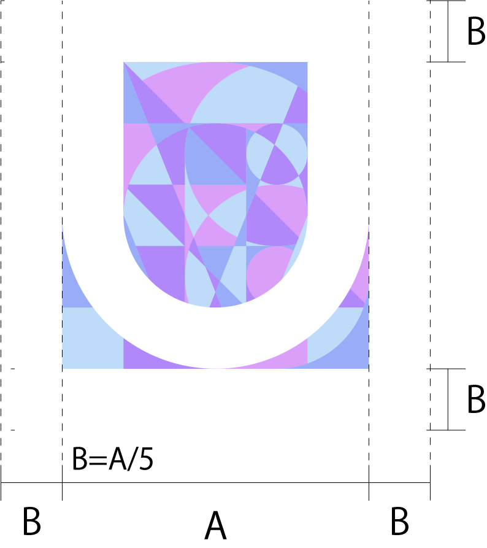
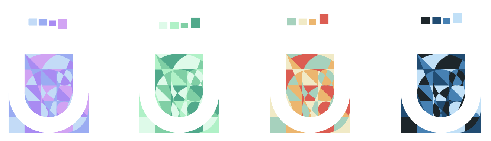

# logo

## isolation

## color variation

### prime
`#BEDCFA`,`#98ACF8`,`#B088F9`,`#DA9FF9`

### sub1
`#D7FBE8`,`#9CF4C4`,`#63D2A2`,`#1EAC89`

### sub2
`#9AD3BC`,`#F2EAC2`,`#F5B462`,`#ED524B`

### sub3
`#1B262C`,`#0D4D75`,`#3282B8`,`#BAE1FA`
