# API利用シーケンス

## 目次

- [L2VPN（P2MP）セットアップ](#l2vpnp2mpセットアップ)
- [L2VPN（P2P）セットアップ](#l2vpnp2pセットアップ)
- [L3VPN セットアップ](#l3vpn-セットアップ)
- [L3 Headend (IPv4)](#l3-headend-ipv4)
- [L3 Headend (IPv6)](#l3-headend-ipv6)
- [End.DX4 / End.DX6 (L3クロスコネクト)](#enddx4--enddx6-l3クロスコネクト)
- [End.X (Nexthopクロスコネクト)](#endx-nexthopクロスコネクト)
- [End.B6 / End.B6.Encaps (ポリシーバインディング)](#endb6--endb6encaps-ポリシーバインディング)
- [GTP-U/SRv6 統合 (RFC 9433)](#gtp-usrv6-統合-rfc-9433)
- [FDB 動的学習フロー](#fdb-動的学習フロー)
- [FDB 静的エントリ管理](#fdb-静的エントリ管理)
- [プラグイン拡張](#プラグイン拡張)
- [統計観測](#統計観測)
- [エラーハンドリングとBulk操作](#エラーハンドリングとbulk操作)
- [リソース削除](#リソース削除)
- [再起動時のReconcile](#再起動時のreconcile)

---

## L2VPN（P2MP）セットアップ

Bridge Domainを使用したマルチポイントL2VPN。MAC学習+BUMフラッディングにより、複数PEでL2セグメントを共有する。

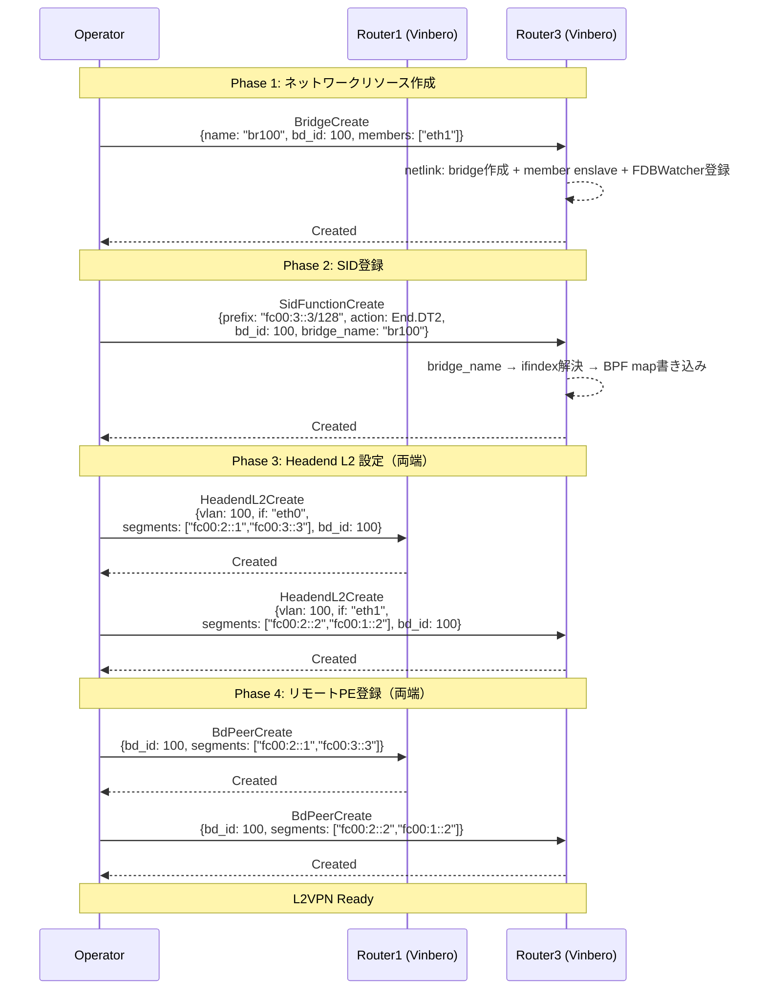
```mermaid
sequenceDiagram
    participant Op as Operator
    participant R1 as Router1 (Vinbero)
    participant R3 as Router3 (Vinbero)

    Note over Op,R3: Phase 1: ネットワークリソース作成

    Op->>R3: BridgeCreate<br/>{name: "br100", bd_id: 100, members: ["eth1"]}
    R3-->>R3: netlink: bridge作成 + member enslave + FDBWatcher登録
    R3-->>Op: Created

    Note over Op,R3: Phase 2: SID登録

    Op->>R3: SidFunctionCreate<br/>{prefix: "fc00:3::3/128", action: End.DT2,<br/>bd_id: 100, bridge_name: "br100"}
    R3-->>R3: bridge_name → ifindex解決 → BPF map書き込み
    R3-->>Op: Created

    Note over Op,R3: Phase 3: Headend L2 設定（両端）

    Op->>R1: HeadendL2Create<br/>{vlan: 100, if: "eth0",<br/>segments: ["fc00:2::1","fc00:3::3"], bd_id: 100}
    R1-->>Op: Created

    Op->>R3: HeadendL2Create<br/>{vlan: 100, if: "eth1",<br/>segments: ["fc00:2::2","fc00:1::2"], bd_id: 100}
    R3-->>Op: Created

    Note over Op,R3: Phase 4: リモートPE登録（両端）

    Op->>R1: BdPeerCreate<br/>{bd_id: 100, segments: ["fc00:2::1","fc00:3::3"]}
    R1-->>Op: Created

    Op->>R3: BdPeerCreate<br/>{bd_id: 100, segments: ["fc00:2::2","fc00:1::2"]}
    R3-->>Op: Created

    Note over Op,R3: L2VPN Ready
```

---

## L2VPN（P2P）セットアップ

`bd_id=0` を指定することで、BD/MAC学習を使わないシンプルなP2P L2VPN を構成する。全フレームが直接SRv6エンカプセルされる。

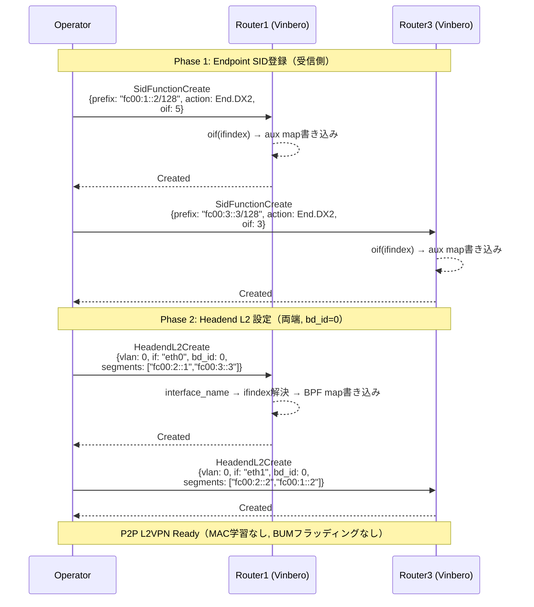
```mermaid
sequenceDiagram
    participant Op as Operator
    participant R1 as Router1 (Vinbero)
    participant R3 as Router3 (Vinbero)

    Note over Op,R3: Phase 1: Endpoint SID登録（受信側）

    Op->>R1: SidFunctionCreate<br/>{prefix: "fc00:1::2/128", action: End.DX2,<br/>oif: 5}
    R1-->>R1: oif(ifindex) → aux map書き込み
    R1-->>Op: Created

    Op->>R3: SidFunctionCreate<br/>{prefix: "fc00:3::3/128", action: End.DX2,<br/>oif: 3}
    R3-->>R3: oif(ifindex) → aux map書き込み
    R3-->>Op: Created

    Note over Op,R3: Phase 2: Headend L2 設定（両端, bd_id=0）

    Op->>R1: HeadendL2Create<br/>{vlan: 0, if: "eth0", bd_id: 0,<br/>segments: ["fc00:2::1","fc00:3::3"]}
    R1-->>R1: interface_name → ifindex解決 → BPF map書き込み
    R1-->>Op: Created

    Op->>R3: HeadendL2Create<br/>{vlan: 0, if: "eth1", bd_id: 0,<br/>segments: ["fc00:2::2","fc00:1::2"]}
    R3-->>Op: Created

    Note over Op,R3: P2P L2VPN Ready（MAC学習なし, BUMフラッディングなし）
```

**P2MPとの違い:**
- Bridge/FDBWatcher の作成が不要
- End.DX2（固定OIF）を使用、End.DT2（MAC学習テーブル参照）は使わない
- BdPeer の登録が不要（BUM複製なし）

---

## L3VPN セットアップ

VRFを使用したL3VPN。End.DT4/DT6/DT46でdecapしたパケットをVRFのルーティングテーブルに転送する。

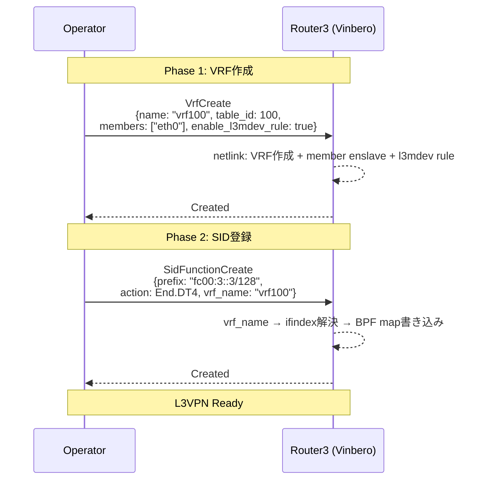
```mermaid
sequenceDiagram
    participant Op as Operator
    participant R3 as Router3 (Vinbero)

    Note over Op,R3: Phase 1: VRF作成

    Op->>R3: VrfCreate<br/>{name: "vrf100", table_id: 100,<br/>members: ["eth0"], enable_l3mdev_rule: true}
    R3-->>R3: netlink: VRF作成 + member enslave + l3mdev rule
    R3-->>Op: Created

    Note over Op,R3: Phase 2: SID登録

    Op->>R3: SidFunctionCreate<br/>{prefix: "fc00:3::3/128",<br/>action: End.DT4, vrf_name: "vrf100"}
    R3-->>R3: vrf_name → ifindex解決 → BPF map書き込み
    R3-->>Op: Created

    Note over Op,R3: L3VPN Ready
```

End.DT6 / End.DT46 も同様のフローで、`action` を変更するだけで対応可能。

---

## L3 Headend (IPv4)

IPv4トラフィックをSRv6バックボーンに挿入する。`trigger_prefix` でマッチしたIPv4パケットに対してSRv6ヘッダを付与する。

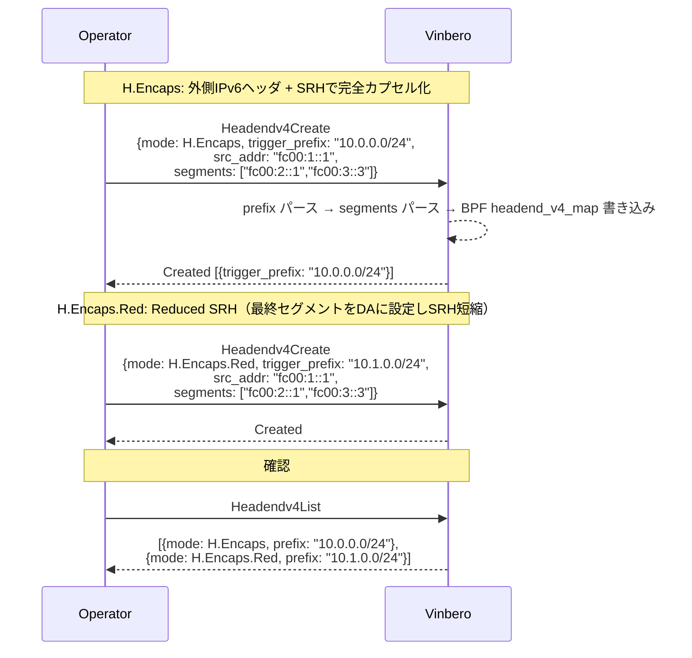
```mermaid
sequenceDiagram
    participant Op as Operator
    participant V as Vinbero

    Note over Op,V: H.Encaps: 外側IPv6ヘッダ + SRHで完全カプセル化

    Op->>V: Headendv4Create<br/>{mode: H.Encaps, trigger_prefix: "10.0.0.0/24",<br/>src_addr: "fc00:1::1",<br/>segments: ["fc00:2::1","fc00:3::3"]}
    V-->>V: prefix パース → segments パース → BPF headend_v4_map 書き込み
    V-->>Op: Created [{trigger_prefix: "10.0.0.0/24"}]

    Note over Op,V: H.Encaps.Red: Reduced SRH（最終セグメントをDAに設定しSRH短縮）

    Op->>V: Headendv4Create<br/>{mode: H.Encaps.Red, trigger_prefix: "10.1.0.0/24",<br/>src_addr: "fc00:1::1",<br/>segments: ["fc00:2::1","fc00:3::3"]}
    V-->>Op: Created

    Note over Op,V: 確認

    Op->>V: Headendv4List
    V-->>Op: [{mode: H.Encaps, prefix: "10.0.0.0/24"},<br/>{mode: H.Encaps.Red, prefix: "10.1.0.0/24"}]
```

---

## L3 Headend (IPv6)

IPv6トラフィックへのSRv6挿入。H.InsertはSRHを既存IPv6ヘッダに挿入し、H.Encapsは外側IPv6ヘッダで完全にカプセル化する。

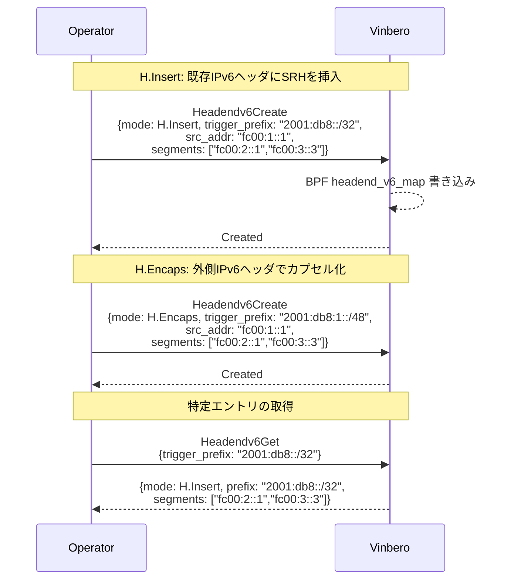
```mermaid
sequenceDiagram
    participant Op as Operator
    participant V as Vinbero

    Note over Op,V: H.Insert: 既存IPv6ヘッダにSRHを挿入

    Op->>V: Headendv6Create<br/>{mode: H.Insert, trigger_prefix: "2001:db8::/32",<br/>src_addr: "fc00:1::1",<br/>segments: ["fc00:2::1","fc00:3::3"]}
    V-->>V: BPF headend_v6_map 書き込み
    V-->>Op: Created

    Note over Op,V: H.Encaps: 外側IPv6ヘッダでカプセル化

    Op->>V: Headendv6Create<br/>{mode: H.Encaps, trigger_prefix: "2001:db8:1::/48",<br/>src_addr: "fc00:1::1",<br/>segments: ["fc00:2::1","fc00:3::3"]}
    V-->>Op: Created

    Note over Op,V: 特定エントリの取得

    Op->>V: Headendv6Get<br/>{trigger_prefix: "2001:db8::/32"}
    V-->>Op: {mode: H.Insert, prefix: "2001:db8::/32",<br/>segments: ["fc00:2::1","fc00:3::3"]}
```

---

## End.DX4 / End.DX6 (L3クロスコネクト)

VRFを使わずに、SRv6パケットをdecapして直接特定の次ホップへ転送するL3クロスコネクト。

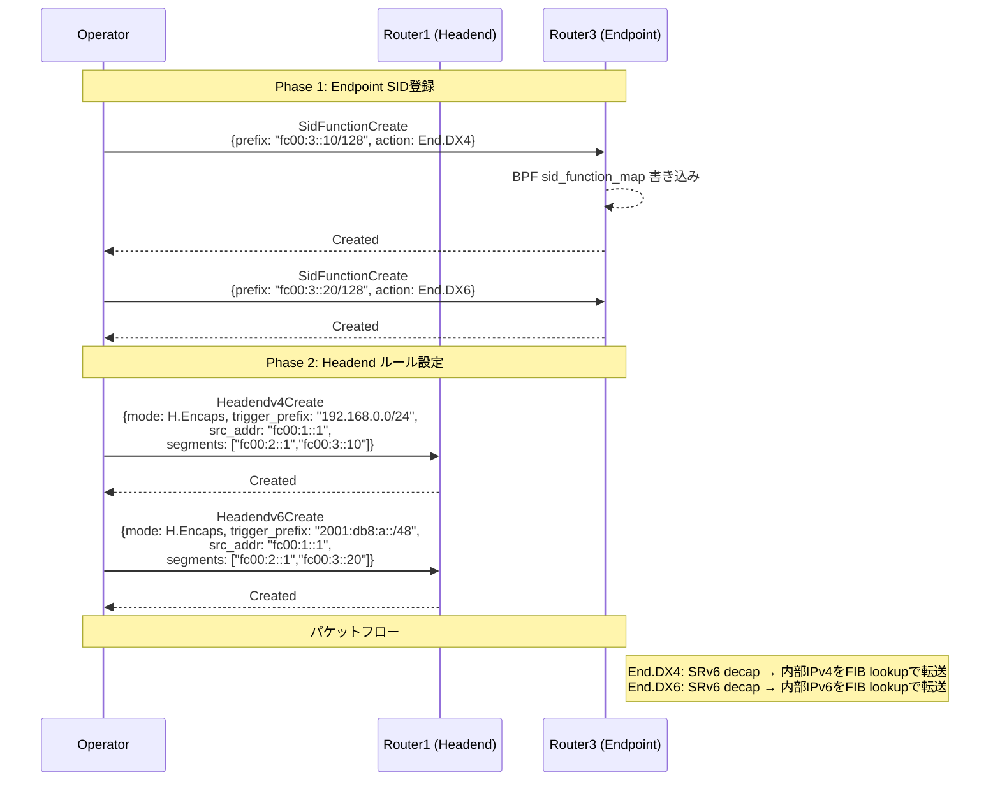
```mermaid
sequenceDiagram
    participant Op as Operator
    participant R1 as Router1 (Headend)
    participant R3 as Router3 (Endpoint)

    Note over Op,R3: Phase 1: Endpoint SID登録

    Op->>R3: SidFunctionCreate<br/>{prefix: "fc00:3::10/128", action: End.DX4}
    R3-->>R3: BPF sid_function_map 書き込み
    R3-->>Op: Created

    Op->>R3: SidFunctionCreate<br/>{prefix: "fc00:3::20/128", action: End.DX6}
    R3-->>Op: Created

    Note over Op,R3: Phase 2: Headend ルール設定

    Op->>R1: Headendv4Create<br/>{mode: H.Encaps, trigger_prefix: "192.168.0.0/24",<br/>src_addr: "fc00:1::1",<br/>segments: ["fc00:2::1","fc00:3::10"]}
    R1-->>Op: Created

    Op->>R1: Headendv6Create<br/>{mode: H.Encaps, trigger_prefix: "2001:db8:a::/48",<br/>src_addr: "fc00:1::1",<br/>segments: ["fc00:2::1","fc00:3::20"]}
    R1-->>Op: Created

    Note over Op,R3: パケットフロー
    Note right of R3: End.DX4: SRv6 decap → 内部IPv4をFIB lookupで転送<br/>End.DX6: SRv6 decap → 内部IPv6をFIB lookupで転送
```

**End.DT4/DT6 との違い:** DT系はVRFテーブルで宛先をルーティング、DX系はVRFなしでFIB lookupのみ。

---

## End.X (Nexthopクロスコネクト)

SRv6パケットを特定のnexthopに転送するクロスコネクト。Flavor（PSP/USP/USD）の適用も可能。

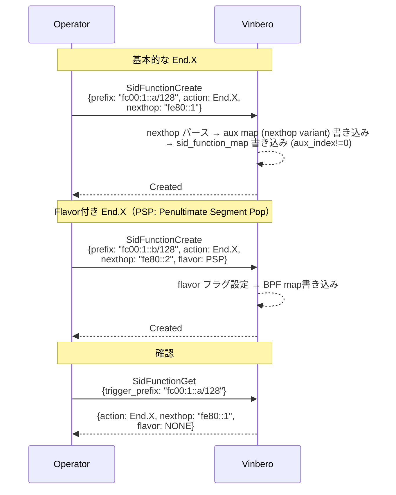
```mermaid
sequenceDiagram
    participant Op as Operator
    participant V as Vinbero

    Note over Op,V: 基本的な End.X

    Op->>V: SidFunctionCreate<br/>{prefix: "fc00:1::a/128", action: End.X,<br/>nexthop: "fe80::1"}
    V-->>V: nexthop パース → aux map (nexthop variant) 書き込み<br/>→ sid_function_map 書き込み (aux_index!=0)
    V-->>Op: Created

    Note over Op,V: Flavor付き End.X（PSP: Penultimate Segment Pop）

    Op->>V: SidFunctionCreate<br/>{prefix: "fc00:1::b/128", action: End.X,<br/>nexthop: "fe80::2", flavor: PSP}
    V-->>V: flavor フラグ設定 → BPF map書き込み
    V-->>Op: Created

    Note over Op,V: 確認

    Op->>V: SidFunctionGet<br/>{trigger_prefix: "fc00:1::a/128"}
    V-->>Op: {action: End.X, nexthop: "fe80::1",<br/>flavor: NONE}
```

**Flavor一覧:**
- PSP (Penultimate Segment Pop): SL=1の時にSRHを除去して転送
- USP (Ultimate Segment Pop): SL=0の時にSRHを除去して転送
- USD (Ultimate Segment Decapsulation): SL=0の時に外部ヘッダごと除去

---

## End.B6 / End.B6.Encaps (ポリシーバインディング)

SIDに別のSRv6ポリシーをバインドし、階層的なSRv6構成を実現する。

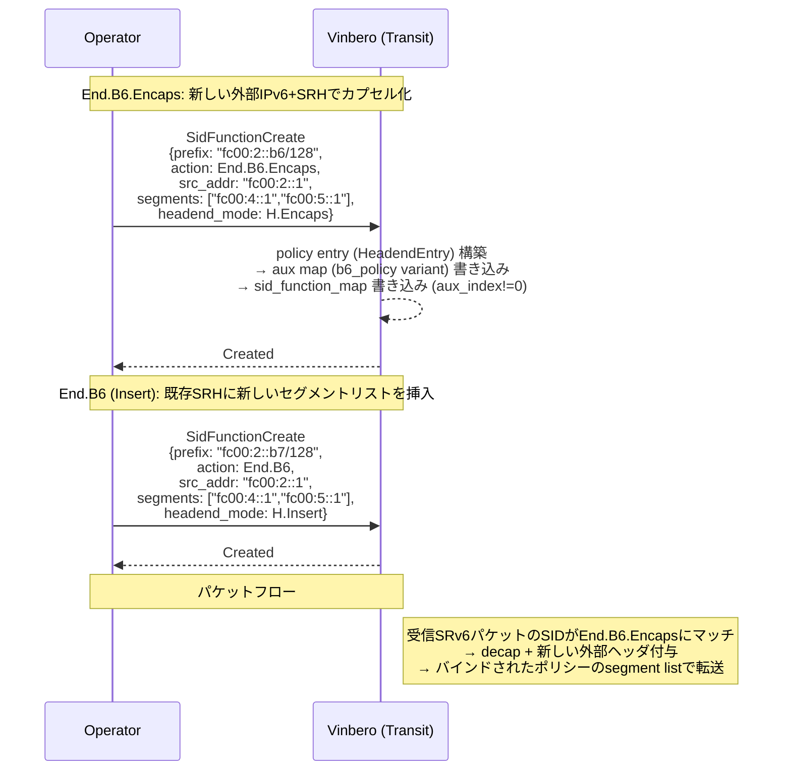
```mermaid
sequenceDiagram
    participant Op as Operator
    participant V as Vinbero (Transit)

    Note over Op,V: End.B6.Encaps: 新しい外部IPv6+SRHでカプセル化

    Op->>V: SidFunctionCreate<br/>{prefix: "fc00:2::b6/128",<br/>action: End.B6.Encaps,<br/>src_addr: "fc00:2::1",<br/>segments: ["fc00:4::1","fc00:5::1"],<br/>headend_mode: H.Encaps}
    V-->>V: policy entry (HeadendEntry) 構築<br/>→ aux map (b6_policy variant) 書き込み<br/>→ sid_function_map 書き込み (aux_index!=0)
    V-->>Op: Created

    Note over Op,V: End.B6 (Insert): 既存SRHに新しいセグメントリストを挿入

    Op->>V: SidFunctionCreate<br/>{prefix: "fc00:2::b7/128",<br/>action: End.B6,<br/>src_addr: "fc00:2::1",<br/>segments: ["fc00:4::1","fc00:5::1"],<br/>headend_mode: H.Insert}
    V-->>Op: Created

    Note over Op,V: パケットフロー
    Note right of V: 受信SRv6パケットのSIDがEnd.B6.Encapsにマッチ<br/>→ decap + 新しい外部ヘッダ付与<br/>→ バインドされたポリシーのsegment listで転送
```

**ユースケース:** ドメイン境界でのSRv6ポリシーの切り替え（inter-domain SRv6）

---

## GTP-U/SRv6 統合 (RFC 9433)

モバイルバックホールのGTP-Uトンネルと SRv6を相互変換する。`args_offset` でSID内のGTPセッション情報の位置を指定する。

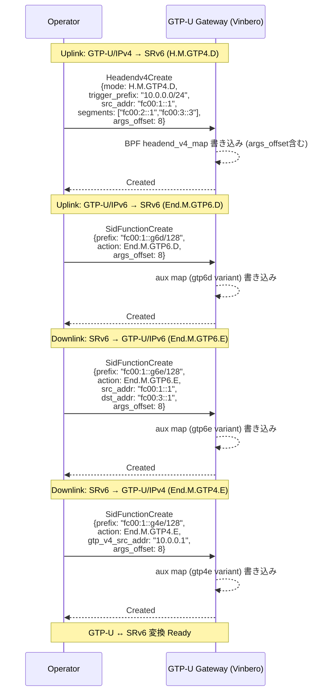
```mermaid
sequenceDiagram
    participant Op as Operator
    participant GW as GTP-U Gateway (Vinbero)

    Note over Op,GW: Uplink: GTP-U/IPv4 → SRv6 (H.M.GTP4.D)

    Op->>GW: Headendv4Create<br/>{mode: H.M.GTP4.D,<br/>trigger_prefix: "10.0.0.0/24",<br/>src_addr: "fc00:1::1",<br/>segments: ["fc00:2::1","fc00:3::3"],<br/>args_offset: 8}
    GW-->>GW: BPF headend_v4_map 書き込み (args_offset含む)
    GW-->>Op: Created

    Note over Op,GW: Uplink: GTP-U/IPv6 → SRv6 (End.M.GTP6.D)

    Op->>GW: SidFunctionCreate<br/>{prefix: "fc00:1::g6d/128",<br/>action: End.M.GTP6.D,<br/>args_offset: 8}
    GW-->>GW: aux map (gtp6d variant) 書き込み
    GW-->>Op: Created

    Note over Op,GW: Downlink: SRv6 → GTP-U/IPv6 (End.M.GTP6.E)

    Op->>GW: SidFunctionCreate<br/>{prefix: "fc00:1::g6e/128",<br/>action: End.M.GTP6.E,<br/>src_addr: "fc00:1::1",<br/>dst_addr: "fc00:3::1",<br/>args_offset: 8}
    GW-->>GW: aux map (gtp6e variant) 書き込み
    GW-->>Op: Created

    Note over Op,GW: Downlink: SRv6 → GTP-U/IPv4 (End.M.GTP4.E)

    Op->>GW: SidFunctionCreate<br/>{prefix: "fc00:1::g4e/128",<br/>action: End.M.GTP4.E,<br/>gtp_v4_src_addr: "10.0.0.1",<br/>args_offset: 8}
    GW-->>GW: aux map (gtp4e variant) 書き込み
    GW-->>Op: Created

    Note over Op,GW: GTP-U ↔ SRv6 変換 Ready
```

**args_offsetについて:** SIDの128ビット中、`args_offset` バイト目から Args.Mob.Session (TEID等) を格納する。0-15の範囲で指定。

---

## FDB 動的学習フロー

L2VPN (P2MP) 構成でのMAC学習の内部動作。BPFデータプレーンとFDBWatcherが協調してFDBを管理する。

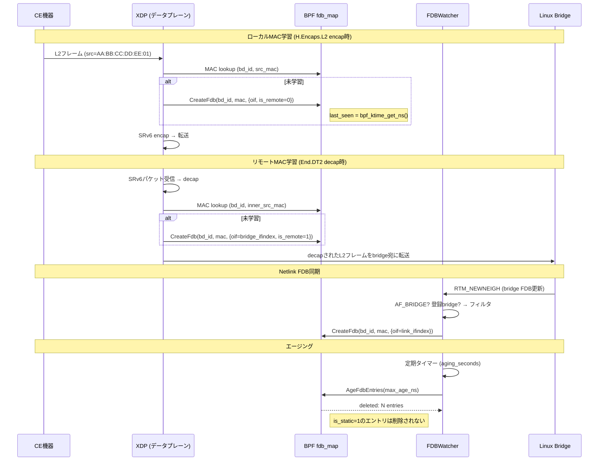
```mermaid
sequenceDiagram
    participant CE as CE機器
    participant XDP as XDP (データプレーン)
    participant FDB as BPF fdb_map
    participant FW as FDBWatcher
    participant BR as Linux Bridge

    Note over CE,BR: ローカルMAC学習 (H.Encaps.L2 encap時)

    CE->>XDP: L2フレーム (src=AA:BB:CC:DD:EE:01)
    XDP->>FDB: MAC lookup (bd_id, src_mac)
    alt 未学習
        XDP->>FDB: CreateFdb(bd_id, mac, {oif, is_remote=0})
        Note right of FDB: last_seen = bpf_ktime_get_ns()
    end
    XDP->>XDP: SRv6 encap → 転送

    Note over CE,BR: リモートMAC学習 (End.DT2 decap時)

    XDP->>XDP: SRv6パケット受信 → decap
    XDP->>FDB: MAC lookup (bd_id, inner_src_mac)
    alt 未学習
        XDP->>FDB: CreateFdb(bd_id, mac, {oif=bridge_ifindex, is_remote=1})
    end
    XDP->>BR: decapされたL2フレームをbridge宛に転送

    Note over CE,BR: Netlink FDB同期

    BR->>FW: RTM_NEWNEIGH (bridge FDB更新)
    FW->>FW: AF_BRIDGE? 登録bridge? → フィルタ
    FW->>FDB: CreateFdb(bd_id, mac, {oif=link_ifindex})

    Note over CE,BR: エージング

    FW->>FW: 定期タイマー (aging_seconds)
    FW->>FDB: AgeFdbEntries(max_age_ns)
    FDB-->>FW: deleted: N entries
    Note right of FDB: is_static=1のエントリは削除されない
```

**is_remote フラグの意味:**
- `is_remote=0`: ローカルCEから学習したMAC（H.Encaps.L2が記録）
- `is_remote=1`: リモートPEからSRv6経由で受信したMAC（End.DT2が記録）

---

## FDB 静的エントリ管理

オペレータが手動でFDBエントリを追加・削除する。静的エントリはエージングで削除されない。

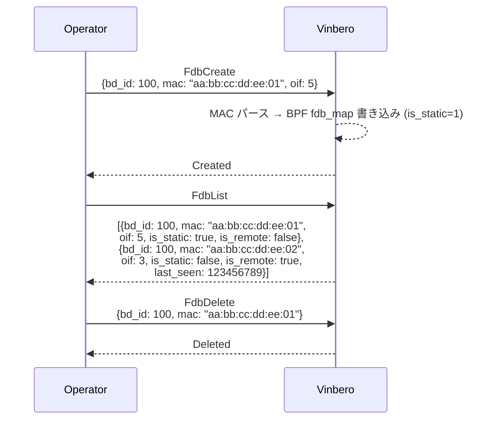
```mermaid
sequenceDiagram
    participant Op as Operator
    participant V as Vinbero

    Op->>V: FdbCreate<br/>{bd_id: 100, mac: "aa:bb:cc:dd:ee:01", oif: 5}
    V-->>V: MAC パース → BPF fdb_map 書き込み (is_static=1)
    V-->>Op: Created

    Op->>V: FdbList
    V-->>Op: [{bd_id: 100, mac: "aa:bb:cc:dd:ee:01",<br/>oif: 5, is_static: true, is_remote: false},<br/>{bd_id: 100, mac: "aa:bb:cc:dd:ee:02",<br/>oif: 3, is_static: false, is_remote: true,<br/>last_seen: 123456789}]

    Op->>V: FdbDelete<br/>{bd_id: 100, mac: "aa:bb:cc:dd:ee:01"}
    V-->>Op: Deleted
```

---

## プラグイン拡張

XDPデータプレーンのtail call dispatchを利用して、ユーザー定義のBPFプラグインを動的に登録する。

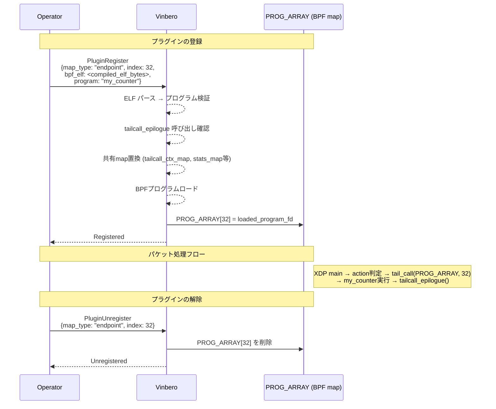
```mermaid
sequenceDiagram
    participant Op as Operator
    participant V as Vinbero
    participant PA as PROG_ARRAY (BPF map)

    Note over Op,PA: プラグインの登録

    Op->>V: PluginRegister<br/>{map_type: "endpoint", index: 32,<br/>bpf_elf: <compiled_elf_bytes>,<br/>program: "my_counter"}
    V-->>V: ELF パース → プログラム検証
    V-->>V: tailcall_epilogue 呼び出し確認
    V-->>V: 共有map置換 (tailcall_ctx_map, stats_map等)
    V-->>V: BPFプログラムロード
    V->>PA: PROG_ARRAY[32] = loaded_program_fd
    V-->>Op: Registered

    Note over Op,PA: パケット処理フロー
    Note right of PA: XDP main → action判定 → tail_call(PROG_ARRAY, 32)<br/>→ my_counter実行 → tailcall_epilogue()

    Note over Op,PA: プラグインの解除

    Op->>V: PluginUnregister<br/>{map_type: "endpoint", index: 32}
    V->>PA: PROG_ARRAY[32] を削除
    V-->>Op: Unregistered
```

**スロット範囲:**
- endpoint: 32-63（SID endpoint処理後のフック）
- headend_v4: 16-31（IPv4 headend処理後のフック）
- headend_v6: 16-31（IPv6 headend処理後のフック）

**プラグイン実装の制約:** `tailcall_epilogue()` を必ず呼び出すこと（共有mapから次のプログラムへchain可能にする契約）

---

## 統計観測

XDPパケット処理のカウンタを参照・リセットする。`enable_stats: true` の設定が必要。

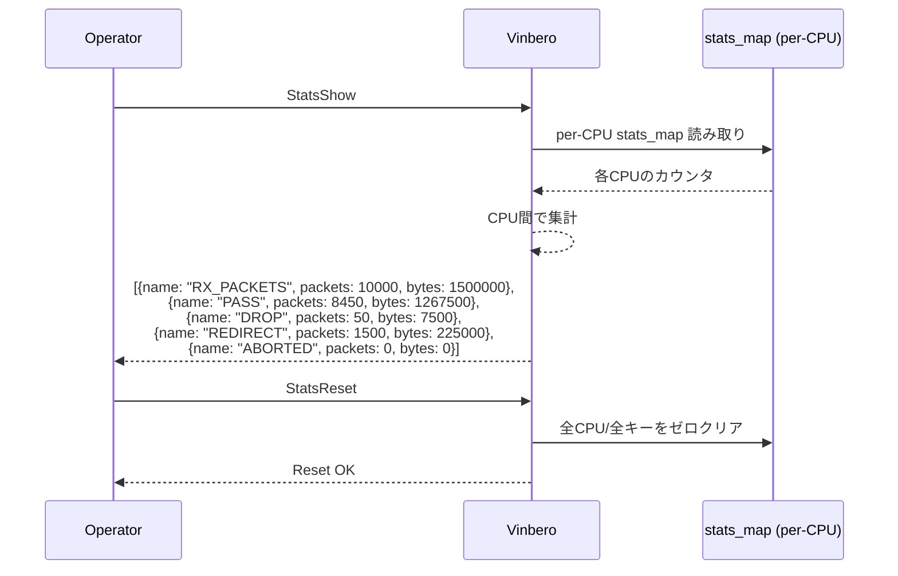
```mermaid
sequenceDiagram
    participant Op as Operator
    participant V as Vinbero
    participant BPF as stats_map (per-CPU)

    Op->>V: StatsShow
    V->>BPF: per-CPU stats_map 読み取り
    BPF-->>V: 各CPUのカウンタ
    V-->>V: CPU間で集計
    V-->>Op: [{name: "RX_PACKETS", packets: 10000, bytes: 1500000},<br/>{name: "PASS", packets: 8450, bytes: 1267500},<br/>{name: "DROP", packets: 50, bytes: 7500},<br/>{name: "REDIRECT", packets: 1500, bytes: 225000},<br/>{name: "ABORTED", packets: 0, bytes: 0}]

    Op->>V: StatsReset
    V->>BPF: 全CPU/全キーをゼロクリア
    V-->>Op: Reset OK
```

**グローバル per-action カウンタ:** RX_PACKETS, PASS, DROP, REDIRECT, ABORTED (XDP_ABORTED = BPF プログラム異常時の action)。tail-call target slot ごとの invocation 数は `StatsSlotShow` / `vinbero stats slot show` で取得 (builtin / plugin 共通)。

---

## エラーハンドリングとBulk操作

Create/Delete系APIは複数エントリの一括操作に対応しており、個別にエラーを報告する（部分成功パターン）。

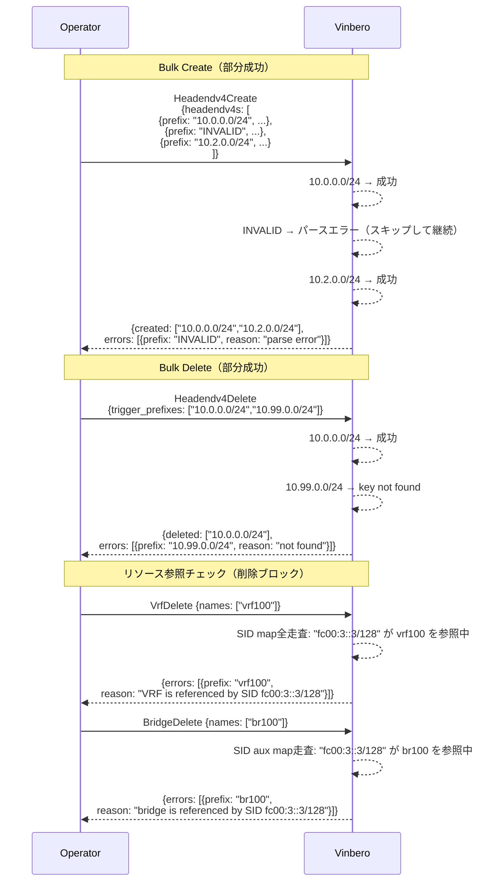
```mermaid
sequenceDiagram
    participant Op as Operator
    participant V as Vinbero

    Note over Op,V: Bulk Create（部分成功）

    Op->>V: Headendv4Create<br/>{headendv4s: [<br/>  {prefix: "10.0.0.0/24", ...},<br/>  {prefix: "INVALID", ...},<br/>  {prefix: "10.2.0.0/24", ...}<br/>]}
    V-->>V: 10.0.0.0/24 → 成功
    V-->>V: INVALID → パースエラー（スキップして継続）
    V-->>V: 10.2.0.0/24 → 成功
    V-->>Op: {created: ["10.0.0.0/24","10.2.0.0/24"],<br/>errors: [{prefix: "INVALID", reason: "parse error"}]}

    Note over Op,V: Bulk Delete（部分成功）

    Op->>V: Headendv4Delete<br/>{trigger_prefixes: ["10.0.0.0/24","10.99.0.0/24"]}
    V-->>V: 10.0.0.0/24 → 成功
    V-->>V: 10.99.0.0/24 → key not found
    V-->>Op: {deleted: ["10.0.0.0/24"],<br/>errors: [{prefix: "10.99.0.0/24", reason: "not found"}]}

    Note over Op,V: リソース参照チェック（削除ブロック）

    Op->>V: VrfDelete {names: ["vrf100"]}
    V-->>V: SID map全走査: "fc00:3::3/128" が vrf100 を参照中
    V-->>Op: {errors: [{prefix: "vrf100",<br/>reason: "VRF is referenced by SID fc00:3::3/128"}]}

    Op->>V: BridgeDelete {names: ["br100"]}
    V-->>V: SID aux map走査: "fc00:3::3/128" が br100 を参照中
    V-->>Op: {errors: [{prefix: "br100",<br/>reason: "bridge is referenced by SID fc00:3::3/128"}]}
```

**エラーレスポンス構造:**
```
OperationError {
  trigger_prefix: string  // 失敗したエントリの識別子
  reason: string          // エラー理由
}
```

---

## L2 VLAN Cross-connect（End.DX2V）セットアップ

End.DX2Vは1つのSIDで複数VLANを異なる出力ポートにクロスコネクトする。MACアドレス学習・FDB・フラッディングは行わない（RFC 8986 Sec.4.10）。

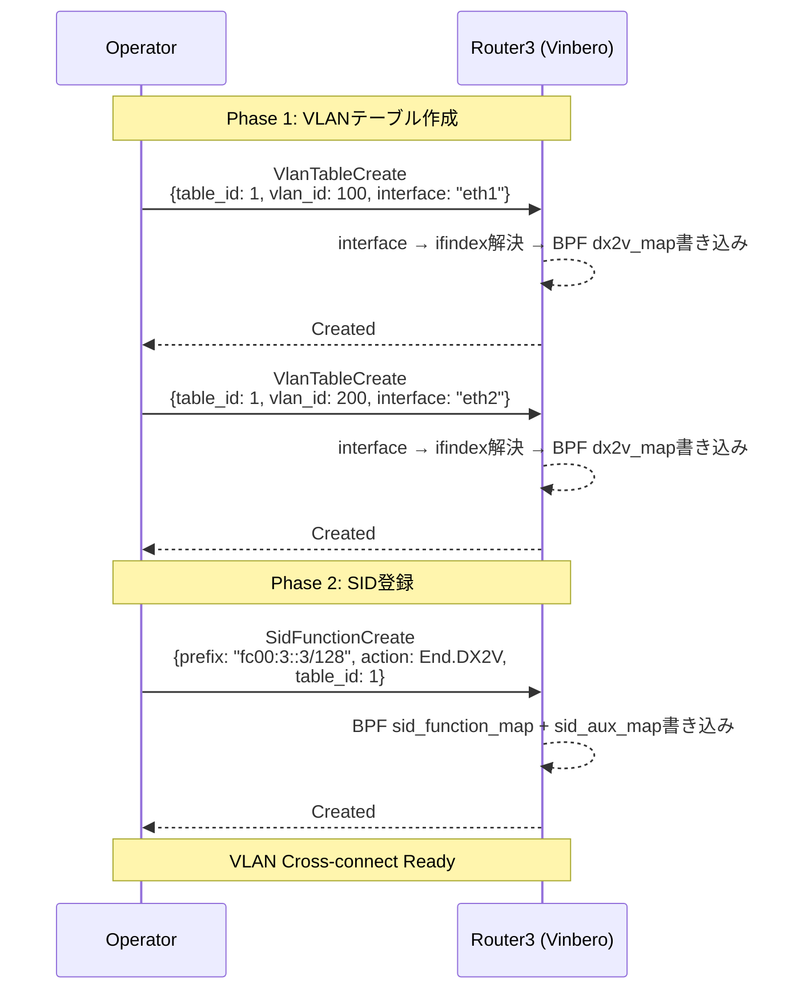
```mermaid
sequenceDiagram
    participant Op as Operator
    participant R3 as Router3 (Vinbero)

    Note over Op,R3: Phase 1: VLANテーブル作成

    Op->>R3: VlanTableCreate<br/>{table_id: 1, vlan_id: 100, interface: "eth1"}
    R3-->>R3: interface → ifindex解決 → BPF dx2v_map書き込み
    R3-->>Op: Created

    Op->>R3: VlanTableCreate<br/>{table_id: 1, vlan_id: 200, interface: "eth2"}
    R3-->>R3: interface → ifindex解決 → BPF dx2v_map書き込み
    R3-->>Op: Created

    Note over Op,R3: Phase 2: SID登録

    Op->>R3: SidFunctionCreate<br/>{prefix: "fc00:3::3/128", action: End.DX2V,<br/>table_id: 1}
    R3-->>R3: BPF sid_function_map + sid_aux_map書き込み
    R3-->>Op: Created

    Note over Op,R3: VLAN Cross-connect Ready
```

---

## リソース削除

登録の逆順で削除します。依存関係がある場合はエラーになります。

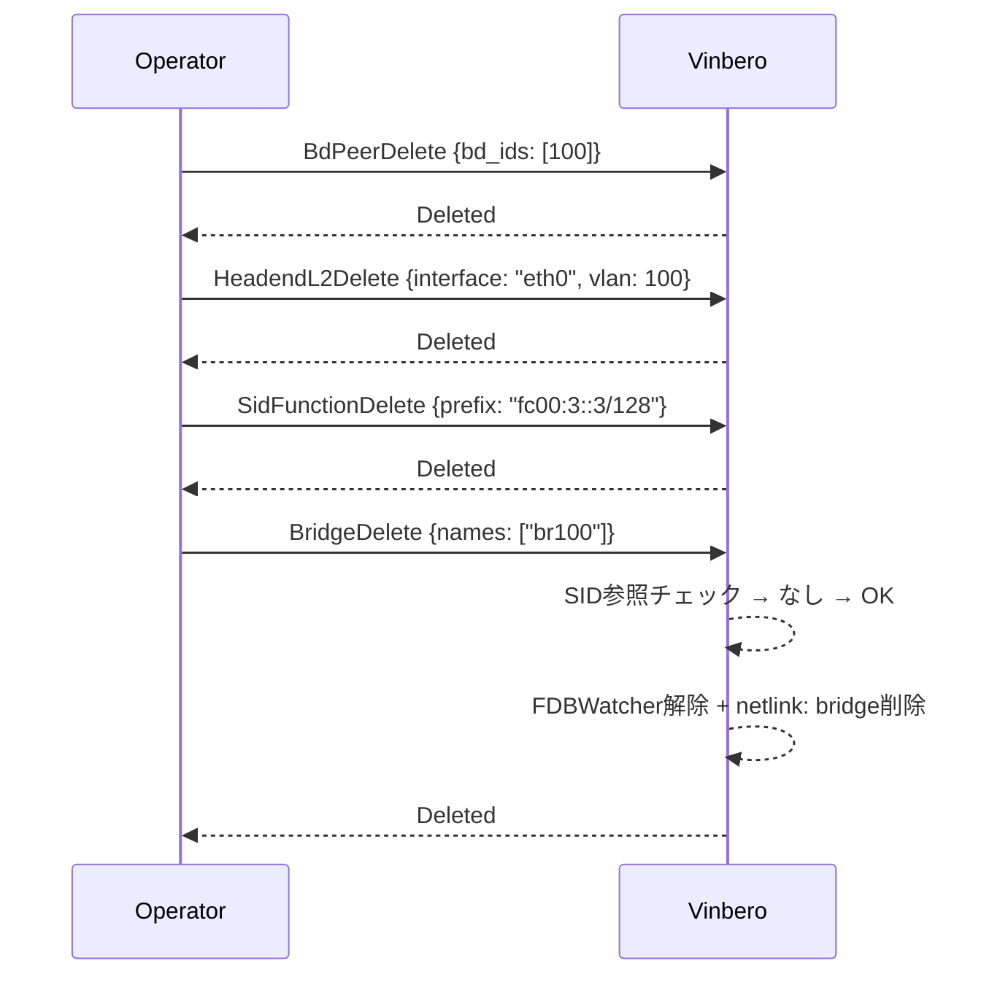
```mermaid
sequenceDiagram
    participant Op as Operator
    participant V as Vinbero

    Op->>V: BdPeerDelete {bd_ids: [100]}
    V-->>Op: Deleted

    Op->>V: HeadendL2Delete {interface: "eth0", vlan: 100}
    V-->>Op: Deleted

    Op->>V: SidFunctionDelete {prefix: "fc00:3::3/128"}
    V-->>Op: Deleted

    Op->>V: BridgeDelete {names: ["br100"]}
    V-->>V: SID参照チェック → なし → OK
    V-->>V: FDBWatcher解除 + netlink: bridge削除
    V-->>Op: Deleted
```

---

## 再起動時のReconcile

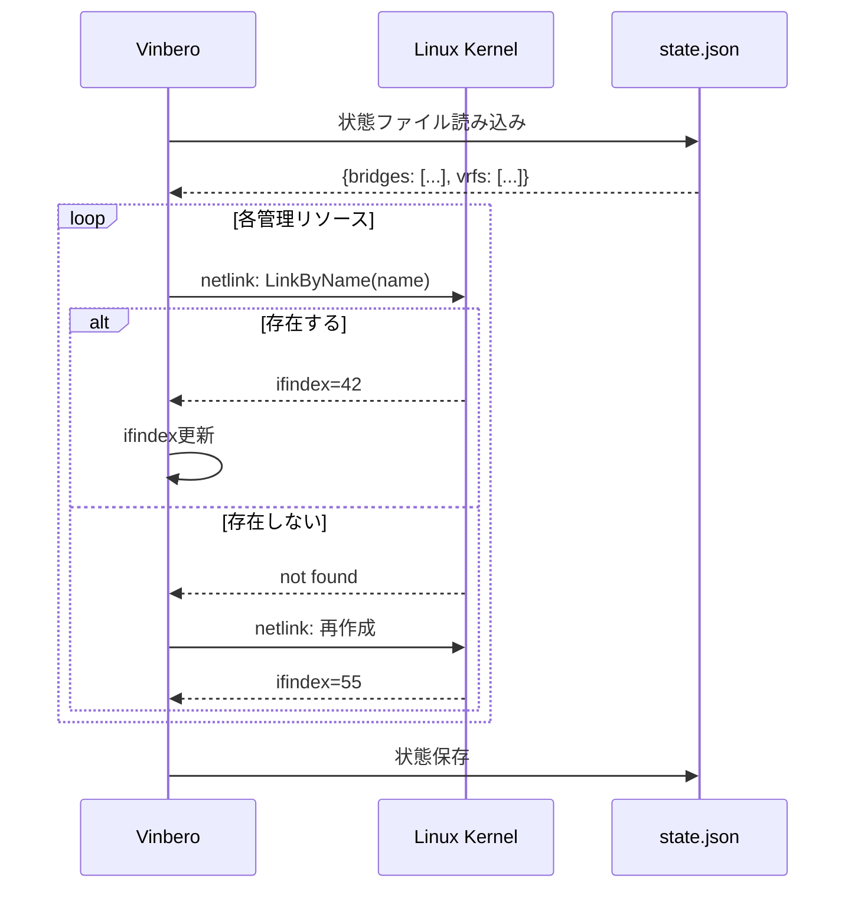
```mermaid
sequenceDiagram
    participant V as Vinbero
    participant K as Linux Kernel
    participant S as state.json

    V->>S: 状態ファイル読み込み
    S-->>V: {bridges: [...], vrfs: [...]}

    loop 各管理リソース
        V->>K: netlink: LinkByName(name)
        alt 存在する
            K-->>V: ifindex=42
            V->>V: ifindex更新
        else 存在しない
            K-->>V: not found
            V->>K: netlink: 再作成
            K-->>V: ifindex=55
        end
    end

    V->>S: 状態保存
```
