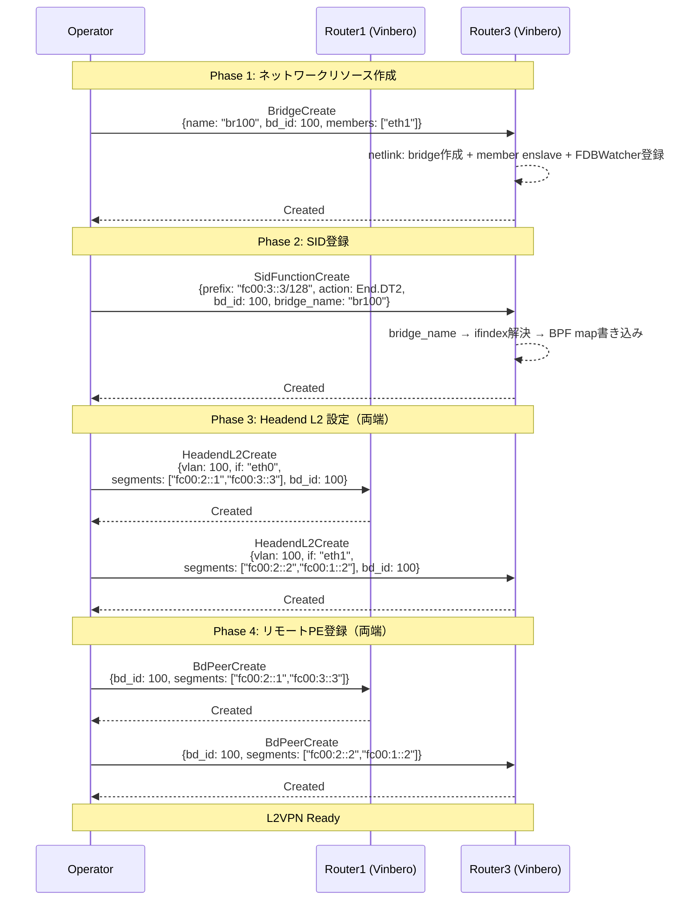
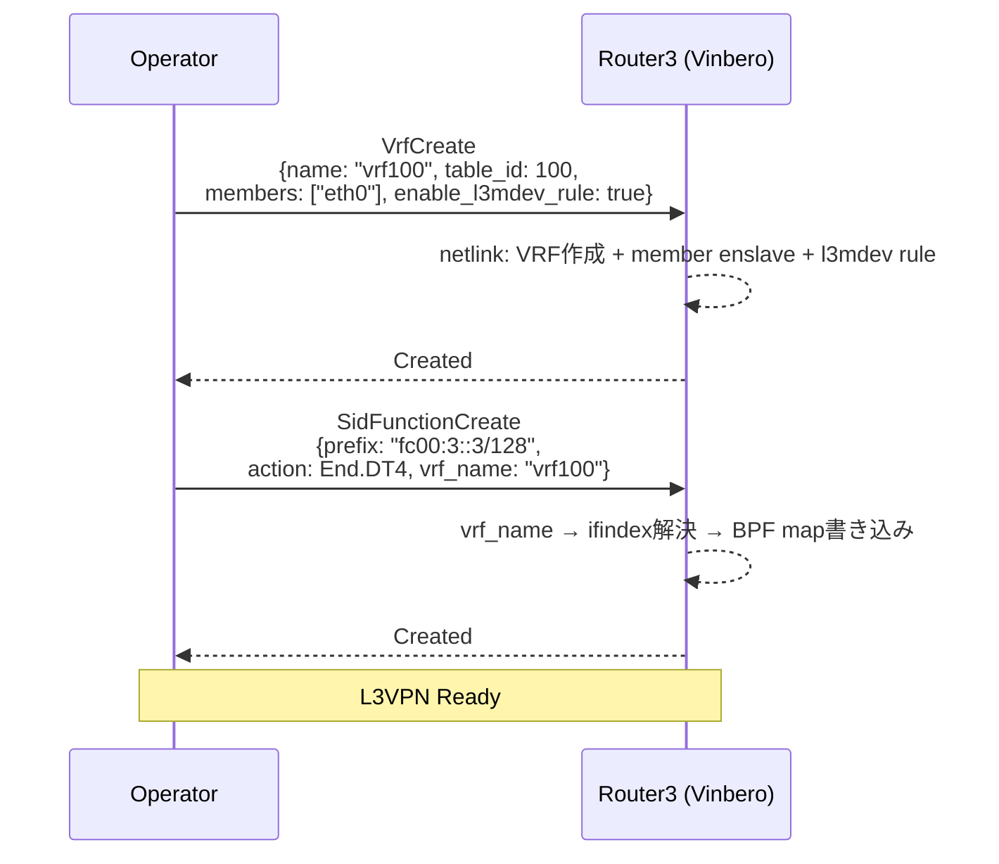
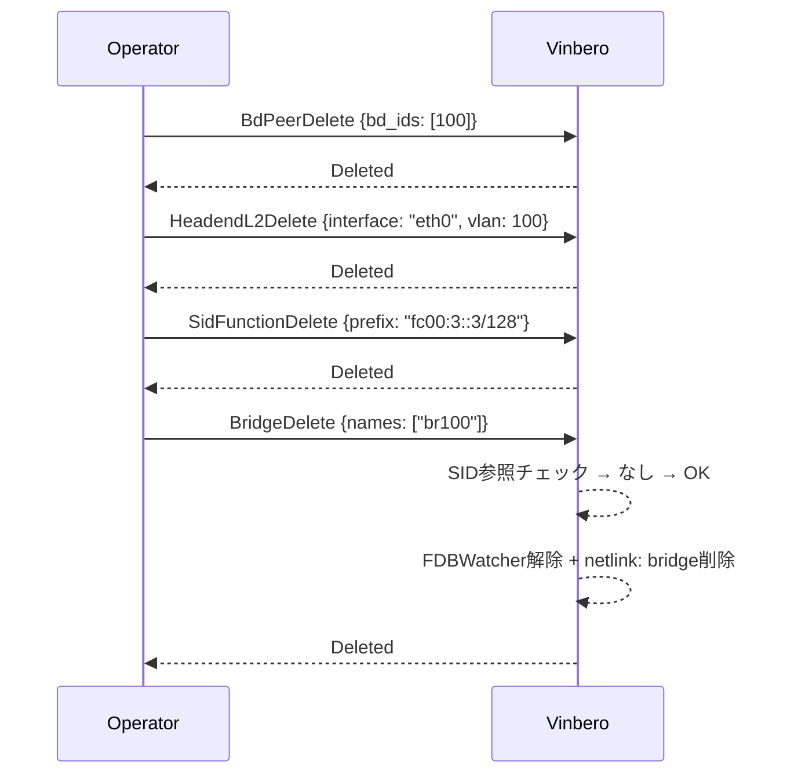
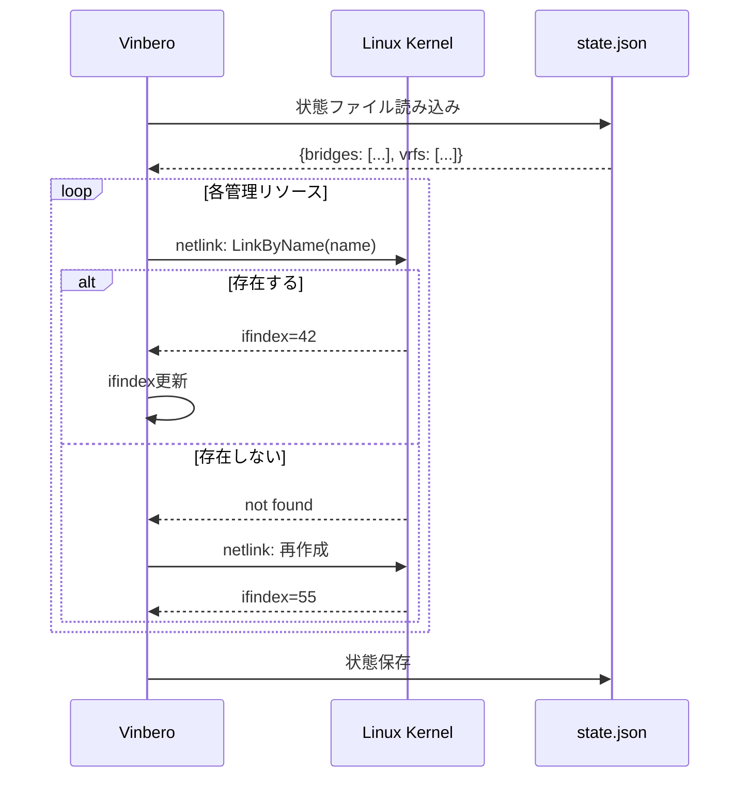

# API利用シーケンス

## L2VPN（P2MP）セットアップ

```mermaid
sequenceDiagram
    participant Op as Operator
    participant R1 as Router1 (Vinbero)
    participant R3 as Router3 (Vinbero)

    Note over Op,R3: Phase 1: ネットワークリソース作成

    Op->>R3: BridgeCreate<br/>{name: "br100", bd_id: 100, members: ["eth1"]}
    R3-->>R3: netlink: bridge作成 + member enslave + FDBWatcher登録
    R3-->>Op: Created

    Note over Op,R3: Phase 2: SID登録

    Op->>R3: SidFunctionCreate<br/>{prefix: "fc00:3::3/128", action: End.DT2,<br/>bd_id: 100, bridge_name: "br100"}
    R3-->>R3: bridge_name → ifindex解決 → BPF map書き込み
    R3-->>Op: Created

    Note over Op,R3: Phase 3: Headend L2 設定（両端）

    Op->>R1: HeadendL2Create<br/>{vlan: 100, if: "eth0",<br/>segments: ["fc00:2::1","fc00:3::3"], bd_id: 100}
    R1-->>Op: Created

    Op->>R3: HeadendL2Create<br/>{vlan: 100, if: "eth1",<br/>segments: ["fc00:2::2","fc00:1::2"], bd_id: 100}
    R3-->>Op: Created

    Note over Op,R3: Phase 4: リモートPE登録（両端）

    Op->>R1: BdPeerCreate<br/>{bd_id: 100, segments: ["fc00:2::1","fc00:3::3"]}
    R1-->>Op: Created

    Op->>R3: BdPeerCreate<br/>{bd_id: 100, segments: ["fc00:2::2","fc00:1::2"]}
    R3-->>Op: Created

    Note over Op,R3: L2VPN Ready
```

## L3VPN セットアップ

```mermaid
sequenceDiagram
    participant Op as Operator
    participant R3 as Router3 (Vinbero)

    Op->>R3: VrfCreate<br/>{name: "vrf100", table_id: 100,<br/>members: ["eth0"], enable_l3mdev_rule: true}
    R3-->>R3: netlink: VRF作成 + member enslave + l3mdev rule
    R3-->>Op: Created

    Op->>R3: SidFunctionCreate<br/>{prefix: "fc00:3::3/128",<br/>action: End.DT4, vrf_name: "vrf100"}
    R3-->>R3: vrf_name → ifindex解決 → BPF map書き込み
    R3-->>Op: Created

    Note over Op,R3: L3VPN Ready
```

## リソース削除

登録の逆順で削除します。依存関係がある場合はエラーになります。

```mermaid
sequenceDiagram
    participant Op as Operator
    participant V as Vinbero

    Op->>V: BdPeerDelete {bd_ids: [100]}
    V-->>Op: Deleted

    Op->>V: HeadendL2Delete {interface: "eth0", vlan: 100}
    V-->>Op: Deleted

    Op->>V: SidFunctionDelete {prefix: "fc00:3::3/128"}
    V-->>Op: Deleted

    Op->>V: BridgeDelete {names: ["br100"]}
    V-->>V: SID参照チェック → なし → OK
    V-->>V: FDBWatcher解除 + netlink: bridge削除
    V-->>Op: Deleted
```

## 再起動時のReconcile

```mermaid
sequenceDiagram
    participant V as Vinbero
    participant K as Linux Kernel
    participant S as state.json

    V->>S: 状態ファイル読み込み
    S-->>V: {bridges: [...], vrfs: [...]}

    loop 各管理リソース
        V->>K: netlink: LinkByName(name)
        alt 存在する
            K-->>V: ifindex=42
            V->>V: ifindex更新
        else 存在しない
            K-->>V: not found
            V->>K: netlink: 再作成
            K-->>V: ifindex=55
        end
    end

    V->>S: 状態保存
```
