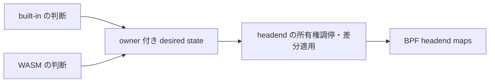

# Control plane plugin の責務整理と段階的移行

起点は `feature/cplane-plugin` の PR #171 マージ版です。
本書は [cplane plugin の現行設計](cplane-plugin.md) を置き換えず、実装する順序と
各段階の完了条件を記録します。現行の保証と、将来の保証は区別します。

## 目標と責務

独自 SRv6 behavior の判断を plugin へ渡し、転送状態の所有権、適用、復旧は
host が管理します。WASM / eBPF の分担と owner-scoped desired set は維持します。

| 層 | 責務 | 持たせない責務 |
|---|---|---|
| BGP / demux | 経路の正本から配送、behavior ごとの購読、再同期 | BPF map の書き換え |
| built-in / WASM | 観測した経路から必要な転送状態を計算 | 他 owner の状態の削除、直接の所有権移譲 |
| headend reconciler | 転送キーの正規化、所有権検査、差分適用、部分失敗後の再実行 | behavior の意味の解釈、BGP best path の選択 |
| cplane host | capability / scope / quota、instance と入力同期の管理 | guest に復旧手順の実装を要求すること（段階的に縮小） |
| resource inventory | owner と安定識別子の対応、残存資源との照合 | BGP RIB 自体の永続化 |

最終的な headend の経路は次の形にします。共通化するのは同じ転送キーに
適用する判断です。すべての protocol / map を一つの controller にまとめません。

## 維持する不変条件

- 実際の map key は address family と masked prefix。RD / peer / ADD-PATH ID は
  入力経路の識別子であり、別々の headend を作れる根拠にはしません。
- 別 owner の entry を上書き・削除しません。lease は早期検査、BPF owner map は
  最終検査です。起動前や別経路で書かれた entry も owner map で検査します。
- 空の desired set はその owner の削除要求です。欠けた snapshot を空集合と
  みなすことや、旧 instance の宣言を新 instance の宣言の後に適用することを防ぎます。
- apply は複数 map entry の atomic transaction ではありません。部分適用を報告し、
  残った entry の所有権を維持して、同じ宣言の再実行で収束させます。
- behavior claim の解除だけでは private behavior を通常の経路へ再解釈しません。
  PR #171 の既存経路の扱いを維持し、将来の移譲規則は別段階で明文化します。
- operator RPC の強制操作は明示的な例外です。通常の built-in / plugin に
  force-delete を所有権移譲の手段として与えません。

## 実装計画

### A1: 共通の headend 適用層（今回の実装）

状態: 実装済み。検証結果と残る環境依存の制約は実装 PR に記録します。

1. lease / quota error の共通型を `pkg/ownership` に、headend の desired-set
   reconcile を `pkg/headend` に切り出します。cplane の既存 Go API は薄い互換層を
   残し、WASM ABI / protobuf / BPF layout は変更しません。
2. daemon が一つの headend reconciler を作り、BGP applier と cplane manager に
   注入します。同じ owner の検査から書き込みまでを排他し、異なる owner の
   競合は共通 lease table で拒否します。plugin の全走査待ちを同期 BGP callback に
   持ち込まないよう、全 owner 共通の長時間 lock は設けません。
3. plugin の全量宣言・scope 縮小・unregister をその reconciler に通します。
   built-in は既存の増分更新を同じ reconciler の単一キー操作に通します。
   built-in の一経路更新を map 全走査へ置き換えることはしません。
4. 旧 RD 単位の VPN owner を移行する際も、観測した owner を指定して削除し、
   owner が変わっていれば拒否します。

この段階は「共有の適用層」までです。built-in の全量宣言化、採用されなかった
intent の保持、claim 変更時の自動移譲は A2 に残します。demux の builtinView と
擬似 withdraw は A1 では引き続き必要です。operator RPC は BPF owner 検査を
利用する既存経路のままで、共通 reconciler による排他の対象外です。

完了条件:

- 同じ prefix を built-in と plugin が宣言すると、別 owner の設定を変更せず
  競合を返す。built-in の lease がある場合は plugin の prune より前に拒否する。
- pinned / RPC entry のように lease が無い競合も、宣言全体の書き込み前に検査する。
- prefix の別表記、v4/v6、部分失敗、削除失敗を跨いでも lease が entry と対応する。
- built-in の削除成功後には plugin が同じキーを取得でき、その逆も成立する。
- 同一 reconciler に対する増分更新と全量宣言の競合を race 検査する。
- 既存 BGP multipath / claim / replay / scope / quota / harness テストが成功する。

### A2: desired state に基づく headend の採用判断

依存: A1。

VPN headend を最初の対象に、built-in の経路集約結果も owner 付きの宣言にします。
入力 path の集合、ECMP group の寿命、headend trigger の依存関係を分けて表現します。
未採用の intent を保持し、経路更新がなくても採用条件の変化で再評価できるようにします。

採用規則は実装前に次を固定します。

- 一つの forwarding key に通常 behavior と private behavior が共存した場合。
- plugin 未起動・restore 失敗・claim 縮小時に、既存 intent を保持するか無効化するか。
- 解釈不能な behavior の扱いと、明示的に許可する fallback の条件。
- entry / ECMP group の作成順序、撤去順序、途中失敗からの再試行。

完了条件: PR #171 の切替・multipath 回帰テストを共通の採用層で満たした後、
demux の擬似 withdraw / builtinView のうち不要になった部分を除去すること。
先に配送履歴だけを削除する移行はしません。

### B: daemon 再起動後の local SID と所有資源の復元

A1 と独立に設計可能。A2 / C の依存する resource status と表現を揃えます。

module 登録の保存、SID の名前と address の対応、kernel の実状態を別々に扱います。
`owner / name / locator / SID` と復旧に必要な dispatch 情報を版付きで記録し、
起動時に pinned entry と照合します。`pin_maps: false` でも名前の対応を保持するかは
保存設定として明記します。登録 module の保存だけで SID 安定性を保証したことにはしません。

disk と kernel の同時 commit はできないので、資源変更の intent を保存し、
適用し、完了を記録する順序と、各境界で停止した場合の再開手順を決めます。
不明な entry は勝手に adopt せず、復旧待ちの資源として可視化します。
scope 縮小・unregister は guest の最初の再宣言前でも owner inventory を参照します。

完了条件: daemon 再生成、保存失敗、map 適用失敗、scope 縮小後の restore を
組み合わせても別 owner に資源を渡さず、SID の継続または拒否理由が説明でき、
再宣言前の unregister で対象 owner の残存資源を回収できること。

### C: 宣言の受付と設定反映の分離

依存: A1。A2 の採用規則と B の資源状態に合わせて実装します。

guest の call budget で測る処理から、host の map 全走査と適用待ちを分離します。
owner / kind ごとに最新の宣言を上限付きで保持し、受理世代と適用済み世代を返します。
instance 世代、入力の再同期世代、宣言世代は別の値として扱います。

受理は適用成功を意味しません。`Accepted / WaitingForDependency / Applied / Failed`
と理由を host が公開し、local SID の実体化後に広告し、撤去時は広告を先に止める
依存関係を管理します。古い世代の完了通知は現行状態を書き換えません。

完了条件: 遅い writer を混在させても、他 guest が lock 待ちのために実行予算を
使い切らないこと。キュー上限、世代の追越し、途中失敗、依存資源の遅延を検証します。

### D: SDK の再同期支援と運用状態

依存: C の状態・世代契約。SDK の経路 view helper は先行して実装できます。

path identity、start/end of replay、snapshot 中の宣言保留を SDK にまとめます。
host は宣言に使った入力が同期済みかを扱い、stats に同期状態・最終適用時刻・
未適用世代を出します。既存の drop / restart / pending カウンタを置き換えません。

fail-static はネットワークの変化を反映しなくなる選択なので、状態の鮮度を表示し、
behavior ごとの保持・停止方針を明文化します。一律の TTL withdraw は導入しません。

完了条件: 二つ目の実用 plugin が独自の replay 復旧処理を書かずに実装でき、
過負荷・restart・欠落した withdraw から収束すること。

## 検証と変更の出し方

A1 は設計書と実際に接続された共通層を一つの PR にします。以降の段階は
それぞれ独立した PR とし、完了条件を満たした箇所だけ状態を更新します。
EVPN / MUP の任意 map 宣言への拡張は本計画に含めません。

Go の対象 package と cplane harness のテスト、race 検査、全 package の build、
lint を行い、PR の CI で kernel / integration テストを確認します。
BPF bytecode、ABI、insn pin を変更する場合は別途その検証範囲を計画に追加します。
