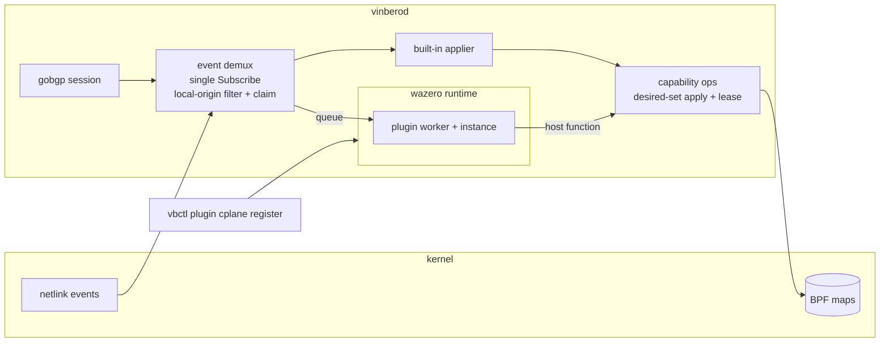

# Control plane plugin

Vinbero の control plane を第三者が拡張するための機構です。data plane
plugin が eBPF bytecode を受け取るのに対し、control plane plugin は
WebAssembly module を受け取ります。どちらも daemon に upload され、登録時
に検証され、宣言した capability と scope の範囲でだけ動きます。

## 何のためにあるか

オペレータが独自の SRv6 endpoint behavior を持ち込み、ネットワークとして
機能する状態までを plugin だけで完結させることが目標です。

1. 転送は data plane plugin が endpoint slot に実装します。これは既存の
   plugin SDK でできます。
2. control plane plugin がその behavior codepoint を claim します。
3. plugin が local SID を要求します。host が locator から address を確保
   し、plugin の slot を指す dispatch entry を書き、address を event で
   plugin に返します。名前は plugin が付け、値は host が選びます。記憶を
   失って戻ってきた plugin が同じ名前を宣言すると同じ address が返ります。
4. plugin がその SID を SID TLV に自分の codepoint を載せて広告します。
5. 対向でその経路を受けた plugin が headend の状態を宣言します。
6. Vinbero 自身の applier はその経路を見ません。codepoint を見ずに service
   SID から entry を作るので、知らない codepoint を素の SID と誤読して
   しまうためです。

これで両ノードは Vinbero も BGP も知らない behavior で通信します。実例は
`sdk/examples/cplane-custom-behavior` にあり、この 6 段を実装しています。

新しい AFI/SAFI は要りません。endpoint behavior は SID TLV の中の 16bit
codepoint なので、独自 codepoint の広告は vpnv4 や EVPN といった既存
family にそのまま載ります。

## 全体像



## 経路の配送

gobgp の watch は daemon ごとに 1 回しか開けません。Subscribe ごとに
current=true の WatchEvent が開き、2 回目は loc-rib を後から attach した
consumer へ replay してしまいます。そこで daemon が唯一の subscription を
持ち、consumer は demux (`pkg/bgp/demux`) に登録します。

demux が引き受ける規則は 2 つです。

- local-origin path を live stream と snapshot replay の両方で落とします。
  plugin が広告を始めると自ノードの経路が post-policy stream に還流し、
  consumer が self-pointing な状態を作ってしまうためです。
- consumer が宣言した family だけを配ります。

配送は plugin ごとの worker goroutine で行います。demux の handler は BGP
watch goroutine で走り、そこは block してはいけない契約です。call budget
いっぱい使う plugin が 1 つあると built-in applier を含む全 consumer が
止まるので、handler は queue に積んで返ります。queue が溢れた分は drop
して数えます。`Manager.DroppedEvents` で確認できます。

drop は plugin の view に穴を空けます。desired set を宣言する consumer に
とってこれは遅延より悪く、次の宣言が見えていない状態を prune します。
そこで drop は snapshot debt として記録し、rib から view を作り直します。
replay は plugin ごとに 1 本だけ走らせます。2 本が 1 つの queue に押し込む
と順序が無く、古い copy が新しい copy の後に届いて plugin が古い値を持ち
続けます。drop している plugin は定義上遅いので、drop ごとに replay を
起動すると積み上がりもします。実行中に来た要求は debt を立て直し、完了後に
返します。
snapshot の配送は drop せず block します。replay は BGP watch goroutine
ではないので block してよく、一部を落とすと目的そのものを損ねるためです。
snapshot も live と同じ queue を通すので、両者の順序は保たれます。

replay の先頭には start of replay の event を置きます。replay は何が在る
かを述べる手段であって、何が無くなったかは述べられません。plugin が聞いて
いない間に withdraw された経路は replay に現れないので、view を持ち越すと
その経路を宣言し続け、以後どの event でも消えません。start of replay を
受けた plugin はその source について知っていることを捨て、続く event から
組み立て直します。これで replay が merge ではなく修復になります。宣言は
end of replay まで待ちます。replay の最中に空集合を宣言すると、その間だけ
転送が落ちるためです。

## behavior の claim

plugin は登録時に claim する codepoint を宣言します。claim 済みの経路は
built-in applier に配りません。

- claim は all-or-nothing です。途中で失敗した plugin が behavior を半分
  だけ持つ状態を作りません。
- 衝突は配送時ではなく登録時に弾きます。
- codepoint 0 は behavior 無しの意味なので claim できません。
- 標準化済みの codepoint は claim できません。受信側は codepoint を見ずに
  service SID から entry を作るので、Vinbero が originate しない End.DT46
  や End.DX4 も現在正しく扱えています。それらを claim 可能にすると本物の
  L3VPN 経路が built-in から逸れます。運用上の規則は「標準 codepoint は
  Vinbero のもの、plugin は割り当て外の codepoint を使う」です。

withdraw には path attribute が一切載りません。BGP は消える NLRI しか
送らないので、advertise 時の behavior は経路が消えるときの wire に存在せず、
そのままでは claim が advertise 側にしか効きません。demux は ledger を
持ち、claim 済み behavior の advertise はその NLRI と path を記録し、記録の
ある path の withdraw を claim 済みとして扱います。記録は path 単位です。
route reflector 2 台や ADD-PATH では 1 つの NLRI が複数 path で届いて複数回
withdraw されるためです。

## plugin が書ける面

`bpf.MapOperations` は 101 method の全能オブジェクトなので plugin には
渡しません。capability ごとに narrow interface を切り、宣言した capability
に対応する host function だけを link します。宣言に無い能力は「呼べない」
のではなく存在しません。

書き込みの基本形は owner ごとの desired-set apply です。plugin は望ましい
集合を丸ごと宣言し、core が現状との差分を計算して適用します。core だけが
差分を持つので、途中で死んだ plugin は同じ集合を宣言し直すだけで収束し、
順序付き編集列のどこまで送ったかを覚える必要がありません。

apply は transaction ではありません。BPF map に複数 entry を atomic に書く
手段が無いため、途中失敗は前の write を残します。冪等なので retry で収束
します。順序は prune を先に回し、貼り替え中の prefix が二重に存在する瞬間
を作りません。

同一 key を 2 owner が書く状況は宣言時に fail-closed で弾きます。desired
set は owner ごとに差分を取るので、2 owner が同じ key を宣言すると互いに
自分の集合としては一貫した view を持ったまま 1 つの map entry を奪い合い
ます。BPF map については per-entry owner map が最終的な enforcement で、
lease は早期に、相手の名前を添えて落とすための前線です。

owner と lease が扱うのは同じ key の奪い合いだけです。他人の key に触れずに
それより強い key を作る形は別の問題で、scope の章で扱います。

## ABI

境界を渡るのは linear memory 上の byte buffer で、構造は protobuf が持ち
ます (`proto/vinbero/v1/cplane_plugin.proto`)。buffer は guest 所有で、host
は guest の alloc に確保させてから書きます。呼び出しが返った後、host は
guest memory への参照を持ちません。linear memory は grow で移動しうる
ためです。

guest が export するもの。

| export | 意味 |
|---|---|
| `vinbero_abi_version() -> i32` | 対応する ABI version。不一致は登録時に拒否 |
| `alloc(size) -> ptr` | host が書き込む領域を確保 |
| `free(ptr, size)` | 領域を解放 |
| `configure(ptr, len) -> i32` | operator 設定を受け取る。省略可 |
| `handle_events(ptr, len) -> i64` | event batch を処理。戻りは status の (ptr, len) |
| `on_tick(now_ns)` | 定期呼び出し。省略可 |
| `_initialize()` | reactor initializer。言語 runtime が使う |

host が提供するもの。すべて `vinbero` module から import します。

| host function | 意味 |
|---|---|
| `log(level, ptr, len)` | daemon log へ出力 |
| `now_monotonic() -> i64` | 単調増加の ns |
| `apply_begin(kind) -> i64` | desired-set transaction を開く (headend v4/v6、advertise、local SID) |
| `apply_put(gen, ptr, len) -> i32` | 宣言の chunk を積む |
| `apply_commit(gen) -> i32` | 差分を適用する |
| `apply_abort(gen)` | transaction を捨てる |

`log` と `now_monotonic` は determinism をあえて壊す穴です。sandbox には
stdout も filesystem も無いので log が無いと plugin 作者に調査手段があり
ません。clock が無いと liveness 系のロジックが書けません。それ以外の
非決定入力は必要になるまで足しません。

## capability

plugin は登録時に何をしてよいかを宣言し、host はそれが覆う host function
だけを link します。link は 2 段のうちの粗い方です。何も書けない plugin に
は apply 関数がそもそも link されず、呼ぶと失敗するのではなく到達できない
関数になります。書ける plugin に対しては、apply 関数が宣言の種類をまたいで
共有なので、種類ごとの判定を transaction を開くところで行います。

| capability | 許すこと |
|---|---|
| `headend` | headend の encap entry を宣言する |
| `advertise` | BGP 経路を originate する |
| `local_sid` | locator から SID を確保し自分の slot に向ける |

`log` と `now_monotonic` は常に link します。どちらも状態を変えず、無いと
plugin 作者が何も調べられなくなるためです。

desired-set の apply 関数は宣言の種類をまたいで共有なので、link は「何か
1 つでも書ける capability があるか」で決まります。種類ごとの判定は
transaction を開くところで再度行います。これが無いと advertise だけを
granted された plugin が同じ扉から headend の transaction を開けます。

何も granted されていない plugin も登録できます。観測と log だけをする
plugin は実際に有用で、それが capability を宣言しなかった plugin の安全な
既定です。

## scope

capability は種類しか絞りません。どこに書いてよいかを決めるのが scope で、
両方が揃わないと plugin は何も書けません。scope を宣言しなかった登録は、
capability が何であれ観測と log だけをする plugin になります。

scope が必要なのは、owner tag と lease が守るのが「他人が持っている鍵を
上書きしないこと」だけだからです。この 3 面はどれも、他人の鍵に触れずに
それより強い鍵を新しく作れます。headend map は LPM trie なので長い prefix が
lookup に勝ち、VPN 経路は受信側の PE で more specific が勝ちます。所有は
object 単位の性質なので、この形は表現できません。

| 宣言 | 範囲 | 理由 |
|---|---|---|
| `local_sid` | locator 名の集合 | 宣言が locator 名を持ち、割り当ては `pkg/locator` が管理する |
| advertise の vpnv4 と vpnv6 | VRF 名の集合 | RD と RT を binding から導出する |
| advertise の ipv6_unicast | 許可された locator の配下 | plugin がここで広告する正当なものは自分の SID である |
| `headend` | trigger prefix の list | 縛れる名前が存在しない |

加えて、plugin が所有する PROG_ARRAY slot を宣言します。headend は v4 と v6 の
map が別の PROG_ARRAY で slot 番号を共有するので、grant も別にします。v4 の
slot 16 を渡しても v6 の slot 16 は渡しません。endpoint は 1 つです。plugin A が
plugin B の slot に entry を向けると、B の program は A の aux bytes を自分の
layout として読むためです。

slot は plugin をまたいで排他にします。同じ slot を 2 つの plugin に渡すと、
一方の SID がもう一方の program に dispatch して aux を取り違えるので、behavior
claim と同じく登録時に拒否します。locator も同じく排他にします。VPN や
ipv6_unicast の広告で SID を locator 配下に閉じ込める抑えが安全なのは、その
locator が 1 つの plugin だけのものであるときだけで、共有した locator では別の
plugin や built-in service SID の配下を指す広告を止められないためです。slot と
locator の排他はどちらも登録時に拒否します。prune や restore に失敗した plugin は
running registry から外れますが、state と claim を map に残したままなので、その
slot と locator も forget されるまで予約し続けます。そうしないと別名の plugin が
同じ grant を取り、残存 state と衝突するためです。prefix scope は排他にしません。
operator が意図的に重ねることがあり、実際の衝突は per-entry の owner と lease が
調停します。

locator の排他は名前で見ます。別名で prefix を入れ子にした locator を別々の
plugin に渡すと、広い locator を持つ plugin が狭い locator 配下の SID も
`Contains` 判定で広告できてしまいます。prefix の重なりの調停は locator の登録側
(`pkg/locator`) の領分で、scope が名前しか持たない登録時には実 prefix が未登録の
こともあるため、ここでは名前の排他に留めます。operator は入れ子の locator を
別々の plugin に割り当てないことを前提とします。

### VPN 広告は照合ではなく導出

plugin は VRF 名だけを宣言し、RD と RT は host が binding から埋めます。
輸入を決めるのは RD ではなく RT なので、RD だけを照合しても余分な RT を
付ければ束縛されていない VRF に経路を注入できます。導出にすると、その経路が
構造として消え、RD の表記揺れを scope 側で正規化する必要も無くなります。
宣言に RD や RT が入っていたら、黙って無視せず拒否します。

binding が受信専用で RD を持たない場合は、その VRF への広告を拒否します。
operator が選んでいない RD で経路を出すことになるためです。同じく、binding が
その family の export RT を 1 つも持たない場合も拒否します。RT が空だと誰も
import しない経路になり、成功したように見えて誰にも届かないためです。

RT の導出が決めるのは経路を誰が import するかで、経路が実際にどこへ向かうかは
prefix-SID TLV の SRv6 SID が決めます。導出だけでは、VRF blue に scope された
plugin が blue の prefix を VRF red の service SID の裏に広告して blue の traffic を
red へ流せます。そこで VPN 経路の SID も、plugin に渡した locator の配下に
限ります。ipv6_unicast の prefix を locator に閉じ込めるのと同じ抑え方です。
next hop や grant 内の segment を縛らない理由は、次の節でまとめます。

### scope が縛る軸と grant 内の自由

scope が縛るのはどの traffic を扱えるかで、grant の中で経路がどこへ向かうかは
縛りません。この線引きは意図したもので、境界を跨げる値だけを scope で抑えます。

next hop はこの grant 内の自由に当たります。VPN 経路の next hop は import した
peer が到達性を解決するためのもので、encap source は locator address であって
BGP transport とは限らず、daemon に妥当な推測がありません。next hop を locator に
縛ると正当な interop 構成を壊すため、元の挙動のまま自由にします。VPN SID を
locator に閉じ込めたのは、SID が別 VRF の decap の裏へ逃げて scope の VRF grant を
跨げるからで、next hop にはその跨ぎがありません。

同じ理由で、plugin が渡された locator の配下に組む segment list の中身も grant 内の
自由です。segment はすべて自分の locator に属し、他人の VRF や locator へ抜ける
出口が無いので、個々の segment を scope で照合しません。segment list が built-in
state の layout を跨いで別 VRF の decap を起こせるのは data plane half の話で、
これは scope ではなく shared map の partition と aux discriminator で抑えます
(後述の data plane 境界の節)。

binding の `MaxPrefixes` は plugin の広告にも適用します。VRF を渡すことが
無制限の VRF を渡すことにならないようにするためです。

binding は plugin が動いている間に operator が編集するものなので、導出した値は
binding が変わった時点で再導出します。unbind も同じで、binding が消えた VRF の
経路は wire から降ろします。RD と RT と上限は宣言を適用した時点で
刻まれるため、これが無いと export RT を変えても plugin が次に宣言し直すまで
古い RT を載せた path が wire に残ります。event 駆動の plugin は長く宣言し直さ
ないことがあります。宣言経路では範囲外を集合ごと拒否しますが、この再導出では
上限を超えた分を withdraw します。operator が上限を下げたときに拒否すると経路が
全部残り、頼んだことと逆になるためです。

### headend だけ prefix で縛る

`headend_v4_map` の key は `lpm_key_v4` で prefixlen と addr しか持たず、
VRF も locator も key に入りません。名前で縛れる対象が無いので、operator が
prefix を並べます。未指定なら headend の宣言を拒否するので、`::/0` の
catch-all は書けません。

将来は「claim した behavior で自分に配送された経路の prefix」を scope の
要素として並べられるようにする余地を残しています。いまは採っていません。
demux の絞り込みが family と claim だけで import RT を見ないため配送集合が
built-in の処理対象より広く、withdraw で縮み restart で作り直す派生状態でも
あるからです。

### 検査する場所

scope は chunk を decode した時点ではなく、集合を apply する時点で検査します。
scope が参照する locator と VRF binding は daemon 起動後に RPC で登録される
ので、restore された plugin がそれらより先に宣言するのは普通に起きます。
apply 時に失敗させれば、既存の retry 機構がそのまま修復に使えます。

範囲外の要素が 1 つでもあれば集合ごと拒否します。宣言は集合についての表明
なので、残りを適用すると plugin が求めていない状態を入れることになります。

### scope を狭めたとき

狭める操作だけは desired-set の模型では直りません。plugin が同じ宣言を
続けると集合ごと拒否されるので reconcile が走らず、広い scope の下で書いた
状態が残ります。そこで登録の時点で host が範囲外の状態を prune します。再登録に
限らず restore でも走らせます。daemon 再起動をまたいだ状態は pinned map に残って
おり、狭い scope で restore した plugin はそれを 1 つも触れないためです。
実装は「まだ許される部分集合を desired set として apply する」形で、残りは
既存の reconcile が落とします。

manifest の format version は 2 です。scope は認可情報なので、scope を持たない
version 1 の manifest (scope 導入前の build が書いたもの) を空 scope で restore
すると、その plugin が書いた転送状態を boot 時に消してしまいます。そこで version 1 は
restore を拒否し、状態を pinned のまま残して plugin を unrestored に落とします。
この機構は未リリースなので migration は用意せず、plugin store をクリーンにしての
起動を upgrade の前提とします。behavior claim は version に関係なく予約するので、
その codepoint の経路は built-in に渡らず withhold されます。

prune に失敗したら登録も失敗させます。成功を返すと、実際には効いていない認可
境界が効いていると言うことになるためです。このとき store と claim と registry が
食い違わないよう、1 つの結末に揃えます。新しい登録を persist するので、再起動時の
restore が prune を再試行し、広い scope へ戻りません。behavior claim は新しい集合の
まま残します。plugin は死んでも書いた状態は map に残るので、その codepoint の
経路は built-in applier へ渡さず withhold し続けます。plugin は running registry から
外して unrestored に記録するので、running と unrestored に二重に載らず、operator は
`forget` で諦められます。

### data plane 境界と aux

plugin の local SID の aux (`aux_raw`) は plugin が並べた bytes で、`sid_aux_entry`
という union に載ります。この union は SID の action で判別され、built-in behavior は
自分の variant として読みます。End.DT4 は先頭 4 byte を VRF ifindex として読み、
End.B6 は segment list 全体を読みます。plugin の data plane half は任意の built-in
slot へ tail call できるので、そのまま渡すと built-in が plugin の bytes を自分の
layout として解釈し、scope の VRF grant を破って任意の VRF へ decap できます。

そこで built-in の aux 参照を分けます。built-in 用の lookup は、処理中の SID の
action が plugin slot 域 (endpoint なら 32 以上) なら aux を NULL にします。plugin の
handoff で built-in に入ったときは aux を読まず、aux 無しと同じ fallback (End.DT4 なら
ingress ifindex) に落ちます。plugin が自分の program で自分の aux を読む経路は
そのままなので、plugin の aux は plugin だけが解釈します。

## claim と built-in state の関係

claim は demux が経路を配る先を決める述語なので、claim が立つ前に届いた
経路は built-in applier が処理してしまいます。built-in は service SID を
behavior を読まずに解釈するため、plugin 用の codepoint を持つ経路も普通の
service SID として自分の owner で install します。plugin が同じ prefix に
書こうとすると owner が衝突して弾かれます。

そこで claim の取得と解放を、経路の流れと突き合わせます。

- 起動時は、store にある plugin の behavior を demux の start より前に予約
  します。start は rib の replay を伴うので、予約が後だと必ずこの窓に入り
  ます。restore に失敗した plugin の claim は保持します。Register 自身は
  失敗時に claim を巻き戻しますが、これは operator の登録に対して正しい
  挙動で、restore は事情が違います。予約は「実装するものが無い codepoint の
  経路を built-in に渡さない」ために取ったものなので、巻き戻しをそのままに
  すると誤った意味での install に戻ります。
- claim 取得後の retract は、plugin が build されて subscribe まで済んでから
  行います。retract は元に戻せない副作用なので、admission で弾かれた module の
  ために既存の経路を built-in から消してしまうと、実装するものが無いまま
  取り残されます。
- unregister では claim を解放しますが、その経路を built-in に流し直すこと
  はしません。plugin が実装していた behavior を実装できるものはここには無く、
  built-in にとって private codepoint はただの service SID なので、渡せば
  claim が防いでいたはずの誤った意味での install になります。理解していた
  唯一のものを外した以上、それらの経路が転送されなくなるのが正しい帰結です。
- restore に失敗した plugin の claim は解放しません。解放すると built-in が
  実装できない codepoint の経路を service SID として install してしまいます。
  黙って誤った転送をするより、operator が直すまで転送されない方がましです。
  claim を保持したことは warning に出します。restore に失敗した plugin は
  `vbctl plugin cplane stats` に別枠で出します。動いていないのに daemon は
  その state と claim を持ち続けるので、running な plugin だけを見せると
  「単に居ない」ようにしか見えません。戻ってこないと判断したら
  `vbctl plugin cplane forget` で claim と store の登録を落とせます。map に
  残った state には触れません。それが何のためのものかを daemon は知らない
  ためです。

- claim を取った時点で、rib の中にその behavior を持つ経路があれば、
  built-in applier に withdraw として配り直します。claim は本来これから
  届く経路の行き先しか決めませんが、先に届いた経路は既に built-in が
  service SID として自分の owner で install しており、plugin が同じ prefix
  に書こうとしても owner が衝突して弾かれます。残るのは誤った意味の entry で、
  それがトラフィックを運びます。withdraw は applier が普段から扱う経路なので、
  それぞれが何をどう保持しているかを demux 側が知る必要はありません。claim は
  plugin を build する前に取るので、最初の宣言時には prefix が空いています。
  この配り直しは withdrawal ledger には記録しません。記録すると後から来る
  本物の withdraw を処理済みと誤判定します。

## 広告の所有権

lease は plugin どうしの所有権を調停します。その下にもう 1 枚あり、gobgp
session は 1 つの NLRI につき local path を 1 本しか持たないので、経路を
出した producer を記録します。plugin ごとに別の producer 名を与えるので、
lease と producer は失敗の仕方が違います。lease 衝突は何も送る前に拒否され、
producer 衝突は誤って lease を手放したときに他の plugin の経路を守ります。

session は auto-advertise の exporter や operator の RPC とも共有なので、
vinbero 自身の originator にも producer 名を与えています。exporter は
`vinbero:export`、operator の RPC は `vinbero:operator` です。片方が routing
table に従って出す経路で、もう片方は operator が明示的に頼んだ経路なので、
同じ名前にすると後から出した方が黙って上書きし、上書きされた側は広告中の
つもりのまま残ります。plugin の producer 名は owner tag なので、`vinbero:`
前置と衝突しません。

producer 名を持つ view は、名前を載せられる surface だけを提供します。
session を embed すると EVPN と MUP と SR Policy の interface も満たして
しまい、それらの method は producer を運ばないので無名で書きます。compiler
は黙って通すので、embed しない形にしています。

session 側で producer を記録し、withdraw は自分が出した経路にしか効かない
ようにしています。これが無いと、後から届いた withdraw が別の producer の
生きた経路を消し、消された側は広告し続けているつもりのままになります。

重複した advertise も拒否します。1 NLRI に 1 path しか無いので、上書きは
先に出した producer の UUID を捨てることになり、後から出した側が withdraw
すると経路自体が消えるのに、先に出した側は広告中のつもりで戻しません。
先に出した方が保持し、拒否された側には理由を返します。

## 既知の限界

reconcile は owner の現在の集合を map の全走査で求めます。lease 表は同じ
情報を持っているので置き換えられますが、置き換えていません。全走査は
lease と entry がずれたときにそれを捕まえる唯一の場所でもあり、本設計の
review で実際に見つかった不具合はどれもそのずれでした。速さのために backstop
を外す判断は、いまの証拠と逆を向いています。

その結果、reconcile の時間は map の大きさに比例します。reconcile は plugin
をまたいで applyMu で直列化され、guest の call budget は host を待つ時間も
数えるので、大きな map と多数の plugin が揃うと、隣の plugin の reconcile を
待つ間に自分の budget が尽きて instance を失うことがあります。budget 超過は
instance を作り直して収束するので転送は保たれますが、隔離としては不完全です。
map が大きい環境で plugin を多数動かす場合は、call budget を map の規模に
見合う値に上げてください。

binding の `MaxPrefixes` は、plugin の広告と auto-advertise の広告を別々に
数えます。exporter の経路数は `pkg/bgp/export` の側にあってここからは見えない
ためで、両方が動く VRF はそれぞれの上限まで持てます。

EVPN と MUP と SR Policy の advertise は producer 名を持ちません。SR Policy と
MUP は書き手が 1 つしか無いので分けるものがありませんが、EVPN は
auto-advertise の exporter と operator の RPC の 2 つがあり、いまは同じ無名の
producer です。さらに EVPN の withdraw は producer を見ずに path を消すので、
名前を付けるだけでは足りず withdraw 側の作り直しが要ります。別の変更として
残しています。

conformance harness は scope のうち daemon 無しで判定できる部分だけを見ます。
prefix が locator に含まれるかと、VRF に binding があるかは daemon の状態に
依存するので harness では判定しません。harness には scope を operator と同じ
文字列の形で渡し、`ParseScope` を通します。daemon が拒否する scope (4-in-6 の
prefix や範囲外の slot) は harness でも拒否され、harness が daemon より緩くなる
のを防ぎます。

restore-time の prune は headend map しか読みません。`LiveSIDs` と `LiveRoutes` は
in-memory の集合を読むので、再起動直後は空で、前の run が確保した local SID や
広告経路は prune の視界に入らず orphan になります。local SID は plugin が次に
local SID を宣言したときの sweep で片付きますが、scope を狭められた plugin は
その宣言をしなくなるので、それまで残ります。map から owner ごとに読む形へ広げるのは
繰越しです。

## 登録時の検証

module は allowlist で検証します。

- import は `vinbero` module からのみ。WASI はこの規則で弾かれます。
- memory は guest が定義して export する 1 つだけ。imported memory は拒否。
- 必須 export が signature まで一致すること。
- ABI version が一致すること。
- `_start` の自動実行は無効化し、reactor initializer だけを host が明示的
  に呼びます。

capability と scope の食い違いも登録時に弾きます。`headend` を granted しな
がら headend prefix を並べていない登録は、plugin が動いて宣言し、その宣言が
全部拒否されるという形で失敗します。壊れた plugin のように見えるので、
operator の手元で断ります。

## lifecycle

- 同名での再登録は in-place upgrade です。古い instance を止めて新しい
  ものを同じ owner tag で始めるので、古いものが書いた状態は残り、新しい
  module が宣言し直して差分が吸収されます。
- plugin が configure から宣言した内容は、登録が成立するまで保留します。
  configure は instantiate の途中で走るので、そこで適用すると instantiate
  が失敗したときに誰も消せない state が残ります。upgrade では更に悪く、
  失敗した新 instance は走行中の旧 instance と同じ owner tag を持つので、
  その宣言が生きている plugin の entry を prune します。
- unregister は意図的な撤去なので owner の状態ごと消します。順序は配送
  停止、instance close、状態削除です。
- trap や budget 超過では状態を消しません。instance を作り直し、rib の
  snapshot を配ってから収束させます。新しい instance は何も覚えていない
  ので、replay しないと最初の宣言が restart 後に届いた event だけの集合に
  なり、それ以外の entry を全部 prune します。連続失敗が上限を超えたら
  状態を残して止めます。上限は連続失敗の数で、成功配送でリセットします。
- daemon の shutdown では flush しません。
- unregister は flush が成功してから claim と store を手放します。先に
  手放すと、flush が失敗したときに retry する手段が無くなります。claim を
  先に返せば plugin の state が残ったまま経路が built-in に戻り、store を
  先に消せば再起動しても後始末をする plugin 自体が居なくなります。flush が
  失敗した plugin は registry に戻すので、operator が retry できます。
- upgrade は、走っている plugin に触る前に subscribe まで済ませます。
  subscribe が失敗する可能性がある間に旧 instance を止めると、demux に
  断られただけでどちらの版も登録されていない状態になり、閉じた旧
  instance は復元できません。subscribe から旧 instance の停止までの間は
  同じ名前に 2 つの subscription がありますが、handler は名前で plugin を
  引くので配送先は 1 つで、重複した event は desired set が吸収します。
- instance の入れ替えでは、instance に属する状態を作り直します。宣言した
  SID の address を伝えたかどうかの記録がそれで、引き継ぐと交代した
  instance は自分の持つ SID を知らないまま広告できなくなります。publication
  も同じで、交代中の宣言は保留し、instantiate が失敗したら適用しません。
  これが無いと、起動に失敗した instance の空宣言が前の instance の state を
  prune したまま残ります。
- 宣言には commit 順の番号を振り、同じ kind でより新しい宣言が適用済みなら
  古い方は適用しません。宣言は集合そのものの宣言なので、retry や staged の
  drain で古い集合が新しい集合を上書きするのを防ぎます。
- publication は snapshot の後に行います。宣言はそれまで保留されるので、
  最初に適用される宣言は queue にたまたま入っていた event ではなく network
  全体を述べたものになります。desired set を宣言する plugin にとって、この
  違いは収束するか自分の持ち物を全部 prune するかの違いです。
- publication は snapshot の後に行います。宣言はそれまで保留されるので、
  最初に適用される宣言は queue にたまたま入っていた event ではなく network
  全体を述べたものになります。desired set を宣言する plugin にとって、この
  違いは収束するか自分の持ち物を全部 prune するかの違いです。
- 公開前に宣言され、公開時に適用できなかった transaction は捨てずに保持し、
  次の配送の前に再試行します。保留されている数は stats に出し、最初の失敗は
  warning に出します。何かを待っている plugin は、配送の counter だけ見ると
  暇な plugin と区別が付きません。保留されている数は stats に出し、最初の失敗は
  warning に出します。何かを待っている plugin は、配送の counter だけ見ると
  暇な plugin と区別が付きません。restore された plugin は daemon の起動途中に
  configure から宣言するので、operator が後から RPC で登録する locator を
  名指しした宣言はその時点では失敗します。plugin は言うべきことを既に言い
  終えているため、再試行が無いと SID と広告が restart から戻りません。

wazero に fuel metering はありません。走っている guest を止める手段は
context の cancel だけで、それは module を閉じます。よって budget 超過は
call ではなく instance を失います。budget を call 単位にしているのはその
ためです。

instantiate 自体も同じ budget の下で走らせます。WebAssembly の start
section は spec 上 instantiate 中に実行されるので、これも guest の code
です。budget を掛けないと、start section で無限 loop する module が登録を
永久に止め、operator の RPC が返りません。

## 運用

```sh
vbctl plugin cplane register --name custom-behavior --wasm plugin.wasm \
    --behavior 0xFE01 --family vpnv4 \
    --capability headend --capability advertise --capability local_sid \
    --locator main --vrf vpn-a \
    --headend-prefix 10.7.0.0/16 --endpoint-slot 33
vbctl plugin cplane list
vbctl plugin cplane stats
vbctl plugin cplane unregister --name custom-behavior
```

capability と scope はどちらも省略できますが、片方でも欠けた plugin は何も
宣言できません。observe と log しかしない plugin はそれで正しく、宣言する
plugin には両方を与えます。`stats` は動いている plugin と、restore に失敗して
claim だけ残っている plugin の両方を出し、scope は本体の表とは別の block に
出します。後者は `vbctl plugin cplane forget --name <plugin>` で落とせます。

behavior は 10 進でも 0x 前置でも書けます。RFC 8986 は codepoint を hex で
振っているので、0x0013 を 10 進の 13 と読むと別の behavior を claim して
しまいます。

## plugin を書く

例は `sdk/examples/cplane-custom-behavior` にあります。TinyGo で書いて
います。生成された Go binding は reflection を要求し、TinyGo の WebAssembly
target はそれを持たないので、protobuf codec は手書きです。

daemon 無しで試すための harness が `sdk/go/cplaneharness` にあります。
daemon と同じ runtime を回し、capability 面だけ記録用に差し替えます。
replay、restart、commit 拒否といった本番で耐える必要のある流れを method
として提供します。

TinyGo は次の flag で使えます。

```sh
tinygo build -o plugin.wasm -target=wasm-unknown \
    -scheduler=none -gc=conservative -panic=trap -no-debug .
```

`-no-debug` は artifact を再現可能にします。付けないと TinyGo が絶対 path を
DWARF に埋めるので、同じ source から作った .wasm が machine ごとに変わり、
committed の artifact と source が一致しているかを CI で見られなくなります。

`gc=conservative` は必須です。WASI を link しない target の既定は
`gc=leaking` で memory を一切回収しません。control plane plugin は daemon
と同じ寿命で走り、ネットワークの経路変化を全部見るので、回収しない
plugin は memory 上限に到達します。harness の churn test は live set を
一定に保ったまま advertise と withdraw を繰り返すので、増える分は garbage
だけです。この test を leaking build は途中で落ち、conservative build は
1 MiB のまま完走します。

## local SID と daemon 再起動

local SID の名前は host の memory にしかありません。pin された map では
前回起動の entry が残りますが、どの宣言がその address を入れたのかを
辿る手段がありません。同じ名前を宣言し直した plugin は別の address を
貰うので、古い entry は誰も dispatch せず誰も消せないまま残ります。

そこで owner ごとに 1 回だけ sweep します。その owner のもので、今回の
run が入れたのではない entry を消します。address の安定性は 1 回の daemon
実行の中では保たれ、再起動を跨ぐと新しい address になります。

## まだ無いもの

EVPN と MUP の desired set は実装していません。用途が先に無いという理由
だけでなく、前提が揃っていないためです。

MUP の uplink map (`mup_uplink_v{4,6}_map`) の entry は owner tag を持ち
ません。packet が運ぶ F-TEID が key なので、そういう設計になっています。
owner が無い store では、どの entry が誰のものかを reconcile が判定でき
ません。plugin に触らせる前に owner 追跡を足す必要があります。

EVPN は owner の問題は無いものの、bd_peer と FDB の状態は DF election、
split-horizon、ESI の不変条件と組で成り立っています。plugin が entry を
直接宣言できるようにすると、その不変条件を壊す形の宣言が書けてしまいます。
DF election のような判断ロジックそのものの差し替えは本設計の非目標に置いて
あり、EVPN の desired set はその判断と不可分です。用途が具体化したときに、
何を宣言させるのが安全かを決めてから足します。

## 開発の進め方

この機構は `feature/cplane-plugin` に積んで育てます。main には直接入れず、
まとまった時点で feature branch から main への PR を別に立てて判断します。

初回投入は 3 本の stack に割ってあります。1 本にすると 18.8k 行になり、
Copilot が行数上限でレビューできないためです。以後の追加も、レビューを
受けられる大きさに割って feature branch を base にします。

| branch | 内容 |
|---|---|
| `cplane-plugin-1-foundation` | BGP demux と behavior claim の土台 |
| `cplane-plugin-2-runtime` | WASM runtime と desired-set apply |
| `cplane-plugin-phase-a` | advertise / local SID / capability / quota / interop |
| `cplane-plugin-b1` | scope / vinbero 自身の producer 分離 / eBPF half を持つ interop |

次に足す候補は次のとおりです。

- EVPN と MUP の desired set (上記の前提を揃えてから)。
- Rust の SDK shim。
- EVPN advertise の producer 分離。exporter と operator の RPC の 2 つの書き手が
  あるのに無名の producer を共有しています。EVPN の withdraw は producer を
  見ずに path を消すので、名前を付けるだけでは足りません。
- restore-time prune の local SID / 広告への拡張。いまは map から読める headend
  しか片付けられません。
- binding 再導出を RPC の critical section の外へ出し、retry と counter を足す。
  いま commitBinding は共有 mutex を握ったまま全 plugin の経路を再広告し、失敗は
  log するだけです。

## 参照

- data plane plugin SDK: `docs/design/ja/plugin-sdk.md`
- 永続化の既定モデル: `docs/design/ja/persistence.md`
