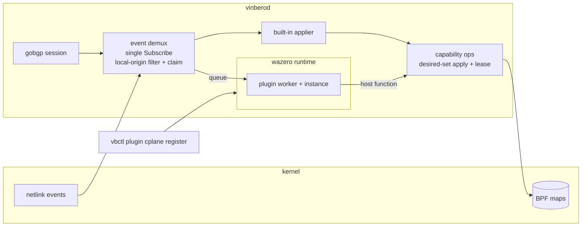

# Control plane plugin

Vinbero の control plane を第三者が拡張するための機構です。data plane
plugin が eBPF bytecode を受け取るのに対し、control plane plugin は
WebAssembly module を受け取ります。どちらも daemon に upload され、登録時
に検証され、宣言した capability の範囲でだけ動きます。

## 何のためにあるか

オペレータが独自の SRv6 endpoint behavior を持ち込み、ネットワークとして
機能する状態までを plugin だけで完結させることが目標です。

1. 転送は data plane plugin が endpoint slot に実装します。これは既存の
   plugin SDK でできます。
2. control plane plugin がその behavior codepoint を claim します。
3. plugin が local SID を要求します。host が locator から address を確保
   し、plugin の slot を指す dispatch entry を書き、address を event で
   plugin に返します。名前は plugin が付け、値は host が選びます。記憶を
   失って戻ってきた plugin が同じ名前を宣言すると同じ address が返ります。
4. plugin がその SID を SID TLV に自分の codepoint を載せて広告します。
5. 対向でその経路を受けた plugin が headend の状態を宣言します。
6. Vinbero 自身の applier はその経路を見ません。codepoint を見ずに service
   SID から entry を作るので、知らない codepoint を素の SID と誤読して
   しまうためです。

これで両ノードは Vinbero も BGP も知らない behavior で通信します。実例は
`sdk/examples/cplane-custom-behavior` にあり、この 6 段を実装しています。

新しい AFI/SAFI は要りません。endpoint behavior は SID TLV の中の 16bit
codepoint なので、独自 codepoint の広告は vpnv4 や EVPN といった既存
family にそのまま載ります。

## 全体像



## 経路の配送

gobgp の watch は daemon ごとに 1 回しか開けません。Subscribe ごとに
current=true の WatchEvent が開き、2 回目は loc-rib を後から attach した
consumer へ replay してしまいます。そこで daemon が唯一の subscription を
持ち、consumer は demux (`pkg/bgp/demux`) に登録します。

demux が引き受ける規則は 2 つです。

- local-origin path を live stream と snapshot replay の両方で落とします。
  plugin が広告を始めると自ノードの経路が post-policy stream に還流し、
  consumer が self-pointing な状態を作ってしまうためです。
- consumer が宣言した family だけを配ります。

配送は plugin ごとの worker goroutine で行います。demux の handler は BGP
watch goroutine で走り、そこは block してはいけない契約です。call budget
いっぱい使う plugin が 1 つあると built-in applier を含む全 consumer が
止まるので、handler は queue に積んで返ります。queue が溢れた分は drop
して数えます。`Manager.DroppedEvents` で確認できます。

drop は plugin の view に穴を空けます。desired set を宣言する consumer に
とってこれは遅延より悪く、次の宣言が見えていない状態を prune します。
そこで drop は snapshot debt として記録し、rib から view を作り直します。
replay は plugin ごとに 1 本だけ走らせます。2 本が 1 つの queue に押し込む
と順序が無く、古い copy が新しい copy の後に届いて plugin が古い値を持ち
続けます。drop している plugin は定義上遅いので、drop ごとに replay を
起動すると積み上がりもします。実行中に来た要求は debt を立て直し、完了後に
返します。
snapshot の配送は drop せず block します。replay は BGP watch goroutine
ではないので block してよく、一部を落とすと目的そのものを損ねるためです。
snapshot も live と同じ queue を通すので、両者の順序は保たれます。

## behavior の claim

plugin は登録時に claim する codepoint を宣言します。claim 済みの経路は
built-in applier に配りません。

- claim は all-or-nothing です。途中で失敗した plugin が behavior を半分
  だけ持つ状態を作りません。
- 衝突は配送時ではなく登録時に弾きます。
- codepoint 0 は behavior 無しの意味なので claim できません。
- 標準化済みの codepoint は claim できません。受信側は codepoint を見ずに
  service SID から entry を作るので、Vinbero が originate しない End.DT46
  や End.DX4 も現在正しく扱えています。それらを claim 可能にすると本物の
  L3VPN 経路が built-in から逸れます。運用上の規則は「標準 codepoint は
  Vinbero のもの、plugin は割り当て外の codepoint を使う」です。

withdraw には path attribute が一切載りません。BGP は消える NLRI しか
送らないので、advertise 時の behavior は経路が消えるときの wire に存在せず、
そのままでは claim が advertise 側にしか効きません。demux は ledger を
持ち、claim 済み behavior の advertise はその NLRI と path を記録し、記録の
ある path の withdraw を claim 済みとして扱います。記録は path 単位です。
route reflector 2 台や ADD-PATH では 1 つの NLRI が複数 path で届いて複数回
withdraw されるためです。

## plugin が書ける面

`bpf.MapOperations` は 101 method の全能オブジェクトなので plugin には
渡しません。capability ごとに narrow interface を切り、宣言した capability
に対応する host function だけを link します。宣言に無い能力は「呼べない」
のではなく存在しません。

書き込みの基本形は owner ごとの desired-set apply です。plugin は望ましい
集合を丸ごと宣言し、core が現状との差分を計算して適用します。core だけが
差分を持つので、途中で死んだ plugin は同じ集合を宣言し直すだけで収束し、
順序付き編集列のどこまで送ったかを覚える必要がありません。

apply は transaction ではありません。BPF map に複数 entry を atomic に書く
手段が無いため、途中失敗は前の write を残します。冪等なので retry で収束
します。順序は prune を先に回し、貼り替え中の prefix が二重に存在する瞬間
を作りません。

同一 key を 2 owner が書く状況は宣言時に fail-closed で弾きます。desired
set は owner ごとに差分を取るので、2 owner が同じ key を宣言すると互いに
自分の集合としては一貫した view を持ったまま 1 つの map entry を奪い合い
ます。BPF map については per-entry owner map が最終的な enforcement で、
lease は早期に、相手の名前を添えて落とすための前線です。

## ABI

境界を渡るのは linear memory 上の byte buffer で、構造は protobuf が持ち
ます (`proto/vinbero/v1/cplane_plugin.proto`)。buffer は guest 所有で、host
は guest の alloc に確保させてから書きます。呼び出しが返った後、host は
guest memory への参照を持ちません。linear memory は grow で移動しうる
ためです。

guest が export するもの。

| export | 意味 |
|---|---|
| `vinbero_abi_version() -> i32` | 対応する ABI version。不一致は登録時に拒否 |
| `alloc(size) -> ptr` | host が書き込む領域を確保 |
| `free(ptr, size)` | 領域を解放 |
| `configure(ptr, len) -> i32` | operator 設定を受け取る。省略可 |
| `handle_events(ptr, len) -> i64` | event batch を処理。戻りは status の (ptr, len) |
| `on_tick(now_ns)` | 定期呼び出し。省略可 |
| `_initialize()` | reactor initializer。言語 runtime が使う |

host が提供するもの。すべて `vinbero` module から import します。

| host function | 意味 |
|---|---|
| `log(level, ptr, len)` | daemon log へ出力 |
| `now_monotonic() -> i64` | 単調増加の ns |
| `apply_begin(kind) -> i64` | desired-set transaction を開く (headend v4/v6、advertise、local SID) |
| `apply_put(gen, ptr, len) -> i32` | 宣言の chunk を積む |
| `apply_commit(gen) -> i32` | 差分を適用する |
| `apply_abort(gen)` | transaction を捨てる |

`log` と `now_monotonic` は determinism をあえて壊す穴です。sandbox には
stdout も filesystem も無いので log が無いと plugin 作者に調査手段があり
ません。clock が無いと liveness 系のロジックが書けません。それ以外の
非決定入力は必要になるまで足しません。

## 登録時の検証

module は allowlist で検証します。

- import は `vinbero` module からのみ。WASI はこの規則で弾かれます。
- memory は guest が定義して export する 1 つだけ。imported memory は拒否。
- 必須 export が signature まで一致すること。
- ABI version が一致すること。
- `_start` の自動実行は無効化し、reactor initializer だけを host が明示的
  に呼びます。

## lifecycle

- 同名での再登録は in-place upgrade です。古い instance を止めて新しい
  ものを同じ owner tag で始めるので、古いものが書いた状態は残り、新しい
  module が宣言し直して差分が吸収されます。
- plugin が configure から宣言した内容は、登録が成立するまで保留します。
  configure は instantiate の途中で走るので、そこで適用すると instantiate
  が失敗したときに誰も消せない state が残ります。upgrade では更に悪く、
  失敗した新 instance は走行中の旧 instance と同じ owner tag を持つので、
  その宣言が生きている plugin の entry を prune します。
- unregister は意図的な撤去なので owner の状態ごと消します。順序は配送
  停止、instance close、状態削除です。
- trap や budget 超過では状態を消しません。instance を作り直し、rib の
  snapshot を配ってから収束させます。新しい instance は何も覚えていない
  ので、replay しないと最初の宣言が restart 後に届いた event だけの集合に
  なり、それ以外の entry を全部 prune します。連続失敗が上限を超えたら
  状態を残して止めます。上限は連続失敗の数で、成功配送でリセットします。
- daemon の shutdown では flush しません。

wazero に fuel metering はありません。走っている guest を止める手段は
context の cancel だけで、それは module を閉じます。よって budget 超過は
call ではなく instance を失います。budget を call 単位にしているのはその
ためです。

## 運用

```sh
vbctl plugin cplane register --name custom-behavior --wasm plugin.wasm \
    --behavior 0xFE01 --family vpnv4
vbctl plugin cplane list
vbctl plugin cplane unregister --name custom-behavior
```

behavior は 10 進でも 0x 前置でも書けます。RFC 8986 は codepoint を hex で
振っているので、0x0013 を 10 進の 13 と読むと別の behavior を claim して
しまいます。

## plugin を書く

例は `sdk/examples/cplane-custom-behavior` にあります。TinyGo で書いて
います。生成された Go binding は reflection を要求し、TinyGo の WebAssembly
target はそれを持たないので、protobuf codec は手書きです。

daemon 無しで試すための harness が `sdk/go/cplaneharness` にあります。
daemon と同じ runtime を回し、capability 面だけ記録用に差し替えます。
replay、restart、commit 拒否といった本番で耐える必要のある流れを method
として提供します。

TinyGo は次の flag で使えます。

```sh
tinygo build -o plugin.wasm -target=wasm-unknown \
    -scheduler=none -gc=conservative -panic=trap .
```

`gc=conservative` は必須です。WASI を link しない target の既定は
`gc=leaking` で memory を一切回収しません。control plane plugin は daemon
と同じ寿命で走り、ネットワークの経路変化を全部見るので、回収しない
plugin は memory 上限に到達します。harness の churn test は live set を
一定に保ったまま advertise と withdraw を繰り返すので、増える分は garbage
だけです。この test を leaking build は途中で落ち、conservative build は
1 MiB のまま完走します。

## local SID と daemon 再起動

local SID の名前は host の memory にしかありません。pin された map では
前回起動の entry が残りますが、どの宣言がその address を入れたのかを
辿る手段がありません。同じ名前を宣言し直した plugin は別の address を
貰うので、古い entry は誰も dispatch せず誰も消せないまま残ります。

そこで owner ごとに 1 回だけ sweep します。その owner のもので、今回の
run が入れたのではない entry を消します。address の安定性は 1 回の daemon
実行の中では保たれ、再起動を跨ぐと新しい address になります。

## まだ無いもの

EVPN と MUP の desired set は実装していません。用途が先に無いという理由
だけでなく、前提が揃っていないためです。

MUP の uplink map (`mup_uplink_v{4,6}_map`) の entry は owner tag を持ち
ません。packet が運ぶ F-TEID が key なので、そういう設計になっています。
owner が無い store では、どの entry が誰のものかを reconcile が判定でき
ません。plugin に触らせる前に owner 追跡を足す必要があります。

EVPN は owner の問題は無いものの、bd_peer と FDB の状態は DF election、
split-horizon、ESI の不変条件と組で成り立っています。plugin が entry を
直接宣言できるようにすると、その不変条件を壊す形の宣言が書けてしまいます。
DF election のような判断ロジックそのものの差し替えは本設計の非目標に置いて
あり、EVPN の desired set はその判断と不可分です。用途が具体化したときに、
何を宣言させるのが安全かを決めてから足します。

## 参照

- 設計の経緯と検討: `docs/plan/cplane-plugin.md`
- data plane plugin SDK: `docs/design/ja/plugin-sdk.md`
- 永続化の既定モデル: `docs/design/ja/persistence.md`
