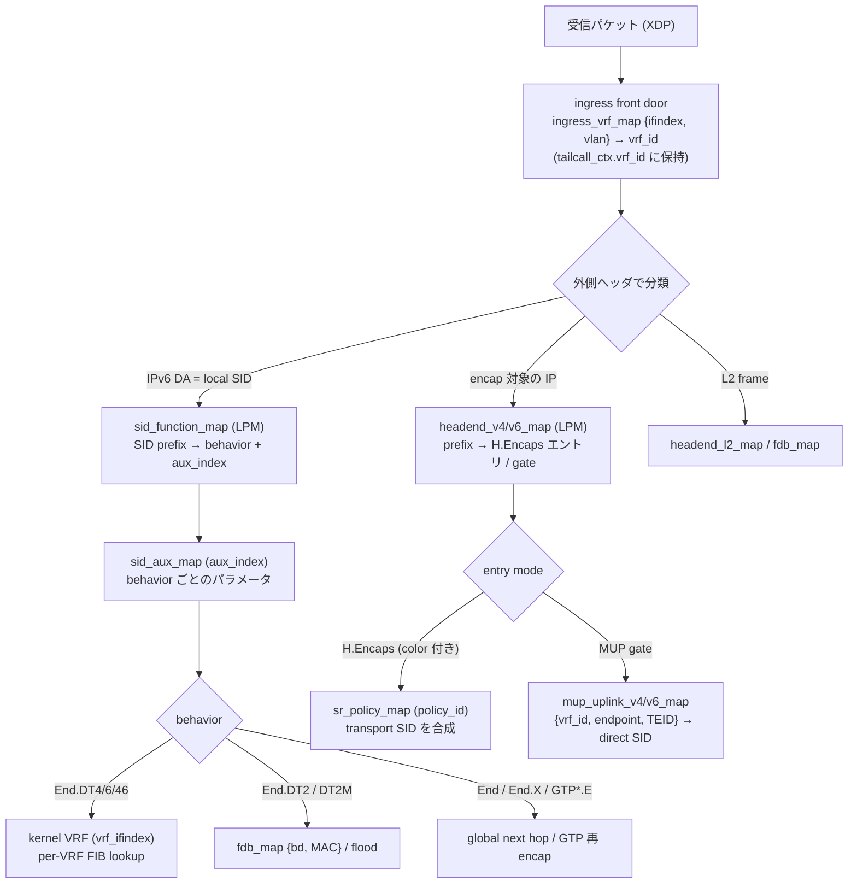

# 転送テーブルのメンタルモデル

## 概要

このドキュメントは、Vinbero がパケットを転送するときにどのテーブルをどの順で引き、それぞれのテーブルが何で分かれているか、というメンタルモデルを整理します。個々のマップの実装詳細ではなく、テーブル同士の関係とスコープに焦点を当てます。SRv6 サービスを BGP でどう運ぶかは [srv6_bgp.md](./srv6_bgp.md)、L2VPN/L3VPN のデータプレーンは [fdb_vrf.md](./fdb_vrf.md) を参照してください。

まず押さえたいことが 2 つあります。テーブルは control plane と data plane の 2 層に分かれること、そして転送テーブルの持ち主が kernel と eBPF の 2 つに分かれることです。

control plane (Go、in-memory) は何を install するかを決め、data plane (eBPF マップと kernel FIB) がそれを高速に実行します。control plane のテーブルは BGP 経路や RPC を受けて方針を保持し、その結果を data plane のテーブルへ書き込みます。

転送テーブルの持ち主は 2 つです。kernel が L3 の per-VRF FIB を持ち、eBPF が SRv6 service テーブル (local SID、headend、F-TEID) と L2 テーブル (FDB、bridge domain) を持ちます。Vinbero は per-VRF の L3 経路表を eBPF 側に持たず、End.DT4/DT6/DT46 で kernel VRF へ渡したあとの L3 lookup は kernel に任せます。BGP で学んだ IPv6 unicast 経路も kernel FIB へ注入します (`pkg/fib`)。

## 転送の lookup chain

受信パケットは XDP で外側ヘッダにより分類され、テーブルを順に辿って転送先が決まります。

パケットはまず ingress front door を通ります。`ingress_vrf_map` を {ifindex, vlan} で引いて vrf_id を決め、`tailcall_ctx.vrf_id` に載せて以降のハンドラへ運びます。front door が無効なら全パケットが global VRF (vrf_id 0、underlay) になります。default-deny を有効にすると、どの VRF にも分類されない access circuit を drop できます。

local SID 宛のパケットは `sid_function_map` で behavior を引き、`sid_aux_map` に置いた behavior ごとのパラメータで配送先が決まります。decap 系 (End.DT4/DT6/DT46) は aux の vrf_ifindex が指す kernel VRF へ渡し、そこからは kernel の per-VRF FIB が転送します。End.DT2/DT2M は bridge domain へ、End や End.X や GTP behavior は global の next hop へ向かいます。

encap 対象のパケットは `headend_v4/v6_map` を prefix で引きます。エントリが H.Encaps なら service SID へ encap し、color が付いていれば `sr_policy_map` を policy_id で引いて transport SID を前置します。エントリが MUP の gate なら、front door で決めた vrf_id を使って `mup_uplink_v4/v6_map` を {vrf_id, endpoint, TEID} で引いて direct SID を得ます。同じ N3 endpoint と TEID 空間を複数の VRF が共有しても、vrf_id がキーに入るので衝突しません。

## スコープ軸

転送テーブルは次の軸で分かれます。どの軸に属するかで、テーブルのキーに何が入るかと、誰が tenant を分けるかが決まります。

- global: ノード全体で 1 つ。tenant の次元を持ちません。`sid_function_map`、`headend_v4/v6_map`、`sr_policy_map` がこれです。local SID 空間と headend の prefix はノード共通です。
- VRF (vrf_id): routing/forwarding instance の identity です。control plane では `pkg/vrf` の一級オブジェクトが name と数値 vrf_id (0 = global/underlay) と ingress membership ({interface, VLAN}) を持ちます。data plane では front door が ingress access circuit を vrf_id に分類し、MUP F-TEID lookup (`mup_uplink_v4/v6_map`) がその vrf_id をキーに含めるので、同じ N3 endpoint と TEID 空間を複数の VRF が共有しても衝突しません。BGP の RT policy (`vrfbgp`)、MUP、EVPN は name で VRF に紐付く facet です。
- kernel VRF: VRF の L3 facet です。End.DT4/DT6/DT46 が aux の vrf_ifindex で kernel VRF へ渡し、per-VRF の L3 FIB は kernel が持ちます。eBPF 側はどの VRF へ渡すかだけを決めます。現状この kernel VRF の ifindex は ingress/MUP の vrf_id とは別管理で、両者の id 統合は後続の作業です。
- bridge domain (bd): L2 の tenant です。`fdb_map` を {bd, MAC} で引き、BUM は bd 単位で flood します。

## default と explicit という共通パターン

どのスコープ軸にも、設定不要の default fallback と、明示的に tenant を切る explicit 形があります。default は設定が無いときの挙動で、instance 化や VRF 化をする前と同じ動きになります。

- kernel routing: main table が default、named VRF が explicit です。
- VRF 分類: global VRF (vrf_id 0) が default、`vbctl vrf ac-add` で access circuit を宣言した named VRF が explicit です。どの VRF にも分類されない access circuit は vrf_id 0 に落ち、default-deny を有効にすると drop します。
- SR Policy steering: color 0 が default で service SID へ直行し、color が付くと SR Policy へ steering します。
- RT import: binding が無い family は default の挙動 (MUP は default-allow、L3VPN/EVPN は該当 bd/VRF が要るので drop)、binding を宣言すると explicit に import を絞ります。

このパターンを意識すると、新しいサービスを足すときに default をどう定義するか、explicit な tenant を何で分類するかの 2 点を決めればよい、と見通せます。

## テーブル早見表

転送先を決める主なテーブルです。owner は kernel か eBPF か、writer は control plane の誰がそれを書くかを表します。

| テーブル | キー | 値 | スコープ | owner | writer |
|------|------|------|------|------|------|
| sid_function_map | IPv6 SID prefix (LPM) | behavior + aux_index | global | eBPF | SidFunctionService |
| sid_aux_map | aux_index | behavior パラメータ (vrf_ifindex / bd / GTP args ほか) | global | eBPF | SidFunctionService |
| headend_v4/v6_map | IP prefix (LPM) | H.Encaps エントリ / gate / policy_id | global | eBPF | Headend*Service / BGP applier |
| sr_policy_map | policy_id | transport SID list | global | eBPF | SrPolicyService / BGP applier |
| ingress_vrf_map | {ifindex, vlan} | vrf_id | VRF (vrf_id) | eBPF | VrfService / config (`vrf.Manager`) |
| mup_uplink_v4/v6_map | {vrf_id, endpoint, TEID prefix} (LPM) | direct SID | VRF (vrf_id) | eBPF | BGP applier (MUP T2ST) |
| fdb_map | {bd, MAC} | bd_peer | bridge domain | eBPF | FdbService / BGP applier (EVPN RT2) |
| bd_peer_map ほか | bd / peer | End.DT2U/DT2M peer、flood、DF | bridge domain | eBPF | BdPeerService / BGP applier (EVPN) |
| kernel VRF FIB | inner dst | next hop | kernel VRF | kernel | kernel (decap 後) + `pkg/fib` (BGP IPv6 unicast) |

control plane 側の in-memory テーブルが上の data plane を populate します。VRF の identity (name、vrf_id、ingress membership、global default-deny policy) は `vrf.Manager` が持ち、`ingress_vrf_map` の唯一の writer です。VRF↔RT の binding は `vrfbgp.Manager` (family ごとの RT policy と RD、bd_id、MUP の source prefix を保持し、VRF object を Ensure する facet)、SR Policy は {color, endpoint} を鍵にした table、locator プールは `locator.Manager`、MUP の segment discovery とセッションは applier 内のテーブルが持ちます。

## 転送決定ではない補助テーブル

次のマップは転送先を決めません。混同しないよう分けて書きます。owner_map 系 (`sid_function_owner_map`、`headend_v4/v6_owner_map`、`aux_owner_map` ほか) はエントリの所有者を記録し、同じ owner の経路だけを正確に withdraw するために使います。`*_progs` (PROG_ARRAY) は tail call の dispatch、`scratch_map` と `tailcall_ctx_map` は per-CPU の作業領域と tail call 間の受け渡し、`stats_map` と `slot_stats_*` はカウンタです。
