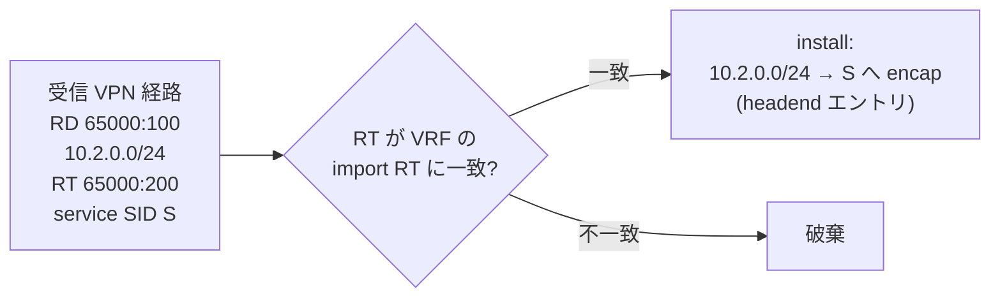
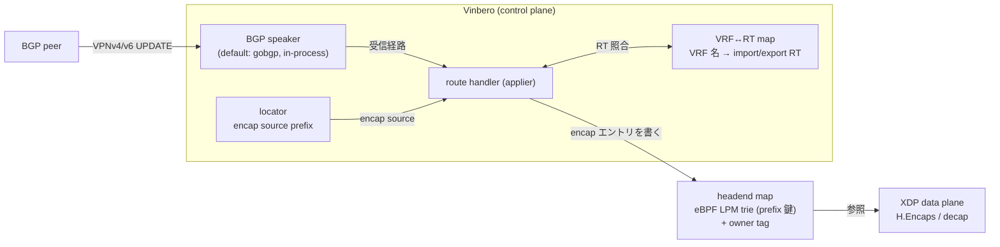
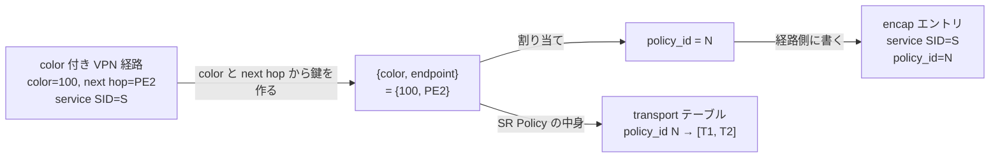
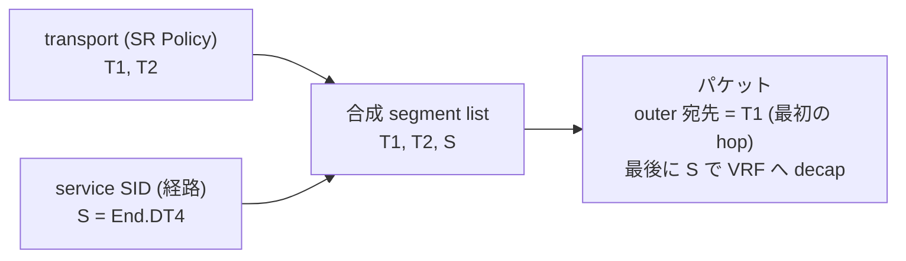

# SRv6 over BGP 設計

## 概要

このドキュメントは、Vinbero が BGP control plane の上で SRv6 サービスをどう実現しているか、そのメンタルモデルを説明します。実装のクラスや関数の羅列ではなく、概念とデータの関係、そして Vinbero がどの役割分担で組んでいるかに焦点を当てます。

BGP でシグナルする SRv6 サービスは複数あり、この資料はそれらを 1 つの枠組みで捉える場所にします。現在カバーするのは次の 2 つです。

- L3VPN (VPNv4/VPNv6): RD/RT で経路を区別してインストールする
- color steering: 経路に付く color を SR Policy の path に紐付けて転送する

EVPN (RFC 7432 系の L2VPN) と SRv6 MUP (mobile user plane) も同じ BGP シグナルの SRv6 サービスで、いずれこの枠組みに加える想定です。RD/RT による区別とインストール、color と SR Policy の steering というメンタルモデルは、これらにも共通する概念です (詳細は [今後の BGP SRv6 サービス](#今後の-bgp-srv6-サービス))。

実装のシーケンスは [api_sequence.md](./api_sequence.md)、interop の検証構成は `examples/interop-clab/scenarios/` を参照してください。

## L3VPN (VPNv4/VPNv6) の概要

VPNv4/VPNv6 は、1 つの物理網の上で複数の顧客の閉じた IP 網を同時に運ぶ仕組みです。顧客ごとに prefix が重複してもよく、経路の配り先も顧客ごとに分離できます。これを成り立たせるために、次の要素があります。

- VRF: 顧客ごとに独立したルーティングテーブルです。
- RD (route distinguisher): 共有 BGP テーブル上で重複 prefix を一意にする名前空間です。どの VRF に入れるかは決めません。
- RT (route target): 経路の所属を表すタグです。VRF は import RT に一致した経路だけを取り込み、full mesh や hub-spoke といった配り方を決めます。
- service SID: SRv6 L3VPN では egress PE の VRF を service SID (End.DT4/DT6) で指します。ingress PE は service SID 宛に encap し、egress PE が decap して VRF へ渡します。

## VPNv4/v6 をどう実現するか

Vinbero は in-process の BGP speaker を持ち、PE 同士で VPNv4/VPNv6 の経路を交換します。受信した 1 つの VPN 経路を、どう区別してどう data plane に落とすかが、L3VPN 実現の中心です。

### 受信経路の区別とインストール

受信した VPN 経路は、次の順に解釈します。

1. RD で区別する。共有 BGP テーブルでは prefix が重複しうるので、NLRI は `RD:prefix` の組で持ちます。RD が違えば同じ prefix でも別経路として共存し、衝突しません。RD は所属を決めないので、ここでは取り込み先 VRF を判断しません。
2. RT で取り込み可否を決める。経路の RT が、登録済みのどれかの VRF の import RT に一致したときだけ取り込みます。一致しなければ破棄します。これが顧客ごとの経路分離の実体です。
3. service SID へ向ける encap として install する。取り込む経路には SRv6 service SID (End.DT4/DT6) が添えられています。Vinbero はこれを、この prefix 宛のパケットを service SID へ encap するという 1 つの転送指示に変換し、headend の encap エントリとして data plane に置きます。

RD は経路を一意にして取り消しを識別するために使い、転送先 VRF の判断には使いません。判断は RT だけで行います。この役割分担で、重複 prefix と経路分離を同時に実現します。

### Vinbero での実装

この区別とインストールを、Vinbero は次の役割分担で組んでいます。

- BGP speaker: default では gobgp を in-process で動かして実現します。gobgp が peer と VPNv4/VPNv6 を交換し、受信した経路を route handler へ渡します。BGP speaker は差し替え可能な interface で、gobgp はその default 実装です。
- route handler (applier): 受信経路ごとに RD・prefix・service SID・RT・next hop を取り出します。
- VRF と RT の対応: VRF ごとの import/export RT は RPC で事前に登録し、VRF 名を鍵にした in-memory の map で保持します。applier は経路の RT をこの map と照合し、どの import RT にも一致しない経路を落とします。
- encap entry の生成: 一致した経路を H.Encaps の headend エントリ (segments = [service SID]) に変換し、prefix を鍵にした eBPF の LPM trie (headend map) へ書きます。書き込みには owner tag を付け、後で同じ owner の経路だけを正確に withdraw できるようにします。
- encap source: outer の送信元 IPv6 は、設定したローカル locator の prefix から取ります。

広報方向も同じ BGP speaker を使い、ローカル prefix を service SID 付きで経路として出します。受信と広報で同じ data model を共有します。

XDP の data plane は、受信が headend エントリを引いて H.Encaps し、egress 側は service SID (End.DT4/DT6) で decap して VRF の table へ渡します。BGP は何を install するかを決め、XDP がそれを高速に実行する、という分担です。

### service SID の運び方 (transposition)

service SID は RFC 9252 §4 の transposition で運ばれ、SID の一部が MPLS label フィールドに転置されます。Vinbero は受信時に transposition を戻し、full SID を組み立ててから install します。これにより、egress PE がどんな割り当てで service SID を出しても、ingress 側は正しい full SID へ encap できます。

### 広報と取り消し

逆方向に、Vinbero はローカルの顧客 prefix を service SID 付きの VPN 経路として広報できます。広報した経路は family・prefix・RD の組で識別し、取り消し (withdraw) もこの識別で行います。VPNv4 と VPNv6 は family が違うだけで、同じ仕組みです。

## color: 通す経路の意図を付ける

color extended community (RFC 9012) は、経路に特定の path を通すという意図を付ける 32bit のタグです。VPN 経路に color が付いていると、その経路宛のトラフィックを、bare な service SID へ直行させるのではなく、指定の path 上に乗せたい、という意味になります。

color はあくまで意図 (どの path グループか) であり、path の中身そのものではありません。path の中身 (通すべき transport segment の並び) は SR Policy が持ちます。color が 0 の経路は steering されず、service SID へ直行します。

## SR Policy

### モデル

SR Policy は path の定義で、{color, endpoint} で識別します (RFC 9256)。endpoint は steering の到達点で、L3VPN では egress PE です。color と endpoint の組が、color 付き経路と SR Policy を結ぶ鍵になります。

1 つの SR Policy は複数の candidate path を束ね、active を 1 つ選びます。candidate path は次を持ちます。

- preference: 大きいほど優先されます (未指定なら 100)。
- origin: 由来 (operator 定義の local、BGP 学習、PCEP) を表し、local > BGP > PCEP の順に強くなります。
- segment list: 通すべき transport segment (SRv6 SID) の並びです。

candidate は BGP で運ぶときは NLRI {distinguisher, color, endpoint} と Tunnel Encapsulation 属性で表します (RFC 9830, SAFI 73)。distinguisher は同じ {color, endpoint} に対する複数の出し手を区別します。

### active の選び方

同じ {color, endpoint} に複数の candidate があるとき、preference の高い順、次に origin の強い順、最後に distinguisher の小さい順で active を 1 つ選びます (RFC 9256 §2.9)。segment list が空、または長すぎて転送に乗せられない candidate は選びません。

operator がローカル定義した SR Policy と BGP で学習した SR Policy は、同じ {color, endpoint} のテーブルで競合し、同じ規則で active を決めます。

## color 紐付け (auto-steering) のメンタルモデル

### 経路と SR Policy を結ぶ

受信した VPN 経路に color が付いていると、その color と経路の next hop から {color, endpoint} を作り、同じ鍵を持つ SR Policy を探します。endpoint は経路の next hop と一致する必要があります。SRv6 over IPv6 では service SID へ向かう next hop が常に IPv6 なので、endpoint も IPv6 であることを要求します。

### policy_id という間接参照

経路と SR Policy を直結させず、間に policy_id という不透明な番号を置きます。{color, endpoint} ごとに policy_id を 1 つ割り当て、それを経路側 (encap エントリ) に書きます。transport segment の並びは policy_id を鍵にした eBPF の hash (sr_policy_map) に置きます。{color, endpoint} と policy_id の対応や candidate の集合は、in-process の SR Policy table ({color, endpoint} を鍵にした in-memory の map) が持ちます。

この間接参照のおかげで、SR Policy の中身が変わってもテーブル 1 本を書き換えるだけで済み、その policy_id を指すすべての経路に一度に反映されます。経路側のエントリは触りません。

経路と SR Policy の到着順は問いません。経路が先なら policy_id を予約し、その時点ではテーブルが空なので転送は service SID へ fallback します。後から SR Policy が来れば同じ policy_id に transport が入り、経路を書き換えずに steering が始まります。逆順でも同じ番号に収束します。

policy_id は、それを指す経路の数で参照を数えます。経路も candidate も無くなった {color, endpoint} は table から外し、空いた番号は free list (slice) に戻して次の {color, endpoint} で再利用します。

### 転送時の合成

転送のときに初めて、transport と service SID を合成します。policy_id があれば transport テーブルを引き、その transport segment の並びの末尾に、経路自身の service SID をつなげます。これが実際にパケットへ載せる segment list です (RFC 9252 §8)。

最初の transport hop がパケットの外側の宛先になり、segment を 1 つずつ辿って最後に service SID へ着き、そこで VRF に decap します。policy_id を引いてテーブルが無い場合 (SR Policy 未着、取り消し、合成が長すぎる) は、合成せず service SID へ直行する fallback になります。

## 広報方向

Vinbero は経路や SR Policy を受け取るだけでなく、広報もできます。ローカルの顧客 prefix を service SID 付きで VPN 経路として広報し、ローカル定義の SR Policy を SAFI 73 で広報できます。広報した SR Policy は {distinguisher, color, endpoint} で管理し、取り消しもこの鍵で行います。

## 今後の BGP SRv6 サービス

この資料は SRv6 over BGP の置き場所なので、今後追加するサービスもここに積みます。いずれも本文と同じメンタルモデル (RD/RT による区別とインストール、color と SR Policy の steering) が下敷きになります。

- EVPN (L2VPN): RFC 7432 系の EVPN を SRv6 で運ぶ構成です。MAC/IP advertisement や Ethernet Segment を SRv6 service SID (End.DT2U/End.DT2M など) に紐付けます。L3VPN の RD/RT と同じく、RD で区別し RT で取り込み先 BD を決める形になります。
- SRv6 MUP (mobile user plane): モバイルの GTP-U セッションを SRv6 へマッピングするサービスです。BGP で MUP の状態を配り、SRv6 の End.M.GTP4.E などの behavior と組み合わせます。

これらを足すときは、本文の VPNv4/v6 の節と同じ粒度で、何を RD/RT で区別し、何を service SID に紐付け、Vinbero がどの役割分担で install するかを書き足します。

## 参照 RFC

- RFC 9252 — BGP ベースの SRv6 L3VPN (service SID、transposition、§8 steering)
- RFC 9256 — SR Policy アーキテクチャ (candidate path、§2.9 active 選定、protocol-origin)
- RFC 9830 — Advertising SR Policies in BGP (SAFI 73 NLRI、Tunnel Encap、Segment Type B)
- RFC 9012 — Tunnel Encapsulation 属性 (§4.3 Color Extended Community)
- RFC 8986 — SRv6 Network Programming (End / End.DT4 / End.DT6 / H.Encaps)
- RFC 9831 — SR Policy の segment type 拡張 (Type C〜K、現状は範囲外)
- RFC 7432 — BGP MPLS-Based Ethernet VPN (EVPN、今後の L2VPN 追加対象)
- draft-ietf-dmm-srv6-mobile-uplane 系 — SRv6 MUP (mobile user plane、今後の追加対象)
