# SRv6 over BGP 設計

## 概要

このドキュメントは、Vinbero が BGP control plane の上で SRv6 サービスをどう実現しているか、そのメンタルモデルを説明します。実装のクラスや関数の羅列ではなく、概念とデータの関係、そして Vinbero がどの役割分担で組んでいるかに焦点を当てます。

BGP でシグナルする SRv6 サービスは複数あり、この資料はそれらを 1 つの枠組みで捉える場所にします。現在カバーするのは次の 4 つです。

- L3VPN (VPNv4/VPNv6): RD/RT で経路を区別してインストールする
- color steering: 経路に付く color を SR Policy の path に紐付けて転送する
- EVPN (L2VPN): MAC を RD/RT で配り、SRv6 service SID で拠点をブリッジする (multi-homing を含む)
- SRv6 MUP (mobile user plane): モバイルの GTP-U セッションを BGP で配り、SRv6 の GTP behavior へ反映する

RD/RT による区別とインストールというメンタルモデルは、これらすべてに共通します。MUP は加えて、セッション経路 (T1ST/T2ST) が segment discovery 経路 (ISD/DSD) から SID を解決する仕組みを持ちます (詳細は [SRv6 MUP (mobile user plane)](#srv6-mup-mobile-user-plane))。

実装のシーケンスは [api_sequence.md](./api_sequence.md)、interop の検証構成は `examples/interop-clab/scenarios/` を参照してください。

## L3VPN (VPNv4/VPNv6) の概要

VPNv4/VPNv6 は、1 つの物理網の上で複数の顧客の閉じた IP 網を同時に運ぶ仕組みです。顧客ごとに prefix が重複してもよく、経路の配り先も顧客ごとに分離できます。これを成り立たせるために、次の要素があります。

- VRF: 顧客ごとに独立したルーティングテーブルです。
- RD (route distinguisher): 共有 BGP テーブル上で重複 prefix を一意にする名前空間です。どの VRF に入れるかは決めません。
- RT (route target): 経路の所属を表すタグです。VRF は import RT に一致した経路だけを取り込み、full mesh や hub-spoke といった配り方を決めます。
- service SID: SRv6 L3VPN では egress PE の VRF を service SID (End.DT4/DT6) で指します。ingress PE は service SID 宛に encap し、egress PE が decap して VRF へ渡します。

## VPNv4/v6 をどう実現するか

Vinbero は in-process の BGP speaker を持ち、PE 同士で VPNv4/VPNv6 の経路を交換します。受信した 1 つの VPN 経路を、どう区別してどう data plane に落とすかが、L3VPN 実現の中心です。

### 受信経路の区別とインストール

受信した VPN 経路は、次の順に解釈します。

1. RD で区別する。共有 BGP テーブルでは prefix が重複しうるので、NLRI は `RD:prefix` の組で持ちます。RD が違えば同じ prefix でも別経路として共存し、衝突しません。RD は所属を決めないので、ここでは取り込み先 VRF を判断しません。
2. RT で取り込み可否を決める。経路の RT が、登録済みのどれかの VRF の import RT に一致したときだけ取り込みます。一致しなければ破棄します。これが顧客ごとの経路分離の実体です。
3. service SID へ向ける encap として install する。取り込む経路には SRv6 service SID (End.DT4/DT6) が添えられています。Vinbero はこれを、この prefix 宛のパケットを service SID へ encap するという 1 つの転送指示に変換し、headend の encap エントリとして data plane に置きます。

RD は経路を一意にして取り消しを識別するために使い、転送先 VRF の判断には使いません。判断は RT だけで行います。この役割分担で、重複 prefix と経路分離を同時に実現します。

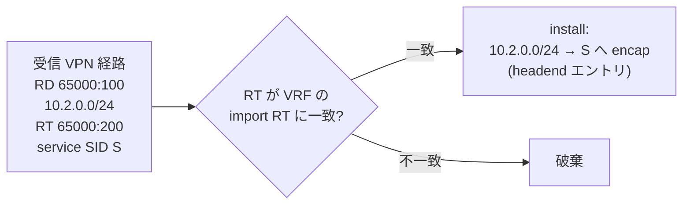

### Vinbero での実装

この区別とインストールを、Vinbero は次の役割分担で組んでいます。

- BGP speaker: default では gobgp を in-process で動かして実現します。gobgp が peer と VPNv4/VPNv6 を交換し、受信した経路を route handler へ渡します。BGP speaker は差し替え可能な interface で、gobgp はその default 実装です。
- route handler (applier): 受信経路ごとに RD・prefix・service SID・RT・next hop を取り出します。
- VRF と RT の対応: VRF ごとの RT は config か RPC で事前に登録し、VRF 名を鍵にした in-memory の map で保持します。binding は family (vpnv4 / vpnv6 / evpn / mup_ipv4 / mup_ipv6) ごとに RT と import/export の方向を持てます。applier は経路の RT を該当 family の import RT と照合し、どれにも一致しない経路を落とします。
- encap entry の生成: 一致した経路を H.Encaps の headend エントリ (segments = [service SID]) に変換し、prefix を鍵にした eBPF の LPM trie (headend map) へ書きます。書き込みには owner tag を付け、後で同じ owner の経路だけを正確に withdraw できるようにします。
- encap source: outer の送信元 IPv6 は、設定したローカル locator の prefix から取ります。

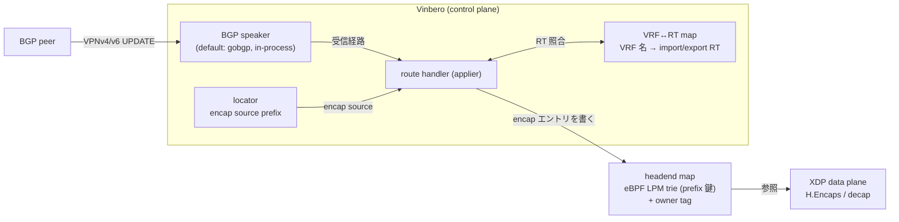

広報方向も同じ BGP speaker を使い、ローカル prefix を service SID 付きで経路として出します。受信と広報で同じ data model を共有します。

XDP の data plane は、受信が headend エントリを引いて H.Encaps し、egress 側は service SID (End.DT4/DT6) で decap して VRF の table へ渡します。BGP は何を install するかを決め、XDP がそれを高速に実行する、という分担です。

### service SID の運び方 (transposition)

service SID は RFC 9252 §4 の transposition で運ばれ、SID の一部が MPLS label フィールドに転置されます。Vinbero は受信時に transposition を戻し、full SID を組み立ててから install します。これにより、egress PE がどんな割り当てで service SID を出しても、ingress 側は正しい full SID へ encap できます。

### 広報と取り消し

逆方向に、Vinbero はローカルの顧客 prefix を service SID 付きの VPN 経路として広報できます。広報した経路は family・prefix・RD の組で識別し、取り消し (withdraw) もこの識別で行います。VPNv4 と VPNv6 は family が違うだけで、同じ仕組みです。

## color: 通す経路の意図を付ける

color extended community (RFC 9012) は、経路に特定の path を通すという意図を付ける 32bit のタグです。VPN 経路に color が付いていると、その経路宛のトラフィックを、bare な service SID へ直行させるのではなく、指定の path 上に乗せたい、という意味になります。

color はあくまで意図 (どの path グループか) であり、path の中身そのものではありません。path の中身 (通すべき transport segment の並び) は SR Policy が持ちます。color が 0 の経路は steering されず、service SID へ直行します。

## SR Policy

### モデル

SR Policy は path の定義で、{color, endpoint} で識別します (RFC 9256)。endpoint は steering の到達点で、L3VPN では egress PE です。color と endpoint の組が、color 付き経路と SR Policy を結ぶ鍵になります。

1 つの SR Policy は複数の candidate path を束ね、active を 1 つ選びます。candidate path は次を持ちます。

- preference: 大きいほど優先されます (未指定なら 100)。
- origin: 由来 (operator 定義の local、BGP 学習、PCEP) を表し、local > BGP > PCEP の順に強くなります。
- segment list: 通すべき transport segment (SRv6 SID) の並びです。

candidate は BGP で運ぶときは NLRI {distinguisher, color, endpoint} と Tunnel Encapsulation 属性で表します (RFC 9830, SAFI 73)。distinguisher は同じ {color, endpoint} に対する複数の出し手を区別します。

### active の選び方

同じ {color, endpoint} に複数の candidate があるとき、preference の高い順、次に origin の強い順、最後に distinguisher の小さい順で active を 1 つ選びます (RFC 9256 §2.9)。segment list が空、または長すぎて転送に乗せられない candidate は選びません。

operator がローカル定義した SR Policy と BGP で学習した SR Policy は、同じ {color, endpoint} のテーブルで競合し、同じ規則で active を決めます。

## color 紐付け (auto-steering) のメンタルモデル

### 経路と SR Policy を結ぶ

受信した VPN 経路に color が付いていると、その color と経路の next hop から {color, endpoint} を作り、同じ鍵を持つ SR Policy を探します。endpoint は経路の next hop と一致する必要があります。SRv6 over IPv6 では service SID へ向かう next hop が常に IPv6 なので、endpoint も IPv6 であることを要求します。

### policy_id という間接参照

経路と SR Policy を直結させず、間に policy_id という不透明な番号を置きます。{color, endpoint} ごとに policy_id を 1 つ割り当て、それを経路側 (encap エントリ) に書きます。transport segment の並びは policy_id を鍵にした eBPF の hash (sr_policy_map) に置きます。{color, endpoint} と policy_id の対応や candidate の集合は、in-process の SR Policy table ({color, endpoint} を鍵にした in-memory の map) が持ちます。

この間接参照のおかげで、SR Policy の中身が変わってもテーブル 1 本を書き換えるだけで済み、その policy_id を指すすべての経路に一度に反映されます。経路側のエントリは触りません。

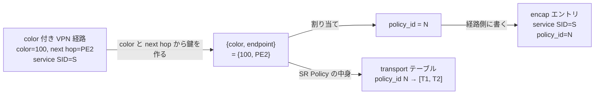

経路と SR Policy の到着順は問いません。経路が先なら policy_id を予約し、その時点ではテーブルが空なので転送は service SID へ fallback します。後から SR Policy が来れば同じ policy_id に transport が入り、経路を書き換えずに steering が始まります。逆順でも同じ番号に収束します。

policy_id は、それを指す経路の数で参照を数えます。経路も candidate も無くなった {color, endpoint} は table から外し、空いた番号は free list (slice) に戻して次の {color, endpoint} で再利用します。

### 転送時の合成

転送のときに初めて、transport と service SID を合成します。policy_id があれば transport テーブルを引き、その transport segment の並びの末尾に、経路自身の service SID をつなげます。これが実際にパケットへ載せる segment list です (RFC 9252 §8)。

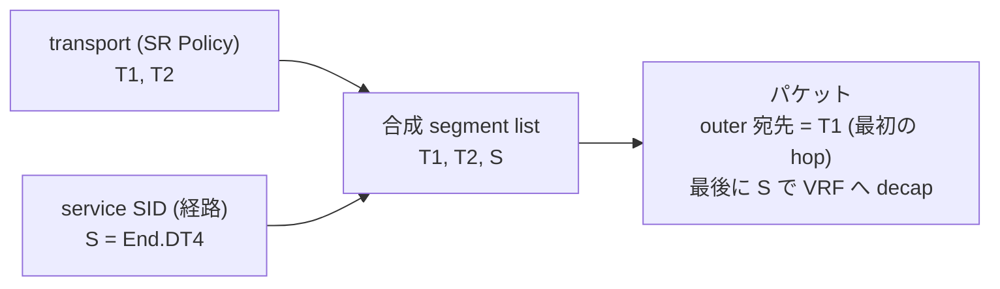

最初の transport hop がパケットの外側の宛先になり、segment を 1 つずつ辿って最後に service SID へ着き、そこで VRF に decap します。policy_id を引いてテーブルが無い場合 (SR Policy 未着、取り消し、合成が長すぎる) は、合成せず service SID へ直行する fallback になります。

## EVPN (L2VPN) over SRv6

### 概要

EVPN (RFC 7432) は、複数拠点の L2 セグメントを 1 つの broadcast domain として束ねる L2VPN です。Vinbero は EVPN を SRv6 で運び (RFC 9252 §6)、顧客の MAC を BGP で配って拠点間のフレームを SRv6 でブリッジします。コントローラも別の signaling もなく、PE 同士が iBGP で MAC と flood 宛先と Ethernet Segment を交換します。

L3VPN と同じく RD で経路を一意にし、RT で取り込み先を決めます。違いは取り込み先が VRF でなく bridge domain (bd) であることだけです。AFI/SAFI は L2VPN-EVPN (25/70) を使い、service SID は L3VPN と同じく Prefix-SID の L2 Service TLV に載せ、transposition で運びます。

### route type と service SID

EVPN は経路の種類 (route type) で役割が分かれます。Vinbero が扱うのは次の 3 つです。

- RT2 (MAC/IP advertisement): 1 つの顧客 MAC の所在を配ります。End.DT2U service SID に紐付け、その MAC 宛ての unicast フレームを SID へ encap します。
- RT3 (Inclusive Multicast): BUM (broadcast / unknown-unicast / multicast) の flood 宛先を配ります。End.DT2M SID に紐付け、PMSI 属性で Ingress Replication を示します。
- RT4 (Ethernet Segment): multi-homing で、1 つの顧客が複数 PE に接続していることを配ります。service SID は載せず、ES-Import RT で同じ segment に接続する PE 同士を結びます。

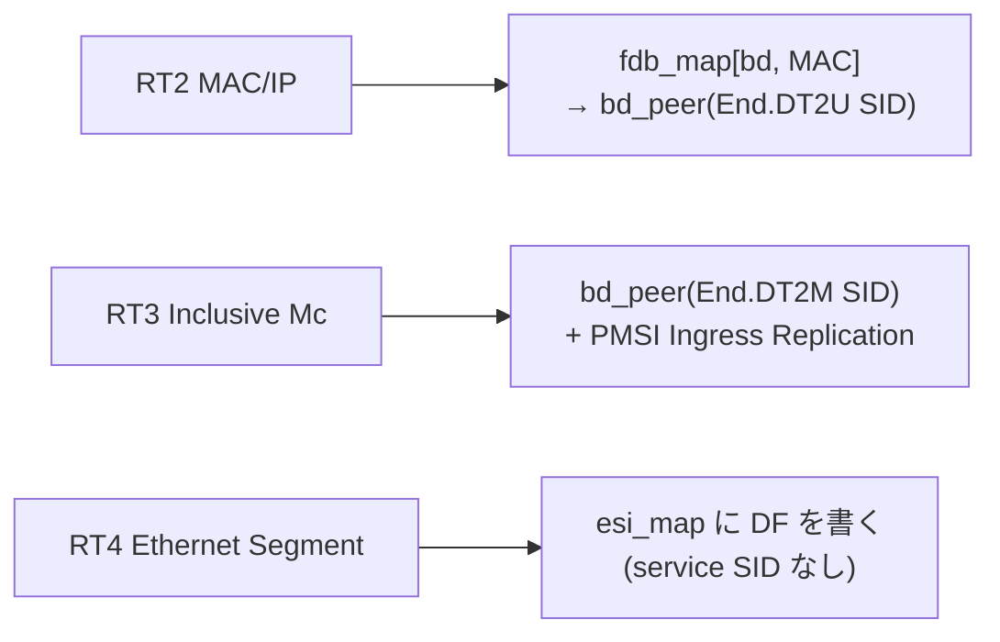

### 受信経路のインストール (RT2 / RT3)

受信した RT2/RT3 は、L3VPN と同じ流れで bd へ落とします。

1. RD で区別する。同じ MAC でも RD が違えば別経路として共存します。
2. RT で取り込み先 bd を決める。経路の RT が登録済みの bd binding の import RT に一致したときだけ取り込みます。
3. service SID へ向ける install にする。RT2 なら相手の End.DT2U SID を segment に持つ bd_peer を作り、`fdb_map[bd, MAC]` をその peer へ向けます。以後その MAC 宛ての L2 フレームは XDP headend が SID へ H.Encaps.L2 します。RT3 なら相手の End.DT2M SID への flood 用 bd_peer を作り、BUM をそこへ複製します。

bd と RT の対応は config か RPC で事前に登録し、VRF↔RT と同じ in-memory の map で保持します。広報方向も同じ data model で、ローカルの顧客 MAC を End.DT2U SID 付きで RT2、flood 宛先を End.DT2M SID 付きで RT3 として出します。

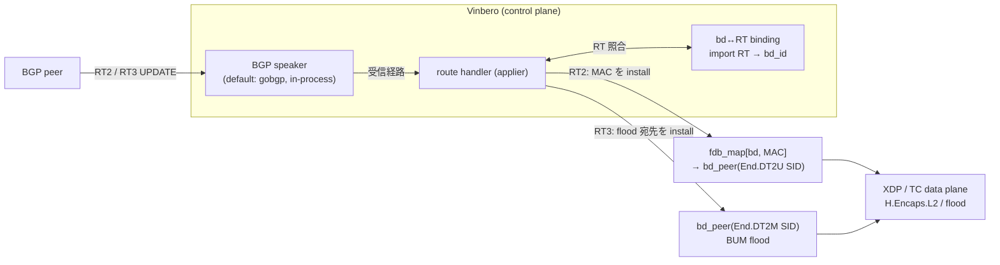

### multi-homing (RT4 / DF election / split-horizon)

1 つの顧客を 2 つの PE にぶら下げると (multi-homing)、BUM が両 PE から顧客へ二重に届いたり、片方が受けた BUM をもう片方経由で顧客へ送り返してループになったりします。これを防ぐのが Designated Forwarder (DF) と split-horizon です。

- Ethernet Segment (ES) は ESI (10 byte の識別子) で表し、同じ ES に接続する PE は RT4 を ES-Import RT 付きで広報し合います。各 PE は、受信した RT4 の送信元 PE と自分を候補集合にして、RFC 8584 の default DF election (候補を encap source で整列し index = ETag mod N) を独立に走らせます。ELAN は ETag 0 なので encap source が最小の PE が DF になります。全 PE が同じ membership から同じ結果を出すので、合意のための調停はいりません。
- BUM が来たとき、DF だけが顧客へ流し、非 DF は drop します (data plane の dt2m_non_df_drop)。これで二重配送が消えます。
- split-horizon (RFC 9252 Local Bias) は、ある PE が受けた BUM を、同じ ES の別 PE 経由で共有顧客へ再 flood しないようにします。受信フレームの outer source (相手 PE の encap source) を鍵に、その PE 向けの flood を抑えます。

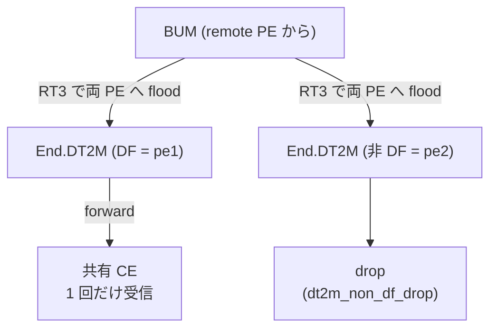

### DF election の収束 (RT4 と es create の到着順)

DF election が書き込むのは、operator が local 接続を宣言した (es create) ESI だけです。spoof された RT4 で phantom な ES を作らせないためです。ただし RT4 と es create の到着順は決まりません。そこで membership (RT4 で学習した PE の集合) は local 接続の有無に関わらず常に記録し (件数に上限を設けて crafted RT4 の氾濫を防ぎ)、es create を契機に election を再実行します。RT4 が es create より先に来ても membership に残るので、後から local 接続を宣言した時点で正しい DF を選べます。逆順なら RT4 受信時の election で収束します。どちらの順序でも同じ DF に落ち着きます。

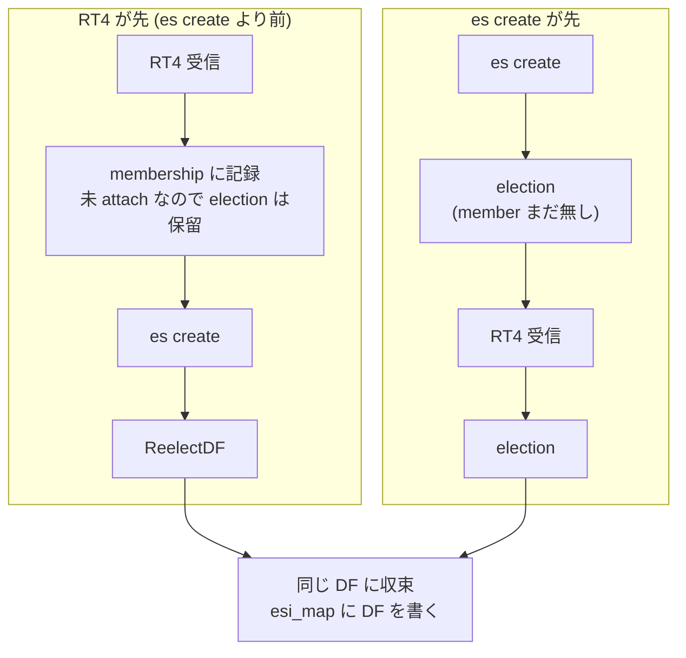

### data plane の分担

control plane は何を install するかを決め、eBPF/XDP の data plane がそれを高速に実行します。XDP headend が unicast フレームを End.DT2U SID へ H.Encaps.L2 し、End.DT2 / End.DT2M で decap して bridge domain へ渡します。BUM は TC の clone-to-self で各 flood 先へ複製し、DF drop と split-horizon をここで効かせます。interop の検証構成は `examples/interop-clab/scenarios/evpn-2site` (RT2/RT3) と `evpn-multihoming` (RT4 DF + split-horizon) を参照してください。

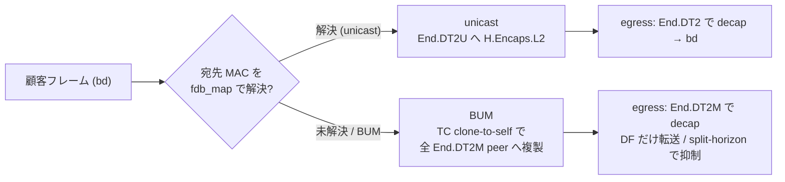

## SRv6 MUP (mobile user plane)

### 概要

SRv6 MUP (RFC 9433、draft-mpmz-bess-mup-safi) は、モバイルの GTP-U セッションを SRv6 へマッピングするサービスです。5G では gNB と UPF の間 (N3) を GTP-U で運びますが、これを SRv6 segment に載せ替えると、コアを純粋な IPv6/SRv6 fabric にでき、per-UE のトンネル状態をコアの中間ノードから排除できます。

役割は 3 つに分かれます。MUP Controller (MUP-C) が UE セッション状態を BGP で配り、MUP Gateway (MUP-GW) が access 側で GTP-U と相互接続し、MUP Provider Edge (MUP-PE) が data 側で DN へ届けます。AFI/SAFI は MUP (1/85) を使い、L3VPN/EVPN と同じく RD で経路を一意にし、RT で VPN の所属を決め、SID は Prefix-SID で運びます。

### route type と方向

MUP は経路の種類で役割が分かれ、方向ごとにペアになります。

- T1ST (session transformed type 1): per-UE の downlink セッションです。UE prefix・TEID・QFI・gNB endpoint を運び、MUP-PE が消費します。
- T2ST (session transformed type 2): uplink の aggregate セッションです。endpoint と可変長の TEID prefix を運び、MUP-GW が消費します。
- ISD (interwork segment discovery): interwork segment の到達性です。MUP-GW が広報し、T1ST の SID 解決に使います。
- DSD (direct segment discovery): direct segment の到達性で、MUP Extended Community の segment id を持ちます。MUP-PE が広報し、T2ST の SID 解決に使います。

ペアは downlink が T1ST + ISD、uplink が T2ST + DSD です。T1ST は TEID を exact 値で運びますが、T2ST は TEID を可変長 prefix で運び (EndpointAddressLength が endpoint と TEID の有効ビットを覆う)、1 経路で TEID 範囲を集約できます。これが uplink の data plane の選択を決めます。

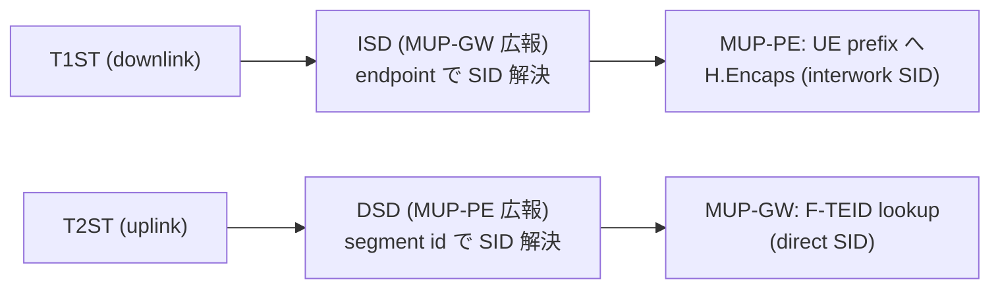

### セッション経路の取り込み

T1ST/T2ST のセッション経路は、L3VPN と同じく RT で取り込み可否を決められます。どれかの VRF binding が MUP family (mup_ipv4 / mup_ipv6) を宣言すると、その family のセッション経路は、どれかの binding の import RT に一致するときだけ取り込み、一致しなければ落とします。ISD/DSD の discovery 経路はこのフィルタを通しません。gateway や PE 自身の RT で届き、VRF をまたいだ解決の材料になるためです。withdraw もフィルタを通さず、先に受理した経路を必ず撤去できるようにします。

その family を宣言した binding が 1 つもなければ、従来どおりすべてのセッション経路を受け入れます。bgp.global.mup_default_allow を立てると、宣言があってもこの default-allow を維持できます。

### SID 解決 (segment discovery)

L3VPN/EVPN は service SID を経路自身の Prefix-SID で運びますが、MUP は加えて、セッション経路が segment discovery 経路から SID を解決できます (RFC 9433 §3)。controller はセッション状態だけを配り、SID は各 gateway/PE が相手の discovery 経路から引きます。

- T1ST → ISD: gNB endpoint を含む ISD prefix の longest-match で interwork SID を解決します。
- T2ST → DSD: 同じ segment id を持つ DSD から direct SID を解決します。
- セッション経路が自分の Prefix-SID を載せる構成も可能で、その場合は discovery で解決できないときの fallback になります。

解決は同じ VPN の中に限定します。所属の判定は L3VPN と同じく RT で行い、セッション経路と discovery 経路の RT リストが少なくとも 1 つ重なるときだけ解決の候補にします。RD は広報者ごとに経路を一意にする鍵であって VPN の境界ではないので、cross-vendor 構成で同じ VPN の経路が別々の RD で届いても解決できます。別 VPN の経路がより具体的な prefix や同じ segment id を広報して他セッションの SID を奪うことは、RT が重ならない限り起きません。

BGP は到着順を保証しないので、discovery 経路が後から届いたら同型の全セッションを再解決し、deferred だったものを install、discovery を withdraw したら依存セッションを撤去します。解決は一意に決まるよう実装し、ISD の longest-match が同じ長さで並んだときも DSD の segment id が衝突したときも最小の SID を決定的に選び、map の反復順でデータプレーンが揺れないようにします。

### 広報の wire format

ISD/DSD を広報するとき、Prefix-SID には SID とともに endpoint behavior を載せます。ISD なら End.M.GTP4.E / End.M.GTP6.E、DSD なら End.DT4 / End.DT6 です。behavior を見て downlink の合成可否を決める受信実装があるためです。SID が登録済みの locator に属するときは、その locator の構成から SID Structure sub-sub-TLV (RFC 9252) を導いて合わせて載せます。SID の locator block で next hop tracking する受信実装が、構造の分からない SID を unreachable と扱うためです。複数の locator prefix が同じ SID を含むときは longest-match の locator から導き、locator に属さない SID では従来どおり省略します。

T1ST の NLRI framing は draft-mpmz-bess-mup-safi の版で異なります。Vinbero は source 付きの -03 形式と source なしの -01 形式の両方を decode し、source なしの広報は -01 の形式 (末尾の SourceAddressLength を省略した 23 byte) で出します。-01 だけを話す peer との interop のためです。

### data plane の分担

downlink と uplink で lookup キーが非対称で、これはセッション経路が運ぶ情報に対応します。

- downlink (T1ST): MUP-PE が UE prefix に対し、interwork SID へ Args.Mob.Session (gNB、TEID、QFI) を合成して H.Encaps します。受信側 MUP-GW の End.M.GTP4.E が SID 宛先から gNB/TEID/QFI を実行時に読み、GTP-U を gNB へ送ります。SID がセッション情報を内包するので、End.M.GTP4.E はセッション非依存に一度設置すれば足ります。GTP6 も同型で、Args.Mob.Session には TEID と QFI だけを載せ、gNB の IPv6 は End.M.GTP6.E 側の aux 設定から取ります。
- uplink (T2ST): MUP-GW が 2 段で dispatch します。まず endpoint に H.M.GTP4.D_TEID の gate を置いて GTP-U を変換対象と認識させ、次に GTP-U の TEID で mup_uplink_v4_map (LPM) を最長一致 lookup して direct SID へ encap します。T2ST が TEID を可変長 prefix で運ぶため、exact HASH でなく LPM になります。受信側 MUP-PE の End.DT4 が inner IP で DN へ届けます。GTP6 も同型で、H.M.GTP6.D_TEID と mup_uplink_v6_map を使います。

GTP4 の downlink では、outer IPv6 の送信元が GTP-U の外側 IPv4 送信元の運び手を兼ねます (RFC 9433 §6.6)。VRF binding に mup_gtp4_source_prefix を設定すると、セッションの RD から binding を引き、その prefix の直後に UPF の IPv4 anchor を埋め込んだアドレスを outer 送信元にします。§6.6 の抽出を実装する受信側 MUP-GW の End.M.GTP4.E は、prefix 長の位置 (v4src position) から IPv4 を取り出して gNB へ送る GTP-U の送信元にします。Vinbero 自身の End.M.GTP4.E はこの抽出を実装しておらず、GTP-U の送信元は SID 設定の aux (gtp_v4_src_addr) から取るので、両端が Vinbero の構成ではその設定値を anchor と一致させます。anchor は同じ RD の T2ST のうち TEID prefix がこのセッションの TEID を覆うものの endpoint から取るので、controller が UPF の N3 アドレスをセッション状態として配れば追加の設定はいりません。prefix が VRF binding 単位なので、サービスインスタンスごとに別の source pool と v4src position を使えます。prefix 未設定や anchor 未着のときは locator 由来の encap source に fallback し、binding を変更したらその RD の install 済み downlink を再 reconcile して、embed のやり直しや plain source への復帰を反映します。

egress 側の End.M.GTP4.E / End.M.GTP6.E は、SRH 付きの encap に加えて、SRH を省いた reduced encap (RFC 8986 §4.1.1) の単一 SID パケットも受理します。H.Encaps reduced で出す送信側との interop のためです。

interop の検証構成は `examples/interop-clab/scenarios/mup-2site` を参照してください。MUP-C・MUP-GW・MUP-PE・gNB・DN を模し、controller が SID なしの T1ST/T2ST を、各 gateway/PE が SID 付きの ISD/DSD を広報して、解決だけで双方向の GTP-U ⇄ SRv6 が通ることを検証します。downlink の outer 送信元が per-VRF prefix で UPF anchor を embed していることも、ここで assert します。

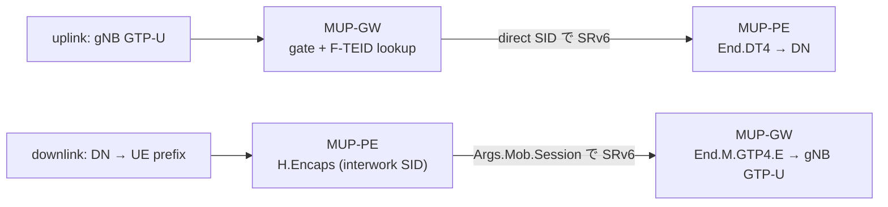

## 広報方向

Vinbero は経路や SR Policy を受け取るだけでなく、広報もできます。ローカルの顧客 prefix を service SID 付きで VPN 経路として広報し、ローカル定義の SR Policy を SAFI 73 で広報できます。広報した SR Policy は {distinguisher, color, endpoint} で管理し、取り消しもこの鍵で行います。MUP も同じく広報でき、MUP-C は T1ST/T2ST を、MUP-GW/MUP-PE はそれぞれ自分の ISD/DSD を出します。

## 今後の BGP SRv6 サービス

この資料は SRv6 over BGP の置き場所なので、今後追加するサービスもここに積みます。いずれも本文と同じメンタルモデル (RD/RT による区別とインストール、color と SR Policy の steering、MUP の segment discovery 解決) が下敷きになります。新しいサービスを足すときは、本文の VPNv4/v6・EVPN・MUP の節と同じ粒度で、何を RD/RT で区別し、何を service SID に紐付け、Vinbero がどの役割分担で install するかを書き足します。

## 参照 RFC

- RFC 9252 — BGP ベースの SRv6 services (L3VPN service SID と transposition、§6 EVPN と Local Bias、§8 steering)
- RFC 9256 — SR Policy アーキテクチャ (candidate path、§2.9 active 選定、protocol-origin)
- RFC 9830 — Advertising SR Policies in BGP (SAFI 73 NLRI、Tunnel Encap、Segment Type B)
- RFC 9012 — Tunnel Encapsulation 属性 (§4.3 Color Extended Community)
- RFC 8986 — SRv6 Network Programming (End / End.DT4 / End.DT6 / End.DT2U / End.DT2M / H.Encaps)
- RFC 9831 — SR Policy の segment type 拡張 (Type C〜K、現状は範囲外)
- RFC 7432 — BGP MPLS-Based Ethernet VPN (EVPN の route type RT2/RT3/RT4)
- RFC 8584 — EVPN の default DF election (ordinal modulo)
- RFC 9433 — SRv6 Mobile User Plane (End.M.GTP4.E / End.DT4 / Args.Mob.Session ほかの GTP behavior、§6.6 の IPv4 source address embed)
- draft-mpmz-bess-mup-safi — BGP MUP SAFI (85) による MUP route (ISD/DSD/T1ST/T2ST) のシグナリング
- draft-ietf-dmm-srv6-mobile-uplane 系 — SRv6 MUP のアーキテクチャ
