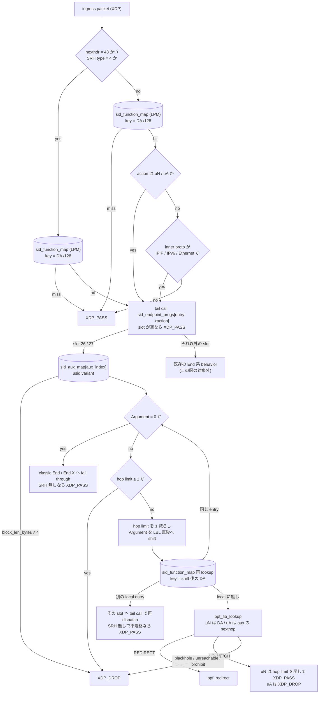
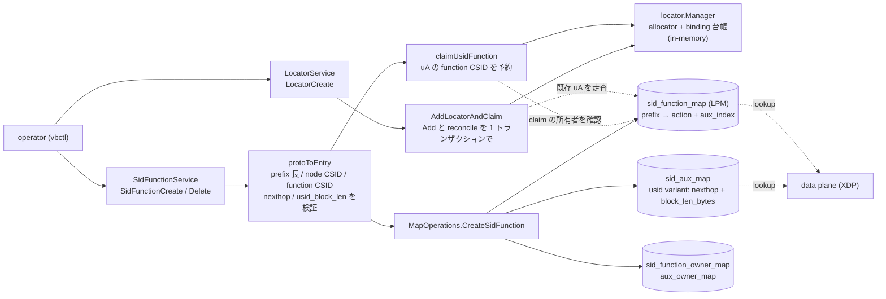

# uSID (NEXT-C-SID) の uN と uA

## 概要

このドキュメントは RFC 9800 の NEXT-C-SID flavor による uSID のデータプレーンとコントロールプレーンの設計を説明します。uSID は 128 bit の IPv6 アドレス 1 つに複数の SID を詰め込む圧縮方式で、SRH を短縮または省略できるため encap の MTU オーバーヘッドが減ります。

Vinbero が実装するのは uN と uA の 2 つです。uN は End の、uA は End.X の NEXT-C-SID 版です。SID 構造は F3216 に固定します。

| behavior | 対応する classic behavior | trigger prefix | 1 回の実行で消費する幅 | 転送先 |
|---|---|---|---|---|
| uN | End | /48 (block + node) | 16 bit (node) | shift 後の DA を FIB で解決 |
| uA | End.X | /64 (block + node + function) | 32 bit (node + function) | 設定した adjacency |

## SID 構造と用語

RFC 9800 の用語で、SID は LBL (locator block)、LNL (locator node)、FL (function)、AL (argument) に分かれます。F3216 は LBL が 32 bit、uSID が 16 bit という意味で、Vinbero の実装はこの構造だけを受け付けます。

```
             0        32       48       64                          128
             +--------+--------+--------+---------------------------+
uN の SID    |  LBL   |  LNL   |            Argument                |
             |fd00:aaaa| b002  |  次の uSID 列 (container の残り)    |
             +--------+--------+--------+---------------------------+
             |<-- trigger prefix /48 -->|

             0        32       48       64                          128
             +--------+--------+--------+---------------------------+
uA の SID    |  LBL   |  LNL   |   FL   |          Argument         |
             |fd00:aaaa| b002  |  a003  | 次の uSID 列               |
             +--------+--------+--------+---------------------------+
             |<------ trigger prefix /64 -------->|
```

container は SID 列を 1 つのアドレスに並べたもので、Argument はまだ消費されていない残りの uSID 列を指します。Argument が全ゼロなら container はこのノードで終わりです。

CSID 0x0000 は container の終端を示す予約値です。node CSID にも function CSID にも 0 は使えません。この予約には転送上の意味もあります。uN の shift は末尾 2 byte をゼロ埋めするので、function CSID 0 を許すと shift 結果が既存の service SID の /128 エントリと偶然一致しえます。allocator が 0 を配らないことで、この alias が構造的に閉じています。

## dispatch 経路

uN と uA は SRH の有無に関係なく動きます。shift 処理は SRH を読まないので、両方の入口から同じ core 関数へ入ります。

- SRH ありのパケットは `process_srv6_localsid` が `sid_function_map` を引き、`DISPATCH_LOCALSID` として endpoint slot へ tail call します
- SRH なしのパケットは `process_srv6_decap_nosrh` が入口です。この経路には従来inner protocol が IPIP / IPv6 / Ethernet のときだけ decap するという gate がありました。uSID は任意の upper-layer protocol を運ぶため、lookup を先に行い、hit した entry が uN か uA なら gate を通す形に変えています。他の action の到達性は変わりません

`sid_function_map` は LPM trie なので、/48 や /64 の locator prefix エントリと、container 終端の /128 service SID エントリが同居できます。終端 DA では /128 が longest match で勝つため、uDT4 のような terminal behavior は従来の実装のまま動きます。

どこで table を引き、その結果がどの分岐を決めるかを図にすると次のようになります。丸括弧付きの箱が BPF map です。

tail call の飛び先は uN / uA 固定ではなく、hit した entry の action の slot です。SRH なし経路の 2 つの判定は、どの slot へ飛ぶかではなく、そもそも tail call するかどうかを決めています。uN / uA は upper-layer protocol を問わず通し、それ以外の action は従来どおり tunnel payload のときだけ通します。uN / uA 以外の slot に入ったパケットはこの図の対象外で、既存の behavior がそのまま処理します。



## shift アルゴリズム

`src/endpoint/srv6_endpoint_usid.h` が実装です。処理は次のとおりです。

1. Argument 全体がゼロかを判定します。uN は byte 6 から 10 byte、uA は byte 8 から 8 byte を見ます。
   1. 次の 16 bit だけを見る実装は誤りで、後続に uSID が残っていても終端と誤判定します
2. Argument が非ゼロなら hop limit を確認します。1 以下なら drop します。ICMPv6 の Time Exceeded は生成しません。既存の End 系と同じ扱いです
3. hop limit を 1 減らします。RFC 9800 Sec.4.1.1 の疑似コード N02-N08 のとおり、論理的な 1 hop につき 1 回減らします
4. Argument を locator block の直後にあたる byte 4 へ左詰めし、空いた末尾をゼロ埋めします。uN は 2 byte、uA は 4 byte です
5. 更新後の DA で転送します。uN は DA 自身を、uA は aux の nexthop を FIB lookup のキーにします

offset はすべてコンパイル時定数です。`aux->usid.block_len_bytes` は shift 幅の計算には使わず、F3216 以外の構造で登録された entry を tail call 冒頭で弾くための guard です。

### shift 幅が uN と uA で違う理由

uN が 16 bit、uA が 32 bit なのは特例を 2 つ持っているのではなく、1 つの規則から出てきます。RFC 9800 Sec.4.1.1 の N05 と N06 は次のとおりです。

```
N05.   Copy DA.Argument into the bits [LBL..(LBL+AL-1)] of the
          Destination Address.
N06.   Set the bits [(LBL+AL)..127] of the Destination Address to
          zero.
```

DA.Argument は bits [LBL+LNFL..127] で、LNFL は Terminology で the sum of the LNL and the FL of the SID と定義されています。Sec.4.1.2 は N08 を adjacency 転送に差し替えるだけで、N05 と N06 は変えません。したがって shift 幅はその SID の LNL + FL です。

- uN は Function を持たないので LNL = 16 bit を消費します
- uA は adjacency を識別する Function を持つので LNL + FL = 32 bit を消費します

uA を 16 bit shift にすると Function を消費しないまま転送し、container の次の CSID として自分の Function を読み直すことになります。Linux kernel の seg6local も `End.X flavors next-csid lblen 32 nflen 32` で 32 bit を消費し、この導出と一致します。

### 同一ノードに連続する uSID

container に自ノードの uSID が連続して並ぶことがあります。この場合 shift 後の DA が再び自ノードの prefix にマッチしますが、FIB に返しても自分宛なので XDP には再入せず kernel に落ちてしまいます。そこで shift 後に `sid_function_map` を引き直し、次の 3 通りに分けます。

- 同じ entry に再ヒットした場合は loop 内で続けて shift します。上限は 5 回で、F3216 の container が最大 6 uSID を持つことから導かれます
- 別の local entry にヒットした場合は、その entry の action と aux で tailcall context を書き直し、対応する slot へ tail call します。別の uN でも、terminal behavior でも同じ扱いです。slot が空か context の書き込みに失敗した場合は fail-closed で drop します
- ただし SRH の無いパケットには例外があります。ヒットした entry が uN でも uA でもなく、inner protocol が IPIP / IPv6 / Ethernet のいずれでもない場合は tail call せず kernel に渡します。多くの endpoint slot は IPv6 ヘッダの直後を無条件に SRH として parse するので、そこへ SRH の無いパケットを渡すと upper-layer ヘッダを Routing header として読んでしまうためです。これは no-SRH dispatcher が非 uN/uA の entry に課しているゲートと同じ条件です
- 自ノードのどの SID でもない場合は転送します

uA はこの loop を持ちません。uA は adjacency へ転送する behavior なので、RFC 9800 Sec.4.1.2 のとおり、同じ uA が container に 2 回現れるなら adjacency も 2 回通るのが正しい挙動です。

### FIB 結果の扱い

DA を書き換えた後なので、転送に失敗したパケットを kernel に渡すと半端に処理された container が流れます。したがって blackhole、unreachable、prohibit は fail-closed で drop します。

neighbor 未解決を表す `BPF_FIB_LKUP_RET_NO_NEIGH` だけは扱いが分かれます。これは経路自体は存在し、NDP がまだ解決していないだけの状態です。XDP は Neighbor Solicitation を送れないので、ここで drop すると他のトラフィックが偶然 neighbor を解決するまで通信が復旧しません。

- uN は kernel に渡します。uN の FIB lookup のキーは shift 後の DA そのものなので、kernel は同じ転送判断をやり直します。classic End と同じ動作です。kernel に渡す直前に、この実行で減らした hop limit を 1 戻します。`ip6_forward` がもう一度減らすためで、戻さないと hop limit 2 のパケットが 1 論理 hop で Time Exceeded になります。結果として消費は論理 hop あたり 1 のままです
- uA は drop します。uA は設定した adjacency へ転送する behavior で、kernel に渡すと DA 側の経路で転送されてしまいます。shift 後の DA に経路がない構成では ICMPv6 unreachable が返ります。uA の nexthop は neighbor が解決済みである必要があり、これは classic End.X と同じ制約です

### container がこのノードで終わる場合

Argument がゼロになったら classic behavior へ fall through します。SRH があれば `process_end` または `process_end_x` を呼びます。SRH がなければ segment list のない classic End なので、RFC 8986 Sec.4.1 に従って upper layer、つまり kernel に渡します。

この経路には 2 つの形があります。1 つは shift を 1 回も行わなかった場合で、DA は uN SID そのものです。もう 1 つは container が自ノードの uSID だけで構成されていた場合で、DA は shift されて uN SID まで縮んでいます。どちらも kernel が見る DA は自ノードの SID なので、書き換え済みのパケットを渡してよいのはここだけです。ただしこれは uN SID がノードのローカルアドレスとして設定されていることを前提にします。設定がないと kernel は locator prefix の経路でルーティングを試みます。

## マップとエントリ

新しいマップは追加していません。uN と uA は既存の `sid_function_map` と `sid_aux_map` を使います。

aux は union で、uSID 用の variant を追加しました。

```c
struct {
    __u8 nexthop[16];      // uA の adjacency (uN では未使用)
    __u8 block_len_bytes;  // F3216 なら 4
    __u8 _pad[3];
} usid;
```

nexthop を offset 0 に置いているので、uA の fall-through が `process_end_x` に aux をそのまま渡せます。既存の nexthop variant と同じ view になるためで、変換コードも分岐も増えません。

`sid_aux_entry` は plugin ABI として 256 byte 固定です。union の variant 追加は sizeof も既存 member の offset も動かしませんが、これは静かに壊れる種類の制約なので `_Static_assert(sizeof(struct sid_aux_entry) == SID_AUX_PLUGIN_RAW_MAX)` でコンパイル時に固定しました。

## コントロールプレーン

data plane が引く table に、誰が何を書くかは次のとおりです。実線が書き込み、破線が読み取りです。`locator.Manager` だけは BPF map ではなく userspace の in-memory 構造で、CSID の重複を防ぐ allocator と binding 台帳を持ちます。



BGP からの経路はまだありません。Phase 4 で uSID locator から service SID を払い出すときに、`locator.Manager` の右側に applier がもう 1 本ぶら下がります。

### locator

`pkg/locator` の `BehaviorUSID` が uSID locator を表します。`Validate` は F3216 の 4 条件、つまり block 32、node 16、function 16、argument 0 と、prefix の node CSID が非ゼロであることを検査します。classic に課している bit 長の合計が 128 という条件は課しません。uSID では Argument が構造の外側にあるためです。

`BuildSID` と `ParseSID` は service uSID の形、つまり block + node + function が並び残りがゼロの形を扱います。CSID 0 は `BuildSID`、`ParseSID`、allocator の manual と auto の全経路で拒否します。

BGP へ渡す SID Structure sub-sub-TLV は LBL/LNL/FL/AL = 32/16/16/0 です。RFC 9252 の AL は behavior が実際に使う argument 幅で、合計が 128 になる必要はありません。

### SID function の登録

uN と uA は `trigger_prefix` の明示指定のみを受け付けます。`locator_ref` からの登録には未対応です。

登録時の検査は次のとおりです。

- `usid_block_len` は 32 のみを受け付けます。他の action に付けた場合は拒否します。Get から Create への往復でフィールドが黙って消えないようにするためです
- prefix 長は uN が /48、uA が /64 です
- node CSID が 0 の prefix は拒否します。uA は function CSID 0 も拒否します
- uN に nexthop を付けた場合は拒否します
- uA の nexthop は IPv6 アドレスのみです。`netip.ParseAddr` で解析し、IPv4 リテラル、IPv4-mapped 表記、unspecified を弾きます

uA は 16 bit の function CSID を消費するので、その prefix を含む uSID locator があれば allocator に予約します。予約しないと同じ CSID が service SID にも払い出され、/128 が LPM で /64 に勝って uA の終端動作が置き換わります。この衝突は登録時にエラーにならず、データプレーンの誤転送として現れるため切り分けが困難です。予約は SID の削除と create の rollback で解放します。uSID locator の外に登録された uA は、衝突する相手がいないので予約しません。

### CLI

```bash
# uN
vbctl sid create --trigger-prefix fd00:aaaa:b002::/48 --action END_UN

# uA
vbctl sid create --trigger-prefix fd00:aaaa:b002:a003::/64 --action END_UA --nexthop fc00:23::1
```

`--usid-block-len` は SID 構造を明示する場合に使います。既定は 32 で、現状は 32 以外を受け付けません。

## headend 側

headend は変更していません。H.Encaps.Red は segment が 1 つのとき SRH なしの encap を出すので、pre-packed の container を segment list として渡せばそのまま uSID のパケットになります。SR Policy の transport list を container へ自動 packing する処理は未実装です。

## 運用上の制約

- trigger prefix は uSID 専用にしてください。uN の /48 と uA の /64 は wildcard なので、その prefix に入るアドレスは SID 自身を除いてすべて container とみなされ、upper-layer protocol に関係なく shift されて転送されます。classic SRv6 でよくある、locator の中にノードの loopback も採番する構成にすると、そのアドレス宛の BGP や SSH が data path 側で書き換えられて到達しなくなります
- uN と uA の SID 自身はノードのローカルアドレスとして設定してください
- uA の nexthop は neighbor が解決済みである必要があります
- flavor は単一値のみです。PSP と USP の組み合わせのような複数 flavor の同時指定は、既存の classic 実装と同じく未対応です
- IPv6 拡張ヘッダを挟んだ NEXT-C-SID 処理は未対応です。shift 経路は SRH を検証しないので、壊れた routing header を持つパケットもそのまま中継します。RFC 9800 の疑似コードは Argument が非ゼロのとき SRH を見ないので仕様上は妥当ですが、変更前は kernel が受け取って落としていたパケットです
- container 宛の生の TCP や UDP は DA が書き換わるため、L4 checksum が最終到達点で不一致になります。実運用の uSID は H.Encaps 経由の encap トラフィックなので問題になりません

## 検証

データプレーンの単体テストは `pkg/bpf/xdp_usid_test.go` です。`BPF_PROG_TEST_RUN` の環境では FIB が必ず失敗するため、戻り値だけでは正しい shift と guard による drop を区別できません。したがって出力パケットの DA と hop limit を直接 assert しています。

E2E は netns example の 2 本で、どちらも Linux kernel の seg6local next-csid flavor を oracle にして 2 phase で確認します。

| example | 対象 | Linux 側の設定 | kernel 要件 |
|---|---|---|---|
| `examples/end-un/` | uN | `action End flavors next-csid lblen 32 nflen 16` | 6.1 以上 |
| `examples/end-ua/` | uA | `action End.X flavors next-csid lblen 32 nflen 32` | 6.6 以上 |

Linux の seg6local で 1 回の実行が消費する幅は `nflen` です。`lblen` は shift せずに残す locator block の長さで、SID の prefix 長は `lblen + nflen` になります。uA は node と function を同時に消費するので、prefix が /64 になる `nflen 32` が正しく、`nflen 16` は function CSID を DA に残す uN の形になります。

end-ua の router2 は terminal SID への経路を持たないので、uA が設定した nexthop を使わずに shift 後の DA を FIB で引いた場合は転送できません。phase 2 の疎通自体が adjacency 転送の確認になります。end-un の phase 2 は neighbor table を flush してから traffic を流すので、NO_NEIGH を drop する実装に戻ると失敗します。

## 未対応

- BGP 統合は未着手です。uSID locator からの service SID 送出と、受信した service SID からの encap source 導出が残っています。後者は `decodeRemoteSrc` が locator base を仮定している点に手を入れる必要があります
- 第三者実装との interop シナリオはまだありません
- REPLACE-C-SID と End.LBS と End.XLBS は実装していません
- 32 bit uSID と F3216 以外の SID 構造。shift の offset がコンパイル時定数なので、`usid_block_len` を緩めるだけでは足りず `src/endpoint/srv6_endpoint_usid.h` の定数も同時に変える必要があります
- SR Policy の transport list を container へ自動 packing する処理はありません
- `locator_ref` からの uN / uA 登録はできません
