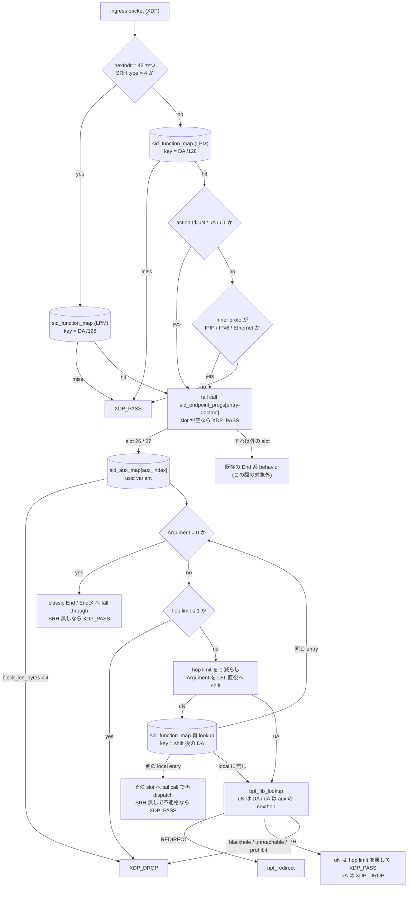
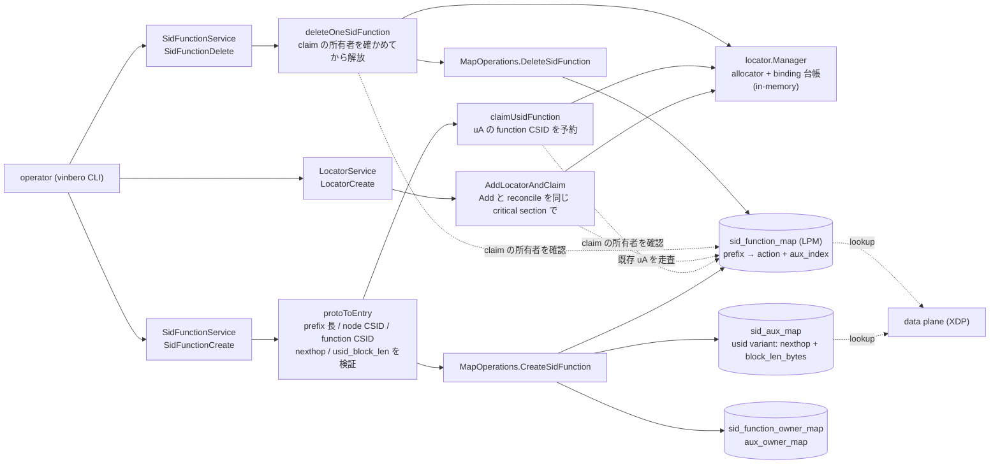

# uSID の uN / uA / uT と REPLACE-C-SID

## 概要

このドキュメントは RFC 9800 の NEXT-C-SID flavor による uSID のデータプレーンとコントロールプレーンの設計を説明します。uSID は 128 bit の IPv6 アドレス 1 つに複数の SID を詰め込む圧縮方式で、SRH を短縮または省略できるため encap の MTU オーバーヘッドが減ります。

Vinbero が shift 系として実装するのは uN と uA と uT の 3 つです。uN は End の、uA は End.X の、uT は End.T の NEXT-C-SID 版です。SID 構造は F3216 に固定します。uDT4 のような terminal behavior は専用実装を持たず、既存の End.* を zero-padded /128 に登録する形で container の最終 uSID になります (後述)。

| behavior | 対応する classic behavior | trigger prefix | 1 回の実行で消費する幅 | 転送先 |
|---|---|---|---|---|
| uN | End | /48 (block + node) | 16 bit (node) | shift 後の DA を FIB で解決 |
| uA | End.X | /64 (block + node + function) | 32 bit (node + function) | 設定した adjacency |
| uT | End.T | /48 (block + node) | 16 bit (node) | shift 後の DA を SID に bind した VRF table で解決 |

## SID 構造と用語

RFC 9800 の用語で、SID は LBL (locator block)、LNL (locator node)、FL (function)、AL (argument) に分かれます。F3216 は LBL が 32 bit、uSID が 16 bit という意味で、Vinbero の実装はこの構造だけを受け付けます。

```
             0        32       48       64                          128
             +--------+--------+--------+---------------------------+
uN の SID    |  LBL   |  LNL   |            Argument                |
             |fd00:aaaa| b002  |  次の uSID 列 (container の残り)    |
             +--------+--------+--------+---------------------------+
             |<-- trigger prefix /48 -->|

             0        32       48       64                          128
             +--------+--------+--------+---------------------------+
uA の SID    |  LBL   |  LNL   |   FL   |          Argument         |
             |fd00:aaaa| b002  |  a003  | 次の uSID 列               |
             +--------+--------+--------+---------------------------+
             |<------ trigger prefix /64 -------->|
```

container は SID 列を 1 つのアドレスに並べたもので、Argument はまだ消費されていない残りの uSID 列を指します。Argument が全ゼロなら container はこのノードで終わりです。

CSID 0x0000 は container の終端を示す予約値です。node CSID にも function CSID にも 0 は使えません。この予約には転送上の意味もあります。uN の shift は末尾 2 byte をゼロ埋めするので、function CSID 0 を許すと shift 結果が既存の service SID の /128 エントリと偶然一致しえます。allocator が 0 を配らないことで、この alias が構造的に閉じています。

## dispatch 経路

uN / uA / uT は SRH の有無に関係なく動きます。shift 処理は SRH を読まないので、両方の入口から同じ core 関数へ入ります。

- SRH ありのパケットは `process_srv6_localsid` が `sid_function_map` を引き、`DISPATCH_LOCALSID` として endpoint slot へ tail call します
- SRH なしのパケットは `process_srv6_decap_nosrh` が入口です。この経路には従来、inner protocol が IPIP / IPv6 / Ethernet のときだけ decap するという gate がありました。uSID は任意の upper-layer protocol を運ぶため、lookup を先に行い、hit した entry が uN / uA / uT なら gate を通す形に変えています。他の action の到達性は変わりません

`sid_function_map` は LPM trie なので、/48 や /64 の locator prefix エントリと、container 終端の /128 service SID エントリが同居できます。終端 DA では /128 が longest match で勝つため、uDT4 のような terminal behavior は従来の実装のまま動きます。

どこで table を引き、その結果がどの分岐を決めるかを図にすると次のようになります。丸括弧付きの箱が BPF map です。

tail call の飛び先は uN / uA / uT 固定ではなく、hit した entry の action の slot です。SRH なし経路の 2 つの判定は、どの slot へ飛ぶかではなく、そもそも tail call するかどうかを決めています。uN / uA / uT は upper-layer protocol を問わず通し、それ以外の action は従来どおり tunnel payload のときだけ通します。uN / uA / uT 以外の slot に入ったパケットはこの図の対象外で、既存の behavior がそのまま処理します。



## shift アルゴリズム

`src/endpoint/srv6_endpoint_usid.h` が実装です。処理は次のとおりです。

1. Argument 全体がゼロかを判定します。uN は byte 6 から 10 byte、uA は byte 8 から 8 byte を見ます。
   1. 次の 16 bit だけを見る実装は誤りで、後続に uSID が残っていても終端と誤判定します
2. Argument が非ゼロなら hop limit を確認します。1 以下なら drop します。RFC 9800 の N03 は ICMPv6 Time Exceeded を送ってから discard するよう求めていますが、Vinbero は ICMPv6 を生成しません。既存の End 系と揃えた意図的な差です
3. hop limit を 1 減らします。RFC 9800 Sec.4.1.1 の疑似コード N02-N08 のとおり、論理的な 1 hop につき 1 回減らします
4. Argument を locator block の直後にあたる byte 4 へ左詰めし、空いた末尾をゼロ埋めします。uN は 2 byte、uA は 4 byte です
5. 更新後の DA で転送します。uN は DA 自身を、uA は aux の nexthop を FIB lookup のキーにします

offset はすべてコンパイル時定数です。`aux->usid.block_len_bytes` は shift 幅の計算には使わず、F3216 以外の構造で登録された entry を tail call 冒頭で弾くための guard です。

### shift 幅が uN と uA で違う理由

uN が 16 bit、uA が 32 bit なのは特例を 2 つ持っているのではなく、1 つの規則から出てきます。RFC 9800 Sec.4.1.1 の N05 と N06 は次のとおりです。

```
N05.   Copy DA.Argument into the bits [LBL..(LBL+AL-1)] of the
          Destination Address.
N06.   Set the bits [(LBL+AL)..127] of the Destination Address to
          zero.
```

DA.Argument は bits [LBL+LNFL..127] で、LNFL は Terminology で the sum of the LNL and the FL of the SID と定義されています。Sec.4.1.2 は N08 を adjacency 転送に差し替えるだけで、N05 と N06 は変えません。したがって shift 幅はその SID の LNL + FL です。

- uN は Function を持たないので LNL = 16 bit を消費します
- uA は adjacency を識別する Function を持つので LNL + FL = 32 bit を消費します

uA を 16 bit shift にすると Function を消費しないまま転送し、container の次の CSID として自分の Function を読み直すことになります。Linux kernel の seg6local も `End.X flavors next-csid lblen 32 nflen 32` で 32 bit を消費し、この導出と一致します。

### 同一ノードに連続する uSID

container に自ノードの uSID が連続して並ぶことがあります。この場合 shift 後の DA が再び自ノードの prefix にマッチしますが、FIB に返しても自分宛なので XDP には再入せず kernel に落ちてしまいます。そこで shift 後に `sid_function_map` を引き直し、次の 3 通りに分けます。

- 同じ entry に再ヒットした場合は loop 内で続けて shift します。上限は 5 回で、F3216 の container が最大 6 uSID を持つことから導かれます
- 別の local entry にヒットした場合は、その entry の action と aux で tailcall context を書き直し、対応する slot へ tail call します。別の uN でも、terminal behavior でも同じ扱いです。slot が空か context の書き込みに失敗した場合は fail-closed で drop します
- ただし SRH の無いパケットには例外があります。ヒットした entry が uN / uA / uT のいずれでもなく、inner protocol が IPIP / IPv6 / Ethernet のいずれでもない場合は tail call せず kernel に渡します。多くの endpoint slot は IPv6 ヘッダの直後を無条件に SRH として parse するので、そこへ SRH の無いパケットを渡すと upper-layer ヘッダを Routing header として読んでしまうためです。これは no-SRH dispatcher が uN / uA / uT 以外の entry に課しているゲートと同じ条件です
- 自ノードのどの SID でもない場合は転送します

uA はこの loop を持ちません。uA は adjacency へ転送する behavior なので、RFC 9800 Sec.4.1.2 のとおり、同じ uA が container に 2 回現れるなら adjacency も 2 回通るのが正しい挙動です。

### FIB 結果の扱い

DA を書き換えた後なので、転送に失敗したパケットを kernel に渡すと半端に処理された container が流れます。したがって blackhole、unreachable、prohibit は fail-closed で drop します。

neighbor 未解決を表す `BPF_FIB_LKUP_RET_NO_NEIGH` だけは扱いが分かれます。これは経路自体は存在し、NDP がまだ解決していないだけの状態です。XDP は Neighbor Solicitation を送れないので、ここで drop すると他のトラフィックが偶然 neighbor を解決するまで通信が復旧しません。

- uN は kernel に渡します。uN の FIB lookup のキーは shift 後の DA そのものなので、kernel は同じ転送判断をやり直します。classic End と同じ動作です。kernel に渡す直前に、この実行で減らした hop limit を 1 戻します。`ip6_forward` がもう一度減らすためで、戻さないと hop limit 2 のパケットが 1 論理 hop で Time Exceeded になります。結果として消費は論理 hop あたり 1 のままです
- uA は drop します。uA は設定した adjacency へ転送する behavior で、kernel に渡すと DA 側の経路で転送されてしまいます。shift 後の DA に経路がない構成では ICMPv6 unreachable が返ります。uA の nexthop は neighbor が解決済みである必要があり、これは classic End.X と同じ制約です
- uT も drop します。VRF に属さない interface に届いたパケットに対して、kernel は ingress interface の VRF 所属で経路を引くため、SID に bind した table での lookup を再現できません。uT の経路では NDP の事前解決が必要です。この規則は shift 経路だけでなく SRH 終端の fall-through にも共通で、`endpoint_fib_redirect_core` は fib ifindex が ingress と異なる lookup の未解決を kernel へ渡さず drop し、SL=0 の USD decap 後の inner lookup も bind した VRF table で行います (classic End.T も同じ経路を通るため、VRF 束縛時の挙動はこの形に統一されています)

### container がこのノードで終わる場合

Argument がゼロになったら classic behavior へ fall through します。SRH があれば `process_end` または `process_end_x` を呼びます。SRH がなければ segment list のない classic End なので、RFC 8986 Sec.4.1 に従って upper layer、つまり kernel に渡します。

この経路には 2 つの形があります。1 つは shift を 1 回も行わなかった場合で、DA は uN SID そのものです。もう 1 つは container が自ノードの uSID だけで構成されていた場合で、DA は shift されて uN SID まで縮んでいます。どちらも kernel が見る DA は自ノードの SID なので、書き換え済みのパケットを渡してよいのはここだけです。ただしこれは uN SID がノードのローカルアドレスとして設定されていることを前提にします。設定がないと kernel は locator prefix の経路でルーティングを試みます。

例外が USD flavor です。SRH なしの container 終端で entry の flavor が USD、かつ inner が IPIP / IPv6 の tunnel payload なら、kernel に渡す代わりに outer IPv6 を剥がして inner パケットを FIB 転送します。H.Encaps.Red は単一 container のとき SRH を出さないため、SRH あり SL=0 を前提にした既存の USD 処理 (`endpoint_handle_usd`) はこの形を扱えず、ここが唯一の追加点です。decap ヘルパは tailcall 側 (`tailcall_endpoint.c`) にあるため、core は sentinel (`USID_RET_USD_NOSRH`) を返して判断だけを伝えます。uT では decap 後の FIB も VRF table になります。PSP と USP は pop すべき SRH が存在しないため、この経路では何もしません (SRH ありの終端では classic End への fall-through で 3 flavor とも従来どおり適用されます)。uA の USD は adjacency 転送で decap します。RFC 8986 Sec.4.16.3 の End.X 系 USD は inner の FIB lookup でなく adjacency J への転送であり、外側パケットが残っているうちに nexthop の neighbor を解決して MAC を eth に書き (decap の eth 保存復元で生き残ります)、decap 後に redirect します。adjacency が未解決なら decap せず fail-closed で drop します。

## uT

uT (RFC 9800 Sec.4.1.3) は uN と同じ /48・同じ 16 bit shift・同じ loop で、shift 後の FIB lookup が SID に bind した VRF table で行われる点だけが違います。実装も `process_end_un_core` を `is_ut` リテラル付きで共有し、呼び出し側の tailcall body (`tailcall_endpoint_end_ut`、slot 28) が 1 を渡します。`__always_inline` の定数畳み込みで死んだ側の分岐は消えるため、uN の slot に End.T のコードは混入しません。

aux に新しい variant は増やしていません。uT は nexthop を持たないので、usid variant の先頭 4 byte (uA なら nexthop の先頭) に VRF ifindex を書き、data plane は l3vrf view で読みます。uN は先頭が全ゼロなので `aux_vrf_or_ingress_ifindex` の ingress fallback と両立します。uA が nexthop variant と layout を揃えているのと同じ view aliasing です。

Argument がゼロになったときの fall-through は `process_end_t` で、classic End.T として VRF table を引きます。

RFC 9800 Sec.4.1.3 は shift 後の lookup を table T で行うと定めていますが、shift 後の DA が自ノードの local SID に一致した場合だけは、uN と同じく loop 内で直接消費または re-dispatch し、table T を引きません。これは意図した設計です。XDP は自分宛の FIB 転送で自プログラムに再入できないため、loop 内消費が動作する唯一の形であることに加え、宛先が自ノードの local SID なら送信者は uT を経由せず /128 に直接パケットを当てられるので、この短絡が VRF 分離の迂回になることはありません。

## terminal uSID (uDT4 / uDT6 / uDT46 / uDX4 / uDX6)

`sid_function_map` の lookup はすべて prefixlen 128 なので、zero-padded な終端 uSID に /128 で既存の End.DT4 などを登録すると、uN / uT の /48 より longest match で勝ちます。shift loop が自ノードの別 entry に着地した場合も、その entry の action の slot へ tail call で引き継ぐため、`[uN, 自ノードの uDT4]` のような container も 1 ノード内で完結します。専用 action・専用コードは不要で、`examples/end-udt4/` が Linux oracle との比較でこれを実証しています。なお Linux の seg6local は shift 後の DA を自ノードの local SID へ転送できない (FIB 経由の self-forward になる) ため、この 1 ノード内引き継ぎは Vinbero 側だけの検証です。

## マップとエントリ

新しいマップは追加していません。uN / uA / uT は既存の `sid_function_map` と `sid_aux_map` を使います。

aux は union で、uSID 用の variant を追加しました。

```c
struct {
    __u8 nexthop[16];      // uA の adjacency (uN では未使用)
    __u8 block_len_bytes;  // F3216 なら 4
    __u8 _pad[3];
} usid;
```

nexthop を offset 0 に置いているので、uA の fall-through が `process_end_x` に aux をそのまま渡せます。既存の nexthop variant と同じ view になるためで、変換コードも分岐も増えません。

`sid_aux_entry` は plugin ABI として 256 byte 固定です。union の variant 追加は sizeof も既存 member の offset も動かしませんが、これは静かに壊れる種類の制約なので `_Static_assert(sizeof(struct sid_aux_entry) == SID_AUX_PLUGIN_RAW_MAX)` でコンパイル時に固定しました。

## コントロールプレーン

data plane が引く table に、誰が何を書くかは次のとおりです。実線が書き込み、破線が読み取りです。`locator.Manager` だけは BPF map ではなく userspace の in-memory 構造で、CSID の重複を防ぐ allocator と binding 台帳を持ちます。



BGP からの経路は `pkg/bgp/apply` の applier 経由で headend map に入ります。詳細は BGP 統合の節を参照してください。

### locator

`pkg/locator` の `BehaviorUSID` が uSID locator を表します。`Validate` は F3216 の 4 条件、つまり block 32、node 16、function 16、argument 0 と、prefix の node CSID が非ゼロであることを検査します。classic に課している bit 長の合計が 128 という条件は課しません。この 4 条件は locator が払い出す service SID の構造を表していて、その service SID は Argument を使わないためです。転送中の uN / uA SID のほうには RFC 9800 の意味での Argument があり、その長さは 128 - LBL - LNFL です。uN なら 80 bit、uA なら 64 bit になります。

`BuildSID` と `ParseSID` は service uSID の形、つまり block + node + function が並び残りがゼロの形を扱います。CSID 0 は `BuildSID`、`ParseSID`、allocator の manual と auto の全経路で拒否します。

BGP へ渡す SID Structure sub-sub-TLV は LBL/LNL/FL/AL = 32/16/16/0 です。これは locator が払い出す service SID の構造であって、uN / uA 自身の構造ではありません。RFC 9252 の AL は behavior が実際に使う argument 幅で、合計が 128 になる必要はありません。

### SID function の登録

uN / uA / uT は `trigger_prefix` の明示指定のみを受け付けます。`locator_ref` からの登録には未対応です。

登録時の検査は次のとおりです。

- `usid_block_len` は 32 のみを受け付けます。他の action に付けた場合は拒否します。Get から Create への往復でフィールドが黙って消えないようにするためです
- prefix 長は uN が /48、uA が /64 です
- node CSID が 0 の prefix は拒否します。uA は function CSID 0 も拒否します
- uN に nexthop を付けた場合は拒否します
- uA の nexthop は IPv6 アドレスのみです。`netip.ParseAddr` で解析し、IPv4 リテラル、IPv4-mapped 表記、unspecified を弾きます

uA は 16 bit の function CSID を消費するので、その prefix を含む uSID locator があれば allocator に予約します。予約しないと同じ CSID が service SID にも払い出され、/128 が LPM で /64 に勝って uA の終端動作が置き換わります。この衝突は登録時にエラーにならず、データプレーンの誤転送として現れるため切り分けが困難です。予約は SID の削除と create の rollback で解放します。uSID locator の外に登録された uA は、衝突する相手がいないので予約しません。

### CLI

```bash
# uN
vinbero sid create --trigger-prefix fd00:aaaa:b002::/48 --action END_UN

# uA
vinbero sid create --trigger-prefix fd00:aaaa:b002:a003::/64 --action END_UA --nexthop fc00:23::1

# uT (vrf_name は必須で、実在の VRF device であることを検証します)
vinbero sid create --trigger-prefix fd00:aaaa:b002::/48 --action END_UT --vrf-name vrf100

# terminal uDT4 (zero-padded /128、専用 action なし)
vinbero sid create --trigger-prefix fd00:aaaa:b002:d004::/128 --action END_DT4 --vrf-name vrf100

# uN + USD flavor
vinbero sid create --trigger-prefix fd00:aaaa:b002::/48 --action END_UN --flavor USD
```

`--usid-block-len` は SID 構造を明示する場合に使います。NEXT-C-SID 系 (uN/uA/uT) では既定が 32 で、32 以外を受け付けません。REPLACE-C-SID 系 (END_REPLACE / END_X_REPLACE) では必須で、byte 境界の任意長を取ります (`--csid-len` は 32 既定 / 16)。

## REPLACE-C-SID (End / End.X)

RFC 9800 Sec.4.2 の REPLACE-CSID flavor を `SRV6_LOCAL_ACTION_END_REPLACE` (29) と `END_X_REPLACE` (30) として実装しています。NEXT-C-SID が DA の中で shift するのに対し、REPLACE は packed container を SRH の segment list に置き、DA の Argument 下位 bit (LNFL=32 なら 2 bit、16 なら 3 bit) が container 内の index を運びます。endpoint は container を歩く間も跨ぐときも DA の C-SID 部分 (bits [LBL..LBL+LNFL-1]) だけを書き換えます (跨ぎでは index を K-1 に戻すだけです)。次の 128 bit SID を丸ごとロードするのは、container が zero C-SID で早期に終わったとき (R06-R10) だけで、そのとき segment list の次の entry は packed container でなく完全な SID です (RFC の R01-R21)。

- SID 構造は可変です。locator block は byte 境界の任意長、C-SID 長は 32 bit (RFC 必須) と 16 bit (任意) の 2 つをコンパイル時定数の 2 系統として実装し、aux の `csid_len_bytes` で選びます。block 長も aux (`block_len_bytes`) にあり、block + C-SID は 120 bit 以下 (index の byte 15 を prefix の外に残すため)
- trigger prefix は block + C-SID です。C-SID 0 は container 終端の予約値なので登録を拒否します
- terminal 条件 (S02) は「SL==0 かつ (Index==0 または SegList[0][Index-1]==0)」で、SL==0 だけでは終端になりません。列の最終 C-SID は任意の behavior でよく、DA の argument bit が変動するため /128 でなく block + C-SID の prefix で登録して受けます
- flavor は entry.Flavor をそのまま使います。PSP は RFC 9800 Sec.4.2.8 の 2 挿入点 (R09 の後は素の SL==0、R20 の後は R20.1 の複合条件)、USP/USD は S02 terminal で既存の SL=0 handler を呼びます。SRH なし (reduced encap) の bare SID も USD で decap します (End(REP) は inner の FIB 転送、End.X(REP) は uA と同じ adjacency 転送)
- 転送は uN と同じ `usid_forward` です。End(REP) は置換後 DA の FIB (NO_NEIGH は kernel 渡し)、End.X(REP) は aux nexthop (fail-closed)
- End.X 系 (End.X / uA / End.X(REP)) の USD は SRH の有無に関わらず adjacency J へ転送します (RFC 8986 Sec.4.16.3)。SRH ありは `endpoint_handle_usd_nexthop`、SRH なしは `nosrh_decap_and_adj` で、どちらも外側パケットが残っているうちに adjacency を解決し、未解決なら decap せず drop します。露出する inner パケットの Hop Limit / TTL は redirect 前にここで 1 消費します (redirect は kernel の転送経路を通らないため)。FIB ベースの既存 decap 経路 (End.DT4 等) は inner の寿命を消費しない既存挙動のままで、これは別途の課題です
- REPLACE には uN のような同一ノード連続 C-SID の loop 内消費はありません。shift でなく FIB 転送で次の C-SID に進む方式のため、連続する C-SID は異なるノードに置く前提です (RFC の想定どおり)

ICMPv6 を生成しない点 (R03/R14 は silent drop) と、segment list の上限を max_LE でなく `MAX_SEGMENTS` とする点は codebase 全体の方針に合わせています。

verifier の教訓を 2 つ helper に焼き込んでいます。値の範囲チェックを clang が subtract-and-mask 形に書き換えると元 register が narrow されないので、block 長は使用直前に mask してから比較します。また可変 offset の packet pointer は、固定 offset で行った data_end チェックを引き継がないため、導出した pointer 自身を data_end と比較します。

## End.LBS / End.XLBS (Locator-Block Swap)

RFC 9800 Sec.7 の Locator-Block Swap を、NEXT-C-SID (Sec.7.1.1 / 7.2.1) と REPLACE-CSID (Sec.7.1.2 / 7.2.2) の両 flavor で実装しています。routing domain の境界で、残りの C-SID 列を target block B2/m の上へ載せ替える behavior です。

- 新しい tail call slot は使いません。target block は aux の usid variant に追加した local property (`target_block[16]` + byte 単位の長さ) で、非ゼロなら uN / uA / End(REP) / End.X(REP) の advance が in place でなく target block 上に新 DA を合成します。API の 4 action (`END_LBS` / `END_XLBS` / `END_LBS_REPLACE` / `END_XLBS_REPLACE`、enum 値は plugin action 範囲を避けて 100 番台) は登録時に base action へ写像され、List は aux から逆写像して返します
- NEXT 系は N05-N06 の置換です。A = B2 とし、DA の Argument を A の bits [m..m+AL-1] へ copy して DA にします。terminal (Argument ゼロ) は無変更で、swap 後は同一 entry に再 match しないため、新 block 側の local SID は既存の re-dispatch が拾います
- REPLACE 系は R20 の置換です。A = B2 に C-SID を [m..m+LNFL-1]、index を下位 bit に書き、旧 Argument は持ち越しません。stack 上で合成して固定 offset の 16 byte copy 1 回で書くため、可変 offset の packet write は発生しません
- m は byte 境界で、NEXT では m <= base SID の block+node(+function) 幅、REPLACE では m + LNFL/8 <= 15 (index byte を残す) を登録時に検証します。target の m より後ろの bit はゼロであることも検証します

## headend 側

headend は変更していません。H.Encaps.Red は segment が 1 つのとき SRH なしの encap を出すので、pre-packed の container を segment list として渡せばそのまま uSID のパケットになります。SR Policy の transport list を container へ自動 packing する処理は未実装です。

## BGP 統合

L3VPN の advertise 側は、RFC 9252 の SID Structure Sub-Sub-TLV を VPNv4 / VPNv6 経路に付けます。構造は SID を払い出した locator から取るので、uSID locator の経路は 32/16/16/0 を運びます。auto-advertise (`pkg/bgp/export`) は binding の default locator から、operator-explicit の `BgpAdvertiseVpn` は SID を含む locator の検索から構造を得ます。構造を持たない経路は従来どおり Sub-Sub-TLV なしで出るため、wire 互換は保たれます。

受信側は peer の SID Structure を decode して経路に載せ、applier の mode 選択点 1 箇所 (`buildHeadendEntry`) で uSID 形状の経路を H.Encaps.Red として設置します。uSID 形状の判定 `SIDStructure.IsUSID` は、非ゼロ、Argument なし、block + node + function が container の半分 (64 bit) 以下、の 3 条件です。ECMP member の fingerprint にもこのフラグが入るので、flavor が変わると group が reconcile されます。

transposition は判定から除外しません。FRR は `format usid-f3216` でも function uSID を VPN label に転置して送るため、転置の有無を uSID の印にはできません。decoder が label を畳み戻してから applier が走るので、設置される SID は常にフルの micro-SID です。この緩和により classic の 32/16/16/0 転置経路 (FRR の classic locator も同形) も H.Encaps.Red になりますが、RFC 8986 は単一 segment の SRH 省略を SID の由来によらず許しており、FRR の End.DT4 が SRH なしの encap を decap することは interop lab で確認済みです。

第三者実装との interop は `examples/interop-clab/scenarios/usid-l3vpn-2site/` で検証します。FRR 10.2.1 の usid-f3216 locator と Vinbero の uSID locator を iBGP で対向させ、label fold、H.Encaps.Red の設置、双方向 ping、Vinbero → FRR 方向の wire に SRH が無いことを tcpdump で確認します。

## 運用上の制約

- trigger prefix は uSID 専用にしてください。uN の /48 と uA の /64 は wildcard なので、その prefix に入るアドレスは SID 自身を除いてすべて container とみなされ、upper-layer protocol に関係なく shift されて転送されます。classic SRv6 でよくある、locator の中にノードの loopback も採番する構成にすると、そのアドレス宛の BGP や SSH が data path 側で書き換えられて到達しなくなります
- uN / uA / uT の SID 自身はノードのローカルアドレスとして設定してください
- uA の nexthop は neighbor が解決済みである必要があります
- flavor は単一値のみです。PSP と USP の組み合わせのような複数 flavor の同時指定は、既存の classic 実装と同じく未対応です
- IPv6 拡張ヘッダを挟んだ NEXT-C-SID 処理は未対応です。dispatcher は IPv6 ヘッダの直後にある SRH しか認識しないので、Hop-by-Hop や Destination Options を挟んだパケットは SRH 無しの経路に入ります。uN / uA / uT はそれを container として shift して転送し、Hop-by-Hop の option は処理しません。RFC 9800 は SRH と Hop-by-Hop と Destination Options をたどった後にも NEXT-C-SID を実行するよう求めているので、ここは仕様との差です
- shift 経路は SRH を検証しないので、壊れた routing header を持つパケットもそのまま中継します。RFC 9800 の疑似コードは Argument が非ゼロのとき SRH を見ないため、この点は仕様どおりです。変更前は kernel が受け取って落としていました
- upper-layer checksum について、RFC 9800 Sec.6.5 は最終宛先を pseudo-header の DA として計算するよう定めています。これに従わず途中の container のアドレスで計算した送信元のパケットは、最終到達点で不一致になります。TCP と UDP に限らず ICMPv6 も同じです。実運用の uSID は H.Encaps 経由の encap トラフィックなので問題になりません

## 検証

データプレーンの単体テストは `pkg/bpf/xdp_usid_test.go` (NEXT-C-SID)、`pkg/bpf/xdp_replace_test.go` (REPLACE-C-SID)、`pkg/bpf/xdp_lbs_test.go` (End.LBS / End.XLBS) です。`BPF_PROG_TEST_RUN` の素の環境では FIB lookup が転送先を返さないため、戻り値だけでは正しい shift と guard による drop を区別できず、出力パケットの DA と hop limit を直接 assert しています。adjacency 転送の decap を実際に観測するテストだけは、veth pair と permanent neighbor entry を作って lookup を成功させ、redirect と宛先 MAC まで assert します。

E2E の netns example は 7 本です。end-un / end-ua / end-udt4 は Linux kernel の seg6local を oracle にした 2 phase、end-ut と end-un-usd と end-replace と end-lbs は kernel に対応する native 実装がないため Vinbero 側で完結する検証です (uT: next-csid flavor は End / End.X のみ。USD: seg6local End は `flavors usd` を拒否します。REPLACE-CSID: seg6local に実装がありません)。

| example | 対象 | Linux 側の設定 | kernel 要件 |
|---|---|---|---|
| `examples/end-un/` | uN | `action End flavors next-csid lblen 32 nflen 16` | 6.1 以上 |
| `examples/end-ua/` | uA | `action End.X flavors next-csid lblen 32 nflen 32` | 6.6 以上 |
| `examples/end-udt4/` | terminal uDT4 | `action End.DT4 vrftable 100` (/128) + next-csid uN | 6.1 以上 |
| `examples/end-ut/` | uT | oracle なし (main table blackhole で VRF lookup を証明) | VRF 対応 |
| `examples/end-un-usd/` | uN + USD | oracle なし (到達自体が decap の証明) | - |
| `examples/end-replace/` | End(REP) | oracle なし (2 台の Vinbero を 4 hop 往復する walk) | - |
| `examples/end-lbs/` | End.LBS | oracle なし (block A を blackhole して swap を構造証明) | - |

Linux の seg6local で 1 回の実行が消費する幅は `nflen` です。`lblen` は shift せずに残す locator block の長さで、SID の prefix 長は `lblen + nflen` になります。uA は node と function を同時に消費するので、prefix が /64 になる `nflen 32` が正しく、`nflen 16` は function CSID を DA に残す uN の形になります。

end-ua の router2 は terminal SID への経路を持たないので、uA が設定した nexthop を使わずに shift 後の DA を FIB で引いた場合は転送できません。phase 2 の疎通自体が adjacency 転送の確認になります。end-un の phase 2 は neighbor table を flush してから traffic を流すので、NO_NEIGH を drop する実装に戻ると失敗します。

## 未対応

- BGP 統合は L3VPN のみです。EVPN の uSID service SID は未対応で、`decodeRemoteSrc` が locator base を仮定している点に手を入れる必要があります
- REPLACE-C-SID の End.T / End.B6 / End.BM への適用は未対応です
- NEXT-C-SID は 32 bit uSID と F3216 以外の SID 構造に対応していません。shift の offset がコンパイル時定数なので、`usid_block_len` を緩めるだけでは足りず `src/endpoint/srv6_endpoint_usid.h` の定数も同時に変える必要があります (REPLACE-C-SID は block 可変・C-SID 32/16 に対応済みです)
- SR Policy の transport list を container へ自動 packing する処理はありません
- `locator_ref` からの uN / uA / uT / REPLACE 登録はできません
- flavor は単一値のみで、PSP+USP のような組合せは classic と同じく未対応です
- End.X 系の USP は classic 実装と同じく pop 後を DA ベースの FIB で転送します。RFC の厳密な読みでは adjacency 転送であり、ここは既知の差分です
- SRH なし終端の USD は nexthdr が直接 IPIP / IPv6 の場合だけ decap します。Hop-by-Hop や Destination Options を挟むパケットは既存 dispatcher 全体の方針どおり extension header 非対応で、kernel への local delivery に fall through します (DA は自ノードの SID なので情報漏洩にはなりません)
