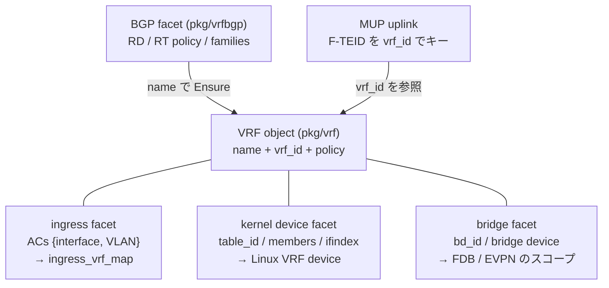

# VRF オブジェクト設計

## 概要

Vinbero の VRF は 1 つの一級オブジェクトです。`pkg/vrf` の Manager が identity を持ち、ingress 分類、kernel device、BGP policy、MUP uplink はすべてこのオブジェクトに付く facet として表現します。「IngressVRF」や「uplink instance」のような別概念は存在せず、VRF は VRF です。

1 つの VRF は次を持ちます。

- name。全 facet を結ぶ唯一の join key です。
- vrf_id。data plane の数値 id です。0 は global/default VRF (underlay) に予約され、tenant VRF には 1 以上が割り当てられます。
- ingress access circuit (AC)。この VRF に属する {interface, VLAN} の集合です。
- kernel device facet (任意)。End.DT4/DT6/DT46 が decap 後の FIB lookup に使う Linux VRF device です。持たない VRF (deviceless) も正当で、MUP gateway のように ingress 分類だけを使う構成がこれにあたります。
- bridge facet (任意)。End.DT2/DT2M が decap したフレームを配送する Linux bridge と、FDB / EVPN 広告をスコープする bd_id です。L2 だけの EVI (kernel device なし) も正当です。



## identity と vrf_id

vrf_id は `vrf.Manager` が割り当てます。最初に参照された時点で遅延作成され (`Ensure`)、次のどの経路でも同じ VRF になります。

- `vbctl vrf ac-add` で AC を足す
- `vbctl vrf create` で kernel device を作る
- `vbctl vrf bridge-attach` で bridge を attach する
- `vbctl vrf-bgp bind` で BGP binding を張る (binding の公開前に Ensure が走るので、並行する route apply が vrf_id 未割当ての binding を見ることはありません)
- config の `vrfs.entries[]`

削除された VRF の id は free list で再利用されます。予約名 `global` は常に id 0 で、tenant には使えず、id 0 が再利用されることもありません。`global` に AC を足すと {ifindex, vlan} → 0 の明示エントリになり、default-deny 下でも underlay/control interface を通せます。`global` は kernel device も bridge も持てません (global VRF は underlay そのものを指すためです)。

## ingress facet

data plane は XDP 入口で ingress front door を 1 回だけ通します。`ingress_vrf_map` ({ifindex, vlan} → vrf_id) を引き、結果を `tailcall_ctx.vrf_id` に載せて下流のハンドラへ運びます。front door は AC が 1 つでも存在するか default-deny が有効なときだけ enable され、無効なら全パケットが vrf 0 になります (後方互換)。

- AC はちょうど 1 つの VRF に属します。別 VRF が持つ AC の追加は拒否されます (map の衝突キーを作らせない)。
- default-deny を有効にすると、どの VRF にも分類されない AC のパケットを drop (または pass) します。underlay/control interface を通すには `global` VRF に AC を足します。
- `ingress_vrf_map` の writer は `vrf.Manager.Reconcile` だけです。

詳細は [forwarding_model.md](forwarding_model.md) の VRF axis を参照してください。

## kernel device facet

End.DT4/DT6/DT46 は decap 後に `bpf_fib_lookup(ifindex=VRF device)` で per-VRF FIB を引くため、Linux VRF device が必要です。この device の lifecycle を VRF オブジェクトが持ちます。

- 作成は `VrfService/VrfCreate` (CLI は `vbctl vrf create --name X --table-id N [--members ...] [--enable-l3mdev-rule]`)。netlink 操作と JSON state への永続化は `pkg/netresource` が機構レイヤとして担い、`vrf.Manager` は `DeviceOps` interface 経由で駆動します (ingress facet に対する `Programmer`/`bpf.MapOperations` と同じ分離)。
- 同名 device が既に居る場合は adopt します。ただし link が本当に VRF device で table が一致するときだけです (名前一致だけで NIC を取り込まない)。adopt は device を up にし、不足 member を enslave し、l3mdev rule を要求どおり足します。
- state への記録はマージです (members は union、l3mdev flag は OR)。runtime は device を上方収束しかしない (enslave/add のみ) ため、未指定フィールドで記録が弱まることはありません。device を縮めたいときは delete して作り直します (table 変更と同じ)。
- l3mdev rule は本物の `from all lookup [l3mdev-table]` rule を prio 1000 に入れます (FRA_L3MDEV を raw rtnetlink で構築)。

data plane の lookup キーはあくまで ifindex です (kernel FIB の要求)。vrf_id と ifindex の両方を 1 つの VRF が持つことで、operator からは 1 つのオブジェクトに見えます。

## bridge facet

EVPN / L2VPN の bridge domain も VRF オブジェクトの facet です。End.DT2/DT2M が decap したフレームを配送する Linux bridge (FDB miss 時の flood 先) と、`fdb_map` や `bd_peer_map` をスコープする bd_id (1..65535) を 1 つの VRF が持ちます。

- attach は `VrfService/VrfBridgeAttach` (CLI は `vbctl vrf bridge-attach --vrf X --name brN --bd-id N [--members ...]`)。netlink と JSON state への永続化は device facet と同じく `pkg/netresource` が `BridgeOps` interface 経由で担い、state record は owning VRF 名も持ちます。attach は FDBWatcher への登録 (MAC 学習と EVPN RT2 の供給源) も行います。
- 一意性は attach 時に強制されます。1 つの VRF が持てる bridge は 1 つ、1 つの bridge device / 1 つの bd_id が属せる VRF も 1 つです。
- facet が bridge domain の唯一の出所です。BGP binding は bd を持たず、受信した EVPN route (RT2/RT3) は RT が一致した binding の VRF が持つ facet の bd に install されます。facet の無い VRF の binding は EVPN route を import しません (fail-closed)。このため運用では bridge-attach を vrf-bgp bind より先に行います。binding が match 可能になった時点で bd が必ず解決でき、bind と attach の間に届いた route が落ちて再適用されない、という窓が生じません。
- adopt のセマンティクスは device facet と同じです。link が本当に bridge であること、state 上の bd_id / owner と矛盾しないことを検証し、up + 不足 member の enslave で収束します。
- detach (`vbctl vrf bridge-detach --vrf X`) は End.DT2/DT2M の SID が bridge を参照している間は拒否します (EVPN auto-advertise が自分で入れた lifecycle SID は除外)。device の削除に成功してから FDBWatcher を解除し、EVPN auto-advertise を disable し、最後に facet を消します。削除失敗時は facet も watcher も無傷で retry できます。

EVPN auto-advertise が有効な場合、bridge facet と EVPN export RT 付きの binding が両方そろった時点で RT3 広告と FDB replay (RT2) が走ります。coordinator は binding の VRF 名から facet を引いて bd_id と bridge ifindex を得るので、bd の数値 join はどこにもありません。

## lifecycle

### 作成

facet ごとに入口が違っても、name が同じなら同じ VRF に集まります。順序の制約はありません (ac-add が先でも vrf create が先でも同じ)。

### 削除

`VrfService/VrfDelete` (CLI は `vbctl vrf delete --name X`) は VRF オブジェクト全体を消します。参照が 1 つでも残っている間は拒否します (refuse-to-guess)。

1. ingress AC が残っている → 拒否 (`vrf ac-remove` で先に外す)
2. vrf-bgp binding が存在する → 拒否 (`vrf-bgp unbind` で先に外す)
3. bridge facet が付いている → 拒否 (`vrf bridge-detach` で先に外す)
4. End.T/DT4/DT6/DT46 の SID が device ifindex を参照している → 拒否 (`sid delete` で先に外す)。参照チェック中に aux が読めない場合も fail-closed で拒否します (読めない aux が参照かもしれないため)
5. すべて clear なら device を teardown してから identity を消して id を回収します。device 削除が失敗した場合は identity に触れず、retry できます

`global` と、Vinbero 管理外の raw な kernel device (先に `vrf create` で adopt すれば管理下に入る) は削除できません。

## 永続化と boot

kernel device facet は `settings.state_path` の JSON state に永続化され、restart を跨いで生き残ります。boot 順序は次のとおりです。

1. `netresource.Reconcile` が state の device と bridge を kernel と突き合わせ、消えていれば再作成します
2. `seedVrfDevices` / `seedVrfBridges` が state を VRF オブジェクトに mirror します (restart 後も facet 付きの一級 VRF として見える)。facet 化以前の bridge record は owning VRF を持たないので、bridge 名を仮の VRF 名として seed します (state file の `vrf` フィールドを書いて再起動すれば本来の VRF に移せます)
3. `loadVRFs` が config の `vrfs:` を適用します (device / bridge は adopt 冪等、AC、policy、最後に ingress reconcile と bridge facet の FDBWatcher 登録 sweep)

config は加算的です。`vrfs.entries[]` から entry を消しても device は消えません。削除は明示的な `vbctl vrf delete` だけです。

## 操作サーフェス

RPC は `VrfService` に集約されています (旧 `NetworkResourceService` は廃止済みです)。

| 操作 | RPC | CLI |
|------|-----|-----|
| kernel device 作成 (adopt 込み) | `VrfCreate` | `vbctl vrf create --name X --table-id N` |
| VRF 全体の削除 | `VrfDelete` | `vbctl vrf delete --name X` |
| bridge attach (adopt 込み) | `VrfBridgeAttach` | `vbctl vrf bridge-attach --vrf X --name brN --bd-id N` |
| bridge detach | `VrfBridgeDetach` | `vbctl vrf bridge-detach --vrf X` |
| AC 追加 (VRF の遅延作成込み) | `VrfAcAdd` | `vbctl vrf ac-add --vrf X --interface I [--vlan V]` |
| AC 削除 | `VrfAcRemove` | `vbctl vrf ac-remove --vrf X --interface I [--vlan V]` |
| default-deny policy | `VrfSetPolicy` | `vbctl vrf policy --default-deny [--deny-action drop\|pass]` |
| 一覧 (全 facet) | `VrfShow` | `vbctl vrf show` |

`vrf show` は 1 つの表で全 facet を出します。持たない facet の列は `-` になります。

```
VRF       VRF_ID  TABLE_ID  IFINDEX  BD_ID  BRIDGE  INTERFACE  VLAN
vrf-cust  1       100       3        -      -       -          -
evi-100   2       -         -        100    br100   -          -
vpn-a     3       -         -        -      -       eth1       0
```

## config

```yaml
vrfs:
  default_deny: false      # 未分類 AC を drop するか (deny_action: drop | pass)
  entries:
    - name: vrf-cust
      table_id: 100        # != 0 で kernel device を作成 (adopt 冪等)
      members: [eth2]      # device に enslave する interface
      enable_l3mdev_rule: true
      acs:                 # ingress 分類 (deviceless でも可)
        - interface: eth1
          vlan: 100
    - name: evi-100
      bridge:              # L2 facet (adopt 冪等)
        name: br100
        bd_id: 100
        members: [eth2]
```

`members` / `enable_l3mdev_rule` は device の設定なので `table_id` なしでは拒否されます。`bgp.vrf_bindings[]` は bd_id を持ちません (旧 field は tombstone で、非 0 を設定すると Load 時にエラーになります。0 は未設定と同義です)。EVPN の bridge domain はこの `bridge` facet が唯一の出所です。フィールドの一覧は [configuration.md](configuration.md) を参照してください。

## 関連ドキュメント

- [forwarding_model.md](forwarding_model.md) — 転送テーブル全体でのスコープ軸と lookup chain
- [fdb_vrf.md](fdb_vrf.md) — End.DT* の data plane (device / bridge facet の消費者)
- [bridge_domain.md](bridge_domain.md) — bridge domain の概念と MAC 学習
- [srv6_bgp.md](srv6_bgp.md) — BGP facet (vrf-bgp binding) と MUP の per-VRF uplink
- [persistence.md](persistence.md) — state.json の永続化層
