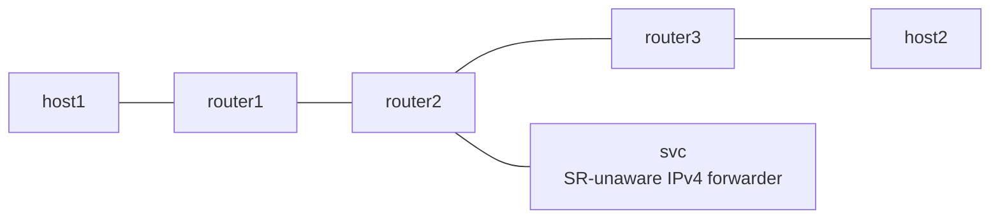

# End.AD (Dynamic Proxy) Example

draft-ietf-spring-srv6-service-programming の End.AD を netns で検証する example です。End.AS と同じ topology で、静的 CACHE の代わりに往路のパケットから SR encapsulation を動的に学習します。

## Topology



- forward 方向は router1 が H.Encaps で `fc00:2::100, fc00:3::3` を積みます。
- `fc00:2::100` は router2 の Vinbero が End.AD として処理します。最初の forward パケットから outer IPv6 + SRH を IFACE-IN circuit 単位で cache し、decap した inner を svc へ渡します。svc から戻ったパケットには cache した encapsulation をそのまま前置します。
- End.AS と違い、SID の設定に segment list を書きません。chain が変わっても設定変更なしで追従します。hop limit の揺れは `--hop-limit-margin` の範囲まで cache を書き換えません。
- return 方向 (host2 から host1) は proxy を通らない Linux native の経路です。

## 実行方法

```bash
sudo ./setup.sh
sudo ./test.sh
sudo ./teardown.sh
```

## テスト内容

- Phase 1 は Linux native の End を baseline にして underlay の疎通を確認します (Linux に End.AD は無いため proxy は bypass)。
- Phase 2 は Vinbero の End.AD で svc 経由の chain を検証します。最初の forward パケットが cache を seed し、svc 側 veth の rx counter でサービス通過を確認します。
- 同じ IFACE-IN に 2 つ目の proxy SID を作ると reject されること (return circuit の 1:1 制約) も確認します。
