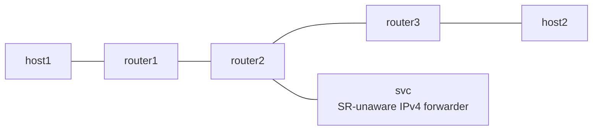

# SRv6 End.AD

*(日本語: [README.ja.md](./README.ja.md))*

netns example for End.AD from draft-ietf-spring-srv6-service-programming.
Same topology as End.AS, but the SR encapsulation is learned dynamically
from the forward packets instead of coming from a static CACHE.

## Topology



- In the forward direction router1 pushes `fc00:2::100, fc00:3::3` with H.Encaps.
- `fc00:2::100` is handled by Vinbero on router2 as End.AD. The first forward
  packet seeds a per-IFACE-IN-circuit cache of the outer IPv6 + SRH; the
  decapsulated inner packet goes to svc, and whatever comes back gets that
  cached encapsulation prepended.
- Unlike End.AS, the SID carries no segment list, so a changed chain needs no
  configuration change. Hop limit jitter within `--hop-limit-margin` does not
  rewrite the cache.
- The return direction (host2 to host1) is plain Linux forwarding and does
  not traverse the proxy.

## Usage

```bash
sudo ./setup.sh
sudo ./test.sh
sudo ./teardown.sh
```

## What is verified

- Phase 1 establishes an underlay baseline with Linux native End (Linux has
  no End.AD, so the proxy is bypassed).
- Phase 2 exercises the chain through svc with Vinbero's End.AD: the first
  forward packet seeds the cache, and the rx counter on the svc-side veth
  confirms the service was traversed.
- Creating a second proxy SID on the same IFACE-IN is rejected (the return
  circuit is 1:1).
