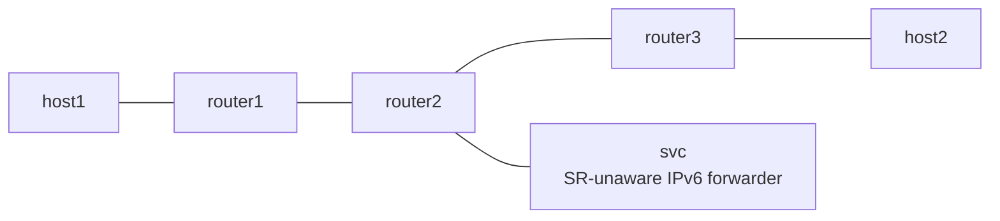

# End.AM (Masquerading Proxy) Example

*(English: [README.md](./README.md))*

draft-ietf-spring-srv6-service-programming の End.AM を netns で検証する example です。SR-unaware なサービスに SRH 付きのままパケットを渡し、宛先だけを最終 segment に偽装します。

## Topology



- forward 方向は router1 が H.Encaps で `fc00:2::150, fc00:3::3` を積みます。
- `fc00:2::150` は router2 の Vinbero が End.AM として処理します。SL を消費して DA を最終 segment (`fc00:3::3`) に書き換え、SRH を残したまま svc へ渡します。
- svc は素の IPv6 router です。パケットは自分宛てではないため SRH を見ずにそのまま転送し、同じ wire で router2 に返します。
- 復路は packet 内の SRH から DA を復元します。AS / AD と違い、router2 側に out-of-band の状態を一切持ちません。
- return 方向 (host2 から host1) は proxy を通らない Linux native の経路です。

## 実行方法

```bash
sudo ./setup.sh
sudo ./test.sh
sudo ./teardown.sh
```

## テスト内容

- Phase 1 は Linux native の End を baseline にして underlay の疎通を確認します (Linux に End.AM は無いため proxy は bypass)。
- Phase 2 は Vinbero の End.AM で svc 経由の chain を検証します。svc 側 veth の rx counter でサービス通過を確認します。
- 同じ IFACE-IN に 2 つ目の proxy SID を作ると reject されること (return circuit の 1:1 制約) も確認します。
