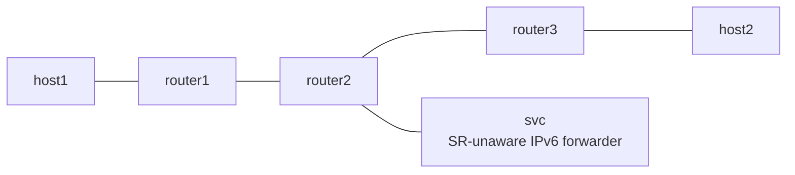

# SRv6 End.AM

*(日本語: [README.ja.md](./README.ja.md))*

netns example for End.AM from draft-ietf-spring-srv6-service-programming.
The packet keeps its SRH on the way to the SR-unaware service; only the
destination is masqueraded as the last segment.

## Topology



- In the forward direction router1 pushes `fc00:2::150, fc00:3::3` with H.Encaps.
- `fc00:2::150` is handled by Vinbero on router2 as End.AM. It consumes SL,
  rewrites the DA to the last segment (`fc00:3::3`), and hands the packet to
  svc with the SRH still in place.
- svc is a plain IPv6 router. The packet is not addressed to it, so it
  forwards it without looking at the SRH and returns it to router2 on the
  same wire.
- The return path restores the DA from the SRH carried in the packet itself.
  Unlike AS and AD, router2 keeps no out-of-band state.
- The return direction (host2 to host1) is plain Linux forwarding and does
  not traverse the proxy.

## Usage

```bash
sudo ./setup.sh
sudo ./test.sh
sudo ./teardown.sh
```

## What is verified

- Phase 1 establishes an underlay baseline with Linux native End (Linux has
  no End.AM, so the proxy is bypassed).
- Phase 2 exercises the chain through svc with Vinbero's End.AM. The rx
  counter on the svc-side veth confirms the service was traversed.
- Creating a second proxy SID on the same IFACE-IN is rejected (the return
  circuit is 1:1).
