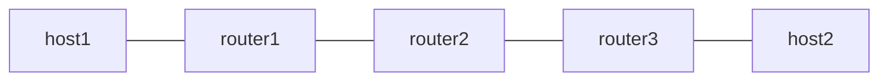

# End.AN (SR-Aware Native Service) Example

draft-ietf-spring-srv6-service-programming の End.AN を netns で検証する example です。SR-aware なサービスは SRH を自分で理解するため、proxy の往復や circuit は不要で、パケット処理は End と同一です。

## Topology



- forward 方向は router1 が H.Encaps で `fc00:2::200, fc00:3::3` を積みます。
- `fc00:2::200` は router2 の Vinbero が End.AN として処理します。転送は End と同じで、専用 slot は per-SID の統計と将来の service liveness 連動のためにあります。
- `--service-name` で NF catalog の metadata を登録し、`vbctl sid get` で引けることを確認します。NF discovery はこの SidFunctionList / Get を service の registration point として使います。
- return 方向 (host2 から host1) は Linux native の経路です。

## 実行方法

```bash
sudo ./setup.sh
sudo ./test.sh
sudo ./teardown.sh
```

## テスト内容

- Phase 1 は Linux native の End を baseline に underlay の疎通を確認します。
- Phase 2 は Vinbero の End.AN で同じ chain を検証し、`service_name` が API から round trip することを確認します。
