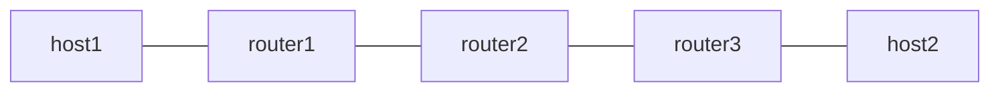

# SRv6 End.AN

*(日本語: [README.ja.md](./README.ja.md))*

netns example for End.AN from draft-ietf-spring-srv6-service-programming. An
SR-aware service understands the SRH itself, so there is no proxy round trip
and no circuit: packet processing is identical to End.

## Topology



- In the forward direction router1 pushes `fc00:2::200, fc00:3::3` with H.Encaps.
- `fc00:2::200` is handled by Vinbero on router2 as End.AN. Forwarding is the
  same as End; the dedicated slot exists for per-SID statistics and for
  future service liveness integration.
- `--service-name` registers NF catalog metadata, which `vinbero sid get`
  reads back (the netns examples use the `vinbero` binary; `vbctl` only
  exists inside the interop-clab image). NF discovery uses this
  SidFunctionList / Get pair as the service registration point.
- The return direction (host2 to host1) is plain Linux forwarding.

## Usage

```bash
sudo ./setup.sh
sudo ./test.sh
sudo ./teardown.sh
```

## What is verified

- Phase 1 establishes an underlay baseline with Linux native End.
- Phase 2 runs the same chain through Vinbero's End.AN and confirms that
  `service_name` round-trips through the API.
