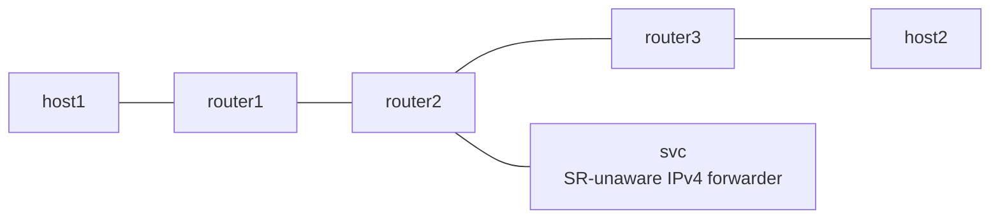

# End.AS (Static Proxy) Example

*(English: [README.md](./README.md))*

draft-ietf-spring-srv6-service-programming の End.AS を netns で検証する example です。SR-unaware なサービス (素の IPv4 forwarder) を SRv6 chain の途中に挟みます。

## Topology



- forward 方向は router1 が H.Encaps で `fc00:2::100, fc00:3::3` を積みます。
- `fc00:2::100` は router2 の Vinbero が End.AS として処理します。SR encapsulation を剥がして svc へ渡し、svc から戻ったパケットを静的 CACHE (`fc00:3::3`) で再 encapsulation して router3 へ送ります。
- svc は SRv6 を一切知りません。受け取った IPv4 パケットを経路表に従って同じ wire に送り返すだけです。
- return 方向 (host2 から host1) は proxy を通らない Linux native の経路です。

## 実行方法

```bash
sudo ./setup.sh
sudo ./test.sh
sudo ./teardown.sh
```

## テスト内容

- Phase 1 は Linux native の End を baseline にして underlay の疎通を確認します (Linux に End.AS は無いため proxy は bypass)。
- Phase 2 は Vinbero の End.AS で svc 経由の chain を検証します。svc 側 veth の rx counter が増えることで、トラフィックが実際にサービスを通過したことを確認します。
- 同じ IFACE-IN に 2 つ目の proxy SID を作ると reject されること (return circuit の 1:1 制約) も確認します。
