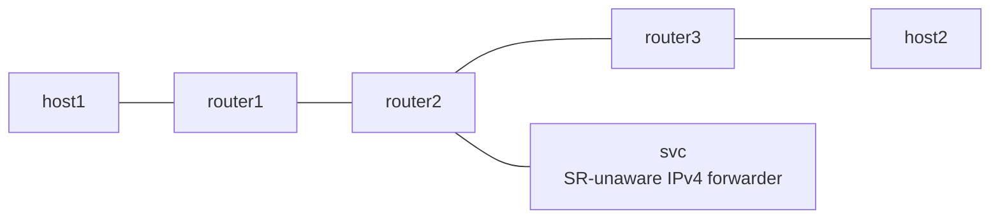

# SRv6 End.AS

*(日本語: [README.ja.md](./README.ja.md))*

netns example for End.AS from draft-ietf-spring-srv6-service-programming. An
SR-unaware service (a plain IPv4 forwarder) is inserted in the middle of an
SRv6 chain.

## Topology



- In the forward direction router1 pushes `fc00:2::100, fc00:3::3` with H.Encaps.
- `fc00:2::100` is handled by Vinbero on router2 as End.AS. It strips the SR
  encapsulation, hands the packet to svc, and re-encapsulates what comes back
  using the static CACHE (`fc00:3::3`) before sending it to router3.
- svc knows nothing about SRv6. It just routes the IPv4 packet it receives
  back out the same wire.
- The return direction (host2 to host1) is plain Linux forwarding and does
  not traverse the proxy.

## Usage

```bash
sudo ./setup.sh
sudo ./test.sh
sudo ./teardown.sh
```

## What is verified

- Phase 1 establishes an underlay baseline with Linux native End (Linux has
  no End.AS, so the proxy is bypassed).
- Phase 2 exercises the chain through svc with Vinbero's End.AS. The rx
  counter on the svc-side veth growing is what proves the traffic really
  crossed the service.
- Creating a second proxy SID on the same IFACE-IN is rejected (the return
  circuit is 1:1).
