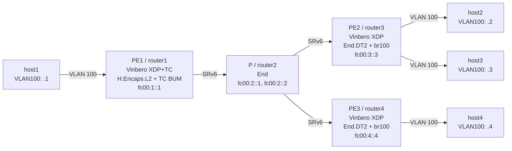

# SRv6 End.DT2 P2MP Playground

Vinbero XDPによるSRv6 End.DT2 P2MP（Point-to-Multipoint）L2VPNのデモ環境です。
BUM flood による複数リモートPEへの転送と、bridgeの複数ポートへのfloodを検証します。

## トポロジー



**テストシナリオ:**

1. BUM P2MP flood: host1がARP broadcastを送ると、PE1のTC clone-to-selfが PE2 と PE3 の両方にSRv6 encapしたコピーを送出する
2. Bridge multi-port flood: PE2のEnd.DT2がdecapした後、bridge br100がhost2とhost3の両方にfloodする
3. ローカルL2: host2とhost3は同じbridge上なので直接通信できる

## クイックスタート

```bash
sudo ./setup.sh    # 環境構築
sudo ./test.sh     # テスト実行
sudo ./teardown.sh # クリーンアップ
```

## 手動実行

### 1. 環境構築

```bash
sudo ./setup.sh
```

### 2. Vinbero起動（3台のPE）

```bash
# PE1
sudo ip netns exec p2m-router1 ../../out/bin/vinberod -c vinbero_pe1.yaml &
# PE2
sudo ip netns exec p2m-router3 ../../out/bin/vinberod -c vinbero_pe2.yaml &
# PE3
sudo ip netns exec p2m-router4 ../../out/bin/vinberod -c vinbero_pe3.yaml &
```

### 3. PE設定

```bash
# PE1: H.Encaps.L2 + BdPeer（PE2とPE3の2つ）
sudo ip netns exec p2m-router1 ../../out/bin/vinbero -s http://127.0.0.1:8082 \
  hl2 create --interface p2m-rt1h1 --vlan-id 100 \
  --src-addr fc00:1::1 --segments fc00:2::1,fc00:3::3 --bd-id 100

sudo ip netns exec p2m-router1 ../../out/bin/vinbero -s http://127.0.0.1:8082 \
  peer create --bd-id 100 --src-addr fc00:1::1 --segments fc00:2::1,fc00:3::3

sudo ip netns exec p2m-router1 ../../out/bin/vinbero -s http://127.0.0.1:8082 \
  peer create --bd-id 100 --src-addr fc00:1::1 --segments fc00:2::1,fc00:4::4

# PE2: End.DT2 + H.Encaps.L2 (return)
sudo ip netns exec p2m-router3 ../../out/bin/vinbero -s http://127.0.0.1:8083 \
  sid create --trigger-prefix fc00:3::3/128 --action END_DT2 --bd-id 100 --bridge-name br100

# PE3: End.DT2 + H.Encaps.L2 (return)
sudo ip netns exec p2m-router4 ../../out/bin/vinbero -s http://127.0.0.1:8084 \
  sid create --trigger-prefix fc00:4::4/128 --action END_DT2 --bd-id 100 --bridge-name br100
```

### 4. テスト

```bash
# BUM P2MP: host1 → host2 (PE2), host3 (PE2 bridge), host4 (PE3)
sudo ip netns exec p2m-host1 ping -c 3 -I p2m-h1rt1.100 172.16.100.2
sudo ip netns exec p2m-host1 ping -c 3 -I p2m-h1rt1.100 172.16.100.3
sudo ip netns exec p2m-host1 ping -c 3 -I p2m-h1rt1.100 172.16.100.4

# Bridge multi-port: host2 ↔ host3 (same bridge)
sudo ip netns exec p2m-host2 ping -c 3 -I p2m-h2rt3.100 172.16.100.3
```

### 5. クリーンアップ
```bash
sudo ./teardown.sh
```
