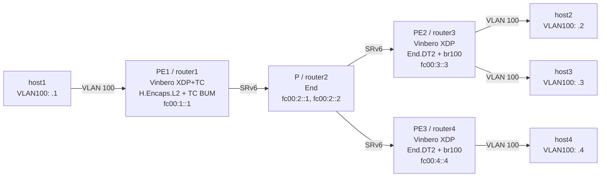

# SRv6 End.DT2 P2MP Playground

*(日本語: [README.ja.md](./README.ja.md))*

Demo environment for a point-to-multipoint L2VPN with SRv6 End.DT2 on Vinbero
XDP. It exercises BUM flooding towards several remote PEs and flooding across
several bridge ports.

## Topology


```mermaid
graph LR
    host1[host1<br/>VLAN100: .1] -->|VLAN 100| PE1[PE1 / router1<br/>Vinbero XDP+TC<br/>H.Encaps.L2 + TC BUM<br/>fc00:1::1]
    PE1 -->|SRv6| P[P / router2<br/>End<br/>fc00:2::1, fc00:2::2]
    P -->|SRv6| PE2[PE2 / router3<br/>Vinbero XDP<br/>End.DT2 + br100<br/>fc00:3::3]
    P -->|SRv6| PE3[PE3 / router4<br/>Vinbero XDP<br/>End.DT2 + br100<br/>fc00:4::4]
    PE2 -->|VLAN 100| host2[host2<br/>VLAN100: .2]
    PE2 -->|VLAN 100| host3[host3<br/>VLAN100: .3]
    PE3 -->|VLAN 100| host4[host4<br/>VLAN100: .4]
```

**Test scenarios:**

1. BUM P2MP flood: when host1 broadcasts an ARP request, PE1's TC
   clone-to-self sends one SRv6-encapsulated copy to PE2 and one to PE3
2. Bridge multi-port flood: after PE2's End.DT2 decapsulates, bridge br100
   floods to both host2 and host3
3. Local L2: host2 and host3 sit on the same bridge and talk directly

## Quick start

```bash
sudo ./setup.sh    # build the environment
sudo ./test.sh     # run the tests
sudo ./teardown.sh # clean up
```

## Running it by hand

### 1. Build the environment

```bash
sudo ./setup.sh
```

### 2. Start Vinbero on the three PEs

```bash
# PE1
sudo ip netns exec p2m-router1 ../../out/bin/vinberod -c vinbero_pe1.yaml &
# PE2
sudo ip netns exec p2m-router3 ../../out/bin/vinberod -c vinbero_pe2.yaml &
# PE3
sudo ip netns exec p2m-router4 ../../out/bin/vinberod -c vinbero_pe3.yaml &
```

### 3. Configure the PEs

```bash
# PE1: H.Encaps.L2 + two BdPeers (PE2 and PE3)
sudo ip netns exec p2m-router1 ../../out/bin/vinbero -s http://127.0.0.1:8082 \
  hl2 create --interface p2m-rt1h1 --vlan-id 100 \
  --src-addr fc00:1::1 --segments fc00:2::1,fc00:3::3 --bd-id 100

sudo ip netns exec p2m-router1 ../../out/bin/vinbero -s http://127.0.0.1:8082 \
  peer create --bd-id 100 --src-addr fc00:1::1 --segments fc00:2::1,fc00:3::3

sudo ip netns exec p2m-router1 ../../out/bin/vinbero -s http://127.0.0.1:8082 \
  peer create --bd-id 100 --src-addr fc00:1::1 --segments fc00:2::1,fc00:4::4

# PE2: End.DT2 + H.Encaps.L2 (return, one per access port) + BdPeer
sudo ip netns exec p2m-router3 ../../out/bin/vinbero -s http://127.0.0.1:8083 \
  sid create --trigger-prefix fc00:3::3/128 --action END_DT2 --bd-id 100 --bridge-name br100

sudo ip netns exec p2m-router3 ../../out/bin/vinbero -s http://127.0.0.1:8083 \
  hl2 create --interface p2m-rt3h2 --vlan-id 100 \
  --src-addr fc00:3::3 --segments fc00:2::2,fc00:1::2 --bd-id 100
sudo ip netns exec p2m-router3 ../../out/bin/vinbero -s http://127.0.0.1:8083 \
  hl2 create --interface p2m-rt3h3 --vlan-id 100 \
  --src-addr fc00:3::3 --segments fc00:2::2,fc00:1::2 --bd-id 100

sudo ip netns exec p2m-router3 ../../out/bin/vinbero -s http://127.0.0.1:8083 \
  peer create --bd-id 100 --src-addr fc00:3::3 --segments fc00:2::2,fc00:1::2

# PE3: End.DT2 + H.Encaps.L2 (return) + BdPeer
sudo ip netns exec p2m-router4 ../../out/bin/vinbero -s http://127.0.0.1:8084 \
  sid create --trigger-prefix fc00:4::4/128 --action END_DT2 --bd-id 100 --bridge-name br100

sudo ip netns exec p2m-router4 ../../out/bin/vinbero -s http://127.0.0.1:8084 \
  hl2 create --interface p2m-rt4h4 --vlan-id 100 \
  --src-addr fc00:4::4 --segments fc00:2::2,fc00:1::2 --bd-id 100

sudo ip netns exec p2m-router4 ../../out/bin/vinbero -s http://127.0.0.1:8084 \
  peer create --bd-id 100 --src-addr fc00:4::4 --segments fc00:2::2,fc00:1::2
```

### 4. Test

```bash
# BUM P2MP: host1 to host2 (PE2), host3 (PE2 bridge), host4 (PE3)
sudo ip netns exec p2m-host1 ping -c 3 -I p2m-h1rt1.100 172.16.100.2
sudo ip netns exec p2m-host1 ping -c 3 -I p2m-h1rt1.100 172.16.100.3
sudo ip netns exec p2m-host1 ping -c 3 -I p2m-h1rt1.100 172.16.100.4

# Bridge multi-port: host2 and host3 on the same bridge
sudo ip netns exec p2m-host2 ping -c 3 -I p2m-h2rt3.100 172.16.100.3
```

### 5. Clean up

```bash
sudo ./teardown.sh
```
