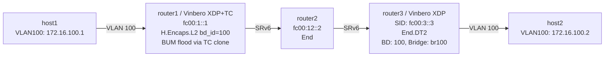

# SRv6 End.DT2 Playground

*(日本語: [README.ja.md](./README.ja.md))*

Demo environment for SRv6 End.DT2 (decapsulation with L2 table lookup) on
Vinbero XDP. It exercises a full bidirectional L2VPN including bridge
domains, MAC learning and BUM flooding.

## Topology



**Packet walk (host1 to host2, first ARP):**
1. host1 broadcasts an ARP request on VLAN 100
2. router1 (Vinbero XDP) recognises the BUM frame and hands it to TC with XDP_PASS
3. router1 (TC) clones to self and sends one SRv6-encapsulated copy per remote PE
   - VLAN materialization restores the VLAN tag on the inner frame
4. router2 transits the SRH with End
5. router3 (Vinbero XDP) runs End.DT2:
   - decapsulates SRv6 and extracts the inner L2 frame (still tagged VLAN 100)
   - learns the inner source MAC as a remote FDB entry
   - FDB miss, so it redirects to bridge br100 and floods
6. host2 receives the ARP request and replies

Subsequent unicast frames are encapsulated straight to the peer PE, because
the FDB has been learned.

## Quick start

```bash
sudo ./setup.sh    # build the environment
sudo ./test.sh     # run the tests
sudo ./teardown.sh # clean up
```

## Running it by hand

### 1. Build the environment and start Vinbero

```bash
sudo ./setup.sh

# router1: H.Encaps.L2 + TC BUM
sudo ip netns exec dt2-router1 ../../out/bin/vinberod -c vinbero_router1.yaml &

# router3: End.DT2 + the H.Encaps.L2 return path
sudo ip netns exec dt2-router3 ../../out/bin/vinberod -c vinbero_router3.yaml &
```

### 2. Configure router1 (forward path)

```bash
# H.Encaps.L2: VLAN 100 -> BD 100 -> SRv6 encap
sudo ip netns exec dt2-router1 ../../out/bin/vinbero -s http://127.0.0.1:8082 \
  hl2 create --interface dt2-rt1h1 --vlan-id 100 \
  --src-addr fc00:1::1 --segments fc00:2::1,fc00:3::3 --bd-id 100

# BdPeer: register the remote PE (router3) for BD 100
sudo ip netns exec dt2-router1 ../../out/bin/vinbero -s http://127.0.0.1:8082 \
  peer create --bd-id 100 --src-addr fc00:1::1 --segments fc00:2::1,fc00:3::3
```

### 3. Configure router3 (decap + return path)

```bash
# End.DT2: SRv6 decap -> BD 100 -> bridge flood
sudo ip netns exec dt2-router3 ../../out/bin/vinbero -s http://127.0.0.1:8083 \
  sid create --trigger-prefix fc00:3::3/128 --action END_DT2 --bd-id 100 --bridge-name br100

# H.Encaps.L2: return path
sudo ip netns exec dt2-router3 ../../out/bin/vinbero -s http://127.0.0.1:8083 \
  hl2 create --interface dt2-rt3h2 --vlan-id 100 \
  --src-addr fc00:3::3 --segments fc00:2::2,fc00:1::2 --bd-id 100

# BdPeer: return path
sudo ip netns exec dt2-router3 ../../out/bin/vinbero -s http://127.0.0.1:8083 \
  peer create --bd-id 100 --src-addr fc00:3::3 --segments fc00:2::2,fc00:1::2
```

### 4. Test

```bash
# ping across the L2VPN (VLAN 100)
sudo ip netns exec dt2-host1 ping -c 3 -I dt2-h1rt1.100 172.16.100.2

# inspect the FDB entries
sudo ip netns exec dt2-router3 ../../out/bin/vinbero -s http://127.0.0.1:8083 fdb list
```

#### Packet capture

```bash
# SRv6-encapsulated packets between router1 and router2
sudo ip netns exec dt2-router1 tcpdump -i dt2-rt1rt2 -n ip6

# decapsulated L2 frames (VLAN 100) between router3 and host2
sudo ip netns exec dt2-router3 tcpdump -i dt2-rt3h2 -n -e
```

### 5. Clean up

```bash
sudo ./teardown.sh
```
