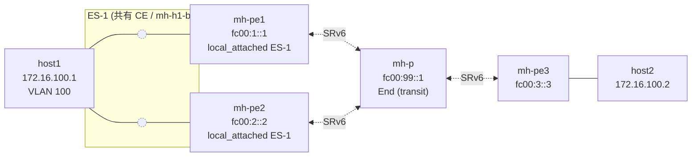

# End.DT2M マルチホーム Playground

RFC 9252 の split-horizon フィルタリングと静的 DF 選出を、**host1 が共有 Linux
ブリッジ経由で PE1 と PE2 にデュアルホームする** 5-namespace トポロジー上で
検証します。

- ESI: `01:00:00:00:00:00:00:00:00:01` (PE1/PE2 共に `local_attached`)
- Bridge Domain: `bd_id = 100` / VLAN 100
- host1 の MAC は MAC Pinning で `02:00:00:00:00:01` 固定
- host1 側の veth は `ethtool -K <veth> txvlan off` で VLAN タグをパケット
  データに残す (veth の VLAN offload は既知の罠)

## トポロジー



PE1 と PE2 は `mh-host1` 内の `mh-h1-br` を介して host1 と接続され、2 本の
veth レッグが生えます。split-horizon が無いと host1 からの BUM が他方の PE
経由でループバックしてきますが、RFC 9252 の split-horizon + DF 選出を入れ
ることで BUM が正しく一方向にファンアウトします。

## クイックスタート (要 sudo)

```bash
sudo ./setup.sh
# (各 PE で vinberod が ready になるのを待つ)
sudo ./test.sh
sudo ./teardown.sh
```

## テストで検証する内容

1. **Split-horizon (Phase C)**: `host1 → broadcast → PE1` が PE2 経由で
   host1 に戻ってこないこと。PE1 側で `SPLIT_HORIZON_TX > 0`、PE2 側
   (fail-safe 経路) で `SPLIT_HORIZON_RX` をアサート。
2. **DF 選出 (Phase D)**:
   - 初期状態は DF=PE1。両 PE で
     `vbctl es df-set --esi ES-1 --pe fc00:1::1` を実行して DF を一致させる。
   - リモートからの `PE3 → BUM → host1` は PE1 経由でのみ host1 に届く
     (PE2 側は `NON_DF_DROP` で落ちる)。
   - DF を PE2 に切り替え: `vbctl es df-set --esi ES-1 --pe fc00:2::2`
     → 以降は PE2 経由で届く。

## ステータス

**データプレーン** (eBPF ロジック): `pkg/bpf/split_horizon_test.go` の
BPF_PROG_TEST_RUN ベースのアサーションで完全にカバー済み。
- `TestXDPProgEndDT2MSplitHorizonRX` (Phase C: RX 側 drop)
- `TestXDPProgEndDT2MNonDFDrop` (Phase D: DF ゲート)
- `TestBdPeerReverseEsi` (`bd_peer_reverse_map` への ESI 伝播)

**コントロールプレーン API** (Connect RPC): 同ディレクトリの
`smoke_api.sh` で検証。vinberod を 1 台だけ立ち上げ (データプレーントラ
フィック無し)、`es create / list / df-set / df-clear / delete` と
`bd-peer create --esi` を一通り叩きます。

**フル E2E トポロジー**: 同ディレクトリの `setup.sh` / `test.sh` で
5-namespace の shared-CE トポロジーを立ち上げます。BPF コード自体は
上記のユニットテストで検証済みですが、Linux bridge との相互作用
(veth tx-vlan offload、ARP 重複、MAC Pinning 等) の確認には E2E が有用
です。まず `smoke_api.sh` を green にしてから `setup.sh` + `test.sh`
に進むのがおすすめです。

## ファイル一覧

| ファイル | 用途 |
|---|---|
| `README.md` | 本ドキュメント |
| `smoke_api.sh` | API のみのスモーク (PE 1 台、データプレーン無し、10 秒以内に完走) |
| `setup.sh` | 共有 CE ブリッジを含む 5-namespace トポロジー構築 |
| `teardown.sh` | namespace / veth の撤去 |
| `test.sh` | pcap + stats アサーション付きの E2E テスト |
| `vinbero_pe1.yaml` | PE1 設定 (ES-1 local_attached) |
| `vinbero_pe2.yaml` | PE2 設定 (ES-1 local_attached) |
| `vinbero_p.yaml` | 中継ルータ設定 (End) |
| `vinbero_pe3.yaml` | 出口 PE 設定 (シングルホーム) |
