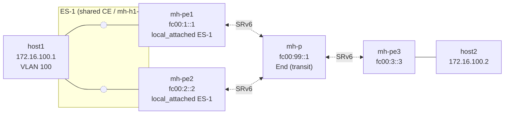

# SRv6 End.DT2M multi-homing

*(日本語: [README.ja.md](./README.ja.md))*

Verifies RFC 9252 split-horizon filtering and static DF election on a
5-namespace topology where **host1 is dual-homed to PE1 and PE2 through a
shared Linux bridge**.

- ESI: `01:00:00:00:00:00:00:00:00:01` (`local_attached` on both PE1 and PE2)
- Bridge domain: `bd_id = 100` / VLAN 100
- host1's MAC is pinned to `02:00:00:00:00:01` with MAC pinning
- The host1-side veths run `ethtool -K <veth> txvlan off` so the VLAN tag
  stays in the packet data (veth VLAN offload is a known trap)

## Topology


```mermaid
flowchart LR
    host1["host1<br/>172.16.100.1<br/>VLAN 100"]

    subgraph ES1["ES-1 (shared CE / mh-h1-br)"]
      direction LR
      leg1(( )):::leg
      leg2(( )):::leg
    end

    pe1["mh-pe1<br/>fc00:1::1<br/>local_attached ES-1"]
    pe2["mh-pe2<br/>fc00:2::2<br/>local_attached ES-1"]
    p["mh-p<br/>fc00:99::1<br/>End (transit)"]
    pe3["mh-pe3<br/>fc00:3::3"]
    host2["host2<br/>172.16.100.2"]

    host1 --- leg1
    host1 --- leg2
    leg1 --- pe1
    leg2 --- pe2

    pe1 <-. SRv6 .-> p
    pe2 <-. SRv6 .-> p
    p   <-. SRv6 .-> pe3
    pe3 --- host2

    classDef leg fill:#eef,stroke:#88a,stroke-dasharray:2 2;
```

PE1 and PE2 reach host1 through `mh-h1-br` inside `mh-host1`, so two veth
legs come off it. Without split-horizon, BUM traffic from host1 loops back
through the other PE; RFC 9252 split-horizon plus DF election makes it fan
out in one direction only.

## Quick start (needs sudo)

```bash
sudo ./setup.sh
# (wait for vinberod to become ready on each PE)
sudo ./test.sh
sudo ./teardown.sh
```

## What the test verifies

1. **Split-horizon (phase C)**: `host1 -> broadcast -> PE1` does not come back
   to host1 via PE2. It asserts `SPLIT_HORIZON_TX > 0` on both PEs and
   checks a pcap on the host1 side for zero self-sourced ARP frames.
2. **DF election (phase D)**: `vbctl` in the commands below is a shell
   function that `test.sh` and `smoke_api.sh` define around `vinbero -s
   http://127.0.0.1:<PE port>`; there is no `vbctl` binary inside the
   namespaces. Pass the real ESI from the top of this page to `--esi`.
   - DF starts as PE1. Run
     `vbctl es df-set --esi 01:00:00:00:00:00:00:00:00:01 --pe fc00:1::1`
     on both PEs so they agree on the DF.
   - `PE3 -> BUM -> host1` from the remote side reaches host1 only via PE1
     (PE2 drops it as `NON_DF_DROP`).
   - Switch the DF to PE2 with
     `vbctl es df-set --esi 01:00:00:00:00:00:00:00:00:01 --pe fc00:2::2`,
     after which the traffic arrives via PE2.

## Status

**Data plane** (eBPF logic): fully covered by the BPF_PROG_TEST_RUN
assertions in `pkg/bpf/split_horizon_test.go`.
- `TestXDPProgEndDT2MSplitHorizonRX` (phase C: RX-side drop)
- `TestXDPProgEndDT2MNonDFDrop` (phase D: DF gate)
- `TestBdPeerReverseEsi` (ESI propagation into `bd_peer_reverse_map`)

**Control plane API** (Connect RPC): covered by `smoke_api.sh` in this
directory. It brings up a single vinberod (no data-plane traffic) and walks
`es create / list / df-set / df-clear / delete` plus `bd-peer create --esi`.

**Full E2E topology**: `setup.sh` and `test.sh` here build the 5-namespace
shared-CE topology. The BPF code itself is covered by the unit tests above,
but the E2E run is what exercises the interaction with the Linux bridge (veth
tx-vlan offload, duplicate ARP, MAC pinning). Getting `smoke_api.sh` green
first and then moving to `setup.sh` + `test.sh` is the smoother path.

## Files

| File | Purpose |
|---|---|
| `README.md` | This document (Japanese version: `README.ja.md`) |
| `smoke_api.sh` | API-only smoke test (one PE, no data plane, finishes within 10 seconds) |
| `setup.sh` | Builds the 5-namespace topology including the shared CE bridge |
| `teardown.sh` | Removes the namespaces and veths |
| `test.sh` | E2E test with pcap and stats assertions |
| `vinbero_pe1.yaml` | PE1 config (ES-1 local_attached) |
| `vinbero_pe2.yaml` | PE2 config (ES-1 local_attached) |
| `vinbero_p.yaml` | Transit router config (End) |
| `vinbero_pe3.yaml` | Egress PE config (single-homed) |
