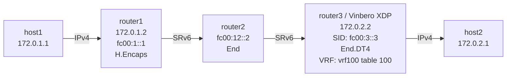

# SRv6 End.DT4 Playground

Vinbero XDPによるSRv6 End.DT4 (Decapsulation with IPv4 Table lookup via VRF) のデモ環境です。

## トポロジー



**パケットの流れ（host1 → host2の例）:**
1. host1が172.0.2.1にpingを送信（IPv4）
2. router1がLinux native H.Encapsを実行し、IPv4パケットをIPv6+SRHでカプセル化する
3. router2がfc00:2::1でEnd操作を実行する（SL減少、次のセグメントへ）
4. router3（Vinbero XDP）がfc00:3::3でEnd.DT4を実行する
   - 外側IPv6+SRHヘッダを除去する
   - VRF vrf100のルーティングテーブルでFIBルックアップし、host2へ転送する
5. host2がpingを受信する

End.DX4との違いは、End.DT4はVRF内のルーティングテーブルを参照するため、複数の顧客ネットワークをVRFで分離できる点です。

## クイックスタート

```bash
sudo ./setup.sh    # 環境構築
sudo ./test.sh     # テスト実行
sudo ./teardown.sh # クリーンアップ
```

## 手動実行

### 1. 環境構築とVinbero起動

```bash
sudo ./setup.sh

# router3のLinux native End.DT4ルートを削除
sudo ip netns exec dt4-router3 ip -6 route del local fc00:3::3/128 2>/dev/null

# Vinbero起動
sudo ip netns exec dt4-router3 ../../out/bin/vinberod -c vinbero_router3.yaml
```

### 2. SidFunction (End.DT4) エントリ登録

```bash
sudo ip netns exec dt4-router3 ../../out/bin/vinbero -s http://127.0.0.1:8082 \
  sid create --trigger-prefix fc00:3::3/128 --action END_DT4 --vrf-name vrf100
```

### 3. テスト

```bash
sudo ip netns exec dt4-host1 ping -c 3 172.0.2.1
```

#### パケットキャプチャ

```bash
# router2-router3間でSRv6パケットを確認
sudo ip netns exec dt4-router3 tcpdump -i dt4-rt3rt2 -n ip6

# router3-host2間でデカプセル化後のIPv4パケットを確認
sudo ip netns exec dt4-router3 tcpdump -i dt4-rt3h2 -n ip
```

### 4. クリーンアップ
```bash
sudo ./teardown.sh
```
