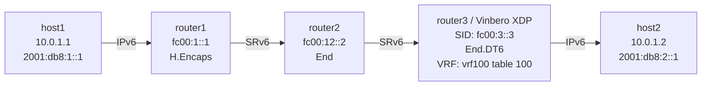

# SRv6 End.DT6 Playground

*(日本語: [README.ja.md](./README.ja.md))*

Demo environment for SRv6 End.DT6 (decapsulation with IPv6 table lookup via
VRF) on Vinbero XDP.

## Topology



**Packet walk (host1 to host2):**
1. host1 pings 2001:db8:2::1 over IPv6
2. router1 runs Linux native H.Encaps and wraps the IPv6 packet in an outer
   IPv6 + SRH
3. router2 runs End on fc00:2::1: decrement SL, move to the next segment
4. router3 (Vinbero XDP) runs End.DT6 on fc00:3::3:
   - strips the outer IPv6 + SRH headers
   - resolves the inner packet in VRF vrf100's routing table and forwards it
     to host2
5. host2 receives the ping

The difference from End.DT4 is that the inner packet is IPv6. End.DT46
handles both IPv4 and IPv6 under a single SID.

## Quick start

```bash
sudo ./setup.sh    # build the environment
sudo ./test.sh     # run the tests
sudo ./teardown.sh # clean up
```

## Running it by hand

### 1. Build the environment and start Vinbero

```bash
sudo ./setup.sh

# Remove the Linux native End.DT6 route on router3
sudo ip netns exec dt6-router3 ip -6 route del local fc00:3::3/128 2>/dev/null

# Start Vinbero
sudo ip netns exec dt6-router3 ../../out/bin/vinberod -c vinbero_router3.yaml
```

### 2. Register the SidFunction (End.DT6) entry

```bash
sudo ip netns exec dt6-router3 ../../out/bin/vinbero -s http://127.0.0.1:8082 \
  sid create --trigger-prefix fc00:3::3/128 --action END_DT6 --vrf-name vrf100
```

### 3. Test

```bash
sudo ip netns exec dt6-host1 ping6 -c 3 2001:db8:2::1
```

#### Packet capture

```bash
# SRv6 packets between router2 and router3
sudo ip netns exec dt6-router3 tcpdump -i dt6-rt3rt2 -n ip6

# Decapsulated IPv6 packets between router3 and host2
sudo ip netns exec dt6-router3 tcpdump -i dt6-rt3h2 -n ip6
```

### 4. Clean up

```bash
sudo ./teardown.sh
```
