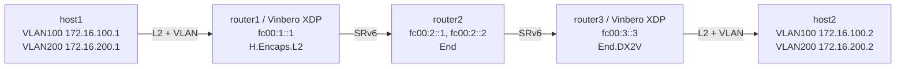

# SRv6 End.DX2V Playground

Vinbero XDPによるSRv6 End.DX2V (Decapsulation and VLAN L2 cross-connect) のデモ環境です。

End.DX2V は外側のIPv6+SRHを除去したあと、内側L2フレームのVLAN IDを見て出力ポートを選ぶVLAN単位のクロスコネクトです。この example はVLAN 100と200を同じ物理ポートへ振り分けます。

L2VPNは双方向ともH.Encaps.L2が必要なため、Vinberoはrouter1とrouter3の両方で動きます。router1が往路をencap、router3がEnd.DX2Vでdecap兼VLANクロスコネクト、戻り方向はrouter3がencapしてrouter1がdecapします。

## トポロジー



**パケットの流れ（host1→host2, VLAN 100）:**
1. host1がVLAN 100で172.16.100.2へpingを送信
2. **router1 (Vinbero XDP)** がH.Encaps.L2を実行し、L2フレームをSegment List `[fc00:2::1, fc00:3::3]` でSRv6カプセル化
3. router2がfc00:2::1でEndを実行 (SL減算、次セグメントへ)
4. **router3 (Vinbero XDP)** がfc00:3::3でEnd.DX2Vを実行:
   - 外側IPv6+SRHを除去
   - 内側フレームのVLAN ID 100をVLAN tableで引き、対応する出力ポートへL2転送
5. host2がVLAN 100でpingを受信
6. VLAN 200も同じ仕組みで同じポートへクロスコネクト

veth pairではtx-vlan-offloadが有効だとVLAN tagが `skb->vlan_tci` に退避してXDPから見えなくなるため、setup.shで送信側の `txvlan` / 受信側の `rxvlan` をoffにしています。

## クイックスタート

```bash
sudo ./setup.sh    # 環境構築（VLAN 100/200 + VLAN offload無効化）
sudo ./test.sh     # テスト実行（Linux native End.DX2 baseline → Vinbero End.DX2V）
sudo ./teardown.sh # クリーンアップ
```

`test.sh` はrouter1/router3でVinberoを起動してH.Encaps.L2を登録し、Phase 1でLinux native End.DX2をbaseline確認、Phase 2でrouter3のEnd.DX2Vに置き換えてVLAN 100/200のクロスコネクトを検証、Phase 3でVLAN table APIを確認します。

## 手動実行

### 1. 環境構築とVinbero起動

```bash
sudo ./setup.sh

# router1 (H.Encaps.L2, port 8082)
sudo ip netns exec dx2v-router1 ../../out/bin/vinberod -c vinbero_router1.yaml &
# router3 (End.DX2V + 戻り方向H.Encaps.L2, port 8083)
sudo ip netns exec dx2v-router3 ../../out/bin/vinberod -c vinbero_router3.yaml &
```

### 2. router1: H.Encaps.L2 登録（VLAN 100 / 200）

```bash
sudo ip netns exec dx2v-router1 ../../out/bin/vinbero -s http://127.0.0.1:8082 \
  hl2 create --interface dx2v-rt1h1 --vlan-id 100 --src-addr fc00:1::1 --segments fc00:2::1,fc00:3::3
sudo ip netns exec dx2v-router1 ../../out/bin/vinbero -s http://127.0.0.1:8082 \
  hl2 create --interface dx2v-rt1h1 --vlan-id 200 --src-addr fc00:1::1 --segments fc00:2::1,fc00:3::3
```

### 3. router3: VLAN table と End.DX2V SID 登録

```bash
# router3のLinux native End.DX2経路を削除
sudo ip netns exec dx2v-router3 ip -6 route del local fc00:3::3/128 2>/dev/null

# VLAN ID -> 出力ポートの対応をtable_id=1に登録
sudo ip netns exec dx2v-router3 ../../out/bin/vinbero -s http://127.0.0.1:8083 \
  vlan-table create --table-id 1 --vlan-id 100 --interface dx2v-rt3h2
sudo ip netns exec dx2v-router3 ../../out/bin/vinbero -s http://127.0.0.1:8083 \
  vlan-table create --table-id 1 --vlan-id 200 --interface dx2v-rt3h2

# End.DX2V SID (table_id=1 を参照)
sudo ip netns exec dx2v-router3 ../../out/bin/vinbero -s http://127.0.0.1:8083 \
  sid create --trigger-prefix fc00:3::3/128 --action END_DX2V --table-id 1
```

### 4. テスト

```bash
sudo ip netns exec dx2v-host1 ping -c 3 -I dx2v-h1rt1.100 172.16.100.2  # VLAN 100
sudo ip netns exec dx2v-host1 ping -c 3 -I dx2v-h1rt1.200 172.16.200.2  # VLAN 200

# VLAN table の確認
sudo ip netns exec dx2v-router3 ../../out/bin/vinbero -s http://127.0.0.1:8083 --json vlan-table list --table-id 1
```

### 5. 環境のクリーンアップ

```bash
sudo ./teardown.sh
```
