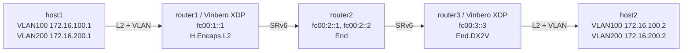

# SRv6 End.DX2V Playground

*(日本語: [README.ja.md](./README.ja.md))*

Demo environment for SRv6 End.DX2V (decapsulation and VLAN L2 cross-connect)
on Vinbero XDP.

End.DX2V strips the outer IPv6 + SRH and then picks the output port from the
VLAN ID of the inner L2 frame, giving a per-VLAN cross-connect. This example
maps VLAN 100 and VLAN 200 onto the same physical port.

An L2VPN needs H.Encaps.L2 in both directions, so Vinbero runs on router1 and
router3: router1 encapsulates the forward direction, router3 decapsulates and
cross-connects with End.DX2V, and the return direction is encapsulated by
router3 and decapsulated by router1.

## Topology



**Packet walk (host1 to host2, VLAN 100):**
1. host1 pings 172.16.100.2 on VLAN 100
2. **router1 (Vinbero XDP)** runs H.Encaps.L2 and encapsulates the L2 frame
   with the segment list `[fc00:2::1, fc00:3::3]`
3. router2 runs End on fc00:2::1 (decrement SL, move to the next segment)
4. **router3 (Vinbero XDP)** runs End.DX2V on fc00:3::3:
   - strips the outer IPv6 + SRH
   - looks the inner frame's VLAN ID 100 up in the VLAN table and forwards it
     to the matching output port
5. host2 receives the ping on VLAN 100
6. VLAN 200 is cross-connected to the same port the same way

On veth pairs, tx-vlan-offload moves the VLAN tag into `skb->vlan_tci` where
XDP cannot see it, so setup.sh turns `txvlan` off on the sending side and
`rxvlan` off on the receiving side.

## Quick start

```bash
sudo ./setup.sh    # build the environment (VLAN 100/200, VLAN offload off)
sudo ./test.sh     # run the tests (Linux native End.DX2 baseline, then Vinbero End.DX2V)
sudo ./teardown.sh # clean up
```

`test.sh` starts Vinbero on router1 and router3 and registers H.Encaps.L2.
Phase 1 establishes a baseline with Linux native End.DX2, phase 2 replaces it
with End.DX2V on router3 and verifies the VLAN 100 and 200 cross-connects,
and phase 3 checks the VLAN table API.

## Running it by hand

### 1. Build the environment and start Vinbero

```bash
sudo ./setup.sh

# router1 (H.Encaps.L2, port 8082)
sudo ip netns exec dx2v-router1 ../../out/bin/vinberod -c vinbero_router1.yaml &
# router3 (End.DX2V + return-path H.Encaps.L2, port 8083)
sudo ip netns exec dx2v-router3 ../../out/bin/vinberod -c vinbero_router3.yaml &
```

### 2. router1: register H.Encaps.L2 for VLAN 100 and 200

```bash
sudo ip netns exec dx2v-router1 ../../out/bin/vinbero -s http://127.0.0.1:8082 \
  hl2 create --interface dx2v-rt1h1 --vlan-id 100 --src-addr fc00:1::1 --segments fc00:2::1,fc00:3::3
sudo ip netns exec dx2v-router1 ../../out/bin/vinbero -s http://127.0.0.1:8082 \
  hl2 create --interface dx2v-rt1h1 --vlan-id 200 --src-addr fc00:1::1 --segments fc00:2::1,fc00:3::3
```

### 3. router3: register the VLAN table and the End.DX2V SID

```bash
# Remove the Linux native End.DX2 route on router3
sudo ip netns exec dx2v-router3 ip -6 route del local fc00:3::3/128 2>/dev/null

# Map VLAN ID to output port in table_id=1
sudo ip netns exec dx2v-router3 ../../out/bin/vinbero -s http://127.0.0.1:8083 \
  vlan-table create --table-id 1 --vlan-id 100 --interface dx2v-rt3h2
sudo ip netns exec dx2v-router3 ../../out/bin/vinbero -s http://127.0.0.1:8083 \
  vlan-table create --table-id 1 --vlan-id 200 --interface dx2v-rt3h2

# End.DX2V SID referring to table_id=1
sudo ip netns exec dx2v-router3 ../../out/bin/vinbero -s http://127.0.0.1:8083 \
  sid create --trigger-prefix fc00:3::3/128 --action END_DX2V --table-id 1
```

### 4. Test

```bash
sudo ip netns exec dx2v-host1 ping -c 3 -I dx2v-h1rt1.100 172.16.100.2  # VLAN 100
sudo ip netns exec dx2v-host1 ping -c 3 -I dx2v-h1rt1.200 172.16.200.2  # VLAN 200

# inspect the VLAN table
sudo ip netns exec dx2v-router3 ../../out/bin/vinbero -s http://127.0.0.1:8083 --json vlan-table list --table-id 1
```

### 5. Clean up

```bash
sudo ./teardown.sh
```
