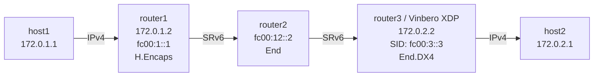

# SRv6 End.DX4 Playground

*(日本語: [README.ja.md](./README.ja.md))*

Demo environment for SRv6 End.DX4 (decapsulation with IPv4 cross-connect) on
Vinbero XDP.

## Topology



**Packet walk (host1 to host2):**
1. host1 pings 172.0.2.1 over IPv4
2. router1 runs Linux native H.Encaps:
   - the IPv4 packet is encapsulated in IPv6 + SRH
   - outer DA: fc00:2::1 (the first segment)
   - segment list: [fc00:2::1, fc00:3::3]
3. router2 runs End on fc00:2::1: decrement SL, move to the next segment
4. **router3 (Vinbero XDP)** runs End.DX4 on fc00:3::3:
   - strips the outer IPv6 + SRH headers
   - forwards the inner IPv4 packet via a FIB lookup
5. host2 receives the ping

## Quick start

```bash
sudo ./setup.sh    # build the environment
sudo ./test.sh     # run the tests
sudo ./teardown.sh # clean up
```

## Running it by hand

### 1. Build the environment and start Vinbero

```bash
sudo ./setup.sh

# Remove the Linux native End.DX4 route on router3
sudo ip netns exec dx4-router3 ip -6 route del local fc00:3::3/128 2>/dev/null

# Start Vinbero
sudo ip netns exec dx4-router3 ../../out/bin/vinberod -c vinbero_router3.yaml
```

### 2. Register the SidFunction (End.DX4) entry

```bash
sudo ip netns exec dx4-router3 ../../out/bin/vinbero -s http://127.0.0.1:8082 sid create --trigger-prefix fc00:3::3/128 --action END_DX4
```

### 3. Test

```bash
sudo ip netns exec dx4-host1 ping -c 3 172.0.2.1
```

#### Packet capture

```bash
# SRv6 packets between router2 and router3
sudo ip netns exec dx4-router3 tcpdump -i dx4-rt3rt2 -n ip6

# Decapsulated IPv4 packets between router3 and host2
sudo ip netns exec dx4-router3 tcpdump -i dx4-rt3h2 -n ip
```

### 4. Clean up

```bash
sudo ./teardown.sh
```
