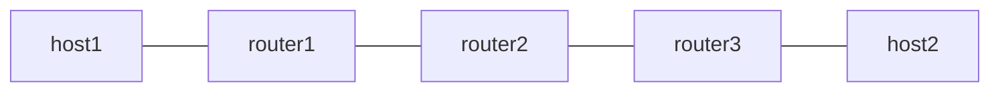

# end-t-replace — End.T with REPLACE-CSID

*(日本語: [README.ja.md](./README.ja.md))*

Exercises End.T with the REPLACE-CSID flavor (RFC 9800 Sec.4.2): the
same packed-container walk as [`end-replace`](../end-replace/), but
router2's two C-SIDs are `END_T_REPLACE` entries bound to `vrf100`, so
every advance resolves the next C-SID in the VRF's table.

The VRF binding is proven structurally: router2's main table carries a
blackhole for the whole locator block and the route towards router3
lives in table 100 only, so an End(REP) that fell back to the default
FIB would drop the packet. There is no Linux oracle phase (seg6local
implements only the NEXT-C-SID flavor); the test asserts delivery, the
`sid list` round-trip (the stored END_REPLACE entry reports back as
END_T_REPLACE with its VRF), and the r2 -> r3 link's TX packet counter
pinning the two crossings per echo.

See [`docs/design/ja/usid.md`](../../docs/design/ja/usid.md) for the design.

## Topology



C-SID plan (48-bit block fd00:aabb:ccdd, 32-bit C-SIDs, K=4):

- router2 (Vinbero): End.T(REP) at C-SIDs b2b2:1 and b2b2:2 (/80),
  both bound to vrf100 (table 100; main table blackholes the block)
- router3 (Vinbero): End(REP) at C-SID b3b3:1 (/80)
- router3 (Linux): terminal End.DX4 at C-SID b3b3:d — the last C-SID of
  a REPLACE sequence can be any behavior, and it matches the block+C-SID
  /80 because the DA's argument bits vary

The sequence [b2b2:1 (DA), b3b3:1, b2b2:2, b3b3:d] packs into one
container (`0:0:b3b3:d:b2b2:2:b3b3:1`), so the packet crosses
r2 → r3 → r2 → r3 and exercises the container cross (Index 0 → K-1) at
router2 and two in-container replacements.

## Requirements

- iproute2 with seg6 encap support (the containers are ordinary segment
  list entries from the headend's point of view)

## Usage

```bash
sudo ./setup.sh
sudo ./test.sh
sudo ./teardown.sh
```

## What is verified

1. `sid list` reports the entries back as END_T_REPLACE with vrf100
   (the reverse mapping from the aux)
2. The forward ping is delivered -- possible only if both r2 advances
   resolved in vrf100, because the main table blackholes the block --
   and the r2 -> r3 TX counter grows by two crossings per echo, pinning
   all four walk steps
3. The return direction works as a native baseline
