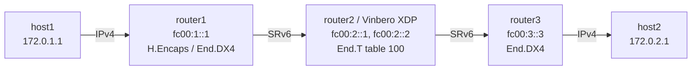

# SRv6 End.T Playground

*(English: [README.md](./README.md))*

Vinbero XDPによるSRv6 End.T (Endpoint with specific IPv6 table lookup) のデモ環境です。

End.T はEndと同じくSRH処理 (DA更新とSL減算) を行いますが、転送先のFIBルックアップをdefault tableではなく指定VRFのrouting tableで行います。decapはしません。

## トポロジー



router2 の `eth` 2本 (`rt2rt1` / `rt2rt3`) は VRF `vrf100` (table 100) に enslave され、router 間経路は table 100 に置かれます。End.T が更新後のDAをこのVRF tableで引きます。

**パケットの流れ（host1→host2）:**
1. host1が172.0.2.1にpingを送信 (IPv4)
2. router1がLinux native H.Encapsを実行し、Segment List `[fc00:2::1, fc00:3::3]` でSRv6カプセル化
3. **router2 (Vinbero XDP)** がfc00:2::1でEnd.Tを実行:
   - SRH処理でDAをfc00:3::3に更新、SLを減算
   - 更新後のDAをVRF table 100でFIBルックアップして転送
4. router3がfc00:3::3でEnd.DX4を実行し、内側IPv4パケットをhost2へ転送
5. 戻り方向は対称で、fc00:2::2のEnd.Tがhost2→host1を処理

## クイックスタート

```bash
sudo ./setup.sh    # 環境構築
sudo ./test.sh     # テスト実行（Linux native → Vinbero XDP の2フェーズ）
sudo ./teardown.sh # クリーンアップ
```

`test.sh` はまずLinux native End.Tで疎通を確認し、native経路を削除してからVinbero XDPで再検証します。

## 手動実行

### 1. 環境構築とVinbero起動

```bash
sudo ./setup.sh

# router2のLinux native End.T経路を削除
sudo ip netns exec end-t-router2 ip -6 route del local fc00:2::1/128 2>/dev/null
sudo ip netns exec end-t-router2 ip -6 route del local fc00:2::2/128 2>/dev/null

# Vinbero起動（フォアグラウンドで動き続けるので & でバックグラウンド起動するか別ターミナルで）
sudo ip netns exec end-t-router2 ../../out/bin/vinberod -c vinbero_router2.yaml &
```

### 2. SidFunction (End.T) エントリ登録

VRFを指定して両方向のSIDを登録します。

```bash
sudo ip netns exec end-t-router2 ../../out/bin/vinbero -s http://127.0.0.1:8082 \
  sid create --trigger-prefix fc00:2::1/128 --action END_T --vrf-name vrf100
sudo ip netns exec end-t-router2 ../../out/bin/vinbero -s http://127.0.0.1:8082 \
  sid create --trigger-prefix fc00:2::2/128 --action END_T --vrf-name vrf100
```

### 3. テスト

```bash
sudo ip netns exec end-t-host1 ping -c 3 172.0.2.1
```

bpf_fib_lookupはNDP解決済みのnext-hopを要求するため、setup.shで事前にrouter間のNDPを解決しています。

### 4. 環境のクリーンアップ

```bash
sudo ./teardown.sh
```
