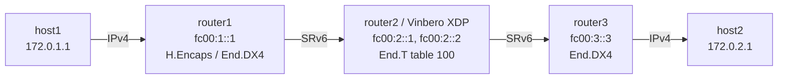

# SRv6 End.T Playground

*(日本語: [README.ja.md](./README.ja.md))*

Demo environment for SRv6 End.T (endpoint with specific IPv6 table lookup)
on Vinbero XDP.

End.T does the same SRH processing as End (update the DA, decrement SL), but
resolves the forwarding decision in a specific VRF routing table instead of
the default table. It does not decapsulate.

## Topology



Both of router2's interfaces (`rt2rt1` and `rt2rt3`) are enslaved to VRF
`vrf100` (table 100), so the inter-router routes live in table 100 and End.T
resolves the updated DA there.

**Packet walk (host1 to host2):**
1. host1 pings 172.0.2.1 over IPv4
2. router1 runs Linux native H.Encaps with the segment list `[fc00:2::1, fc00:3::3]`
3. **router2 (Vinbero XDP)** runs End.T on fc00:2::1:
   - SRH processing updates the DA to fc00:3::3 and decrements SL
   - the updated DA is resolved in VRF table 100 and forwarded
4. router3 runs End.DX4 on fc00:3::3 and forwards the inner IPv4 packet to host2
5. The return direction is symmetric: End.T on fc00:2::2 handles host2 to host1

## Quick start

```bash
sudo ./setup.sh    # build the environment
sudo ./test.sh     # run the tests (Linux native, then Vinbero XDP)
sudo ./teardown.sh # clean up
```

`test.sh` first checks connectivity through Linux native End.T, then removes
the native routes and repeats the check against Vinbero XDP.

## Running it by hand

### 1. Build the environment and start Vinbero

```bash
sudo ./setup.sh

# Remove the Linux native End.T routes on router2
sudo ip netns exec end-t-router2 ip -6 route del local fc00:2::1/128 2>/dev/null
sudo ip netns exec end-t-router2 ip -6 route del local fc00:2::2/128 2>/dev/null

# vinberod stays in the foreground, so background it or use another terminal
sudo ip netns exec end-t-router2 ../../out/bin/vinberod -c vinbero_router2.yaml &
```

### 2. Register the SidFunction (End.T) entries

Both directions are registered against the VRF.

```bash
sudo ip netns exec end-t-router2 ../../out/bin/vinbero -s http://127.0.0.1:8082 \
  sid create --trigger-prefix fc00:2::1/128 --action END_T --vrf-name vrf100
sudo ip netns exec end-t-router2 ../../out/bin/vinbero -s http://127.0.0.1:8082 \
  sid create --trigger-prefix fc00:2::2/128 --action END_T --vrf-name vrf100
```

### 3. Test

```bash
sudo ip netns exec end-t-host1 ping -c 3 172.0.2.1
```

bpf_fib_lookup needs a next hop whose neighbour is already resolved, so
setup.sh resolves NDP between the routers up front.

### 4. Clean up

```bash
sudo ./teardown.sh
```
