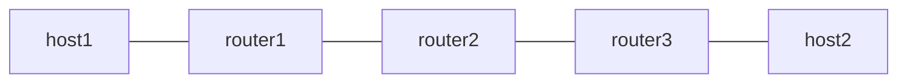

# end-ua — uA (NEXT-C-SID)

*(English: [README.md](./README.md))*

RFC 9800 の NEXT-C-SID flavor による uA を検証します。F3216 の SID 構造を使い、locator block は 32 bit の fd00:aaaa、uSID は 16 bit です。uA は End.X の NEXT-C-SID 版で、node と function をまとめた 32 bit を 1 回の実行で消費し、shift 後のパケットを FIB でなく設定した adjacency へ転送します。router2 の uA を Linux kernel の seg6local next-csid flavor と Vinbero XDP の両方で実行し、同じトポロジで到達性を突き合わせます。

## トポロジ



役割は次のとおりです。

- router1 は Linux の seg6 encap で forward 方向の container を付与し、return 方向の terminal SID fd00:aaaa:b001:d001::/128 を End.DX4 で受けます
- router2 は uA です。adjacency ごとに /64 の SID を持ち、fd00:aaaa:b002:a003::/64 は router3 へ、fd00:aaaa:b002:a001::/64 は router1 へ転送します。Phase 1 は Linux native の next-csid flavor、Phase 2 は Vinbero の END_UA で同じ SID を提供します
- router3 は Linux の seg6 encap で return 方向の container を付与し、forward 方向の terminal SID fd00:aaaa:b003:d004::/128 を End.DX4 で受けます

container は forward が fd00:aaaa:b002:a003:b003:d004::、return が fd00:aaaa:b002:a001:b001:d001:: です。

## Linux 側の設定について

Linux の seg6local が 1 回の実行で消費する幅は `nflen` です。`lblen` は shift せずに残す locator block の長さで、SID の prefix 長は `lblen + nflen` になります。uA は node と function を同時に消費するので、F3216 では `lblen 32 nflen 32` (prefix /64) を指定します。`nflen 16` は uN の形で、function CSID が DA に残ります。

## 必要条件

- Linux kernel 6.6 以上 (seg6local End.X の next-csid flavor)
- iproute2 6.0 以上

## 実行方法

```bash
sudo ./setup.sh
sudo ./test.sh
sudo ./teardown.sh
```

## 検証内容

1. Linux native の next-csid flavor で host1 と host2 の双方向 ping が通ることを確認します
2. Linux native の local route を削除し、Vinbero を起動して同じ 2 つの /64 に END_UA を登録し、双方向 ping が通ることを確認します

router2 は terminal SID への経路を一切持たないので、uA が設定した nexthop を使わずに shift 後の DA を FIB で引いた場合は転送できません。phase 2 の ping が通ること自体が adjacency 転送の確認になります。

phase 2 は neighbor table を flush してから traffic を流します。uA は FIB が NO_NEIGH を返したパケットを kernel に渡して neighbor を解決させるので、事前の NDP warm up なしで通信が立ち上がります。

## 制約

- uA の nexthop は IPv6 アドレスのみを受け付けます。FIB lookup の context は ingress ifindex で、既存の End.X と同じです
- trigger prefix は /64 で、function CSID に 0 は使えません。prefix 内のアドレスは uA SID 自身を除いてすべて container とみなされます

設計の全体像は [uSID (NEXT-C-SID) の uN と uA](../../docs/design/ja/usid.md) にあります。
