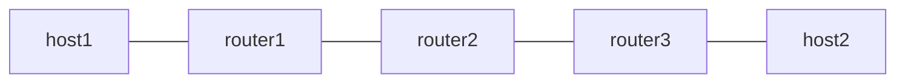

# end-ua — uA (NEXT-C-SID)

*(日本語: [README.ja.md](./README.ja.md))*

Exercises uA, the NEXT-C-SID flavor of End.X (RFC 9800), with the F3216 SID
structure: a 32-bit locator block (fd00:aaaa) and 16-bit uSIDs. uA consumes
node and function together -- 32 bits per execution -- and forwards over a
configured adjacency instead of a FIB lookup on the shifted DA. router2's uA
is served first by the Linux kernel's seg6local next-csid flavor and then by
Vinbero XDP, so the two are compared on the same topology.

See [`docs/design/ja/usid.md`](../../docs/design/ja/usid.md) for the design.

## Topology



- router1 pushes the forward container with Linux seg6 encap, and terminates
  the return direction on fd00:aaaa:b001:d001::/128 (End.DX4)
- router2 is the uA. It holds one /64 per adjacency:
  fd00:aaaa:b002:a003::/64 forwards to router3 and fd00:aaaa:b002:a001::/64
  to router1. Phase 1 serves them from Linux native next-csid, phase 2 from
  Vinbero END_UA
- router3 pushes the return container with Linux seg6 encap, and terminates
  the forward direction on fd00:aaaa:b003:d004::/128 (End.DX4)

The containers are fd00:aaaa:b002:a003:b003:d004:: forward and
fd00:aaaa:b002:a001:b001:d001:: return.

## The Linux side

seg6local consumes lblen + nflen bits per execution, so the uA shape is
`lblen 32 nflen 32`: node and function go together. `nflen 16` leaves the
function CSID in the DA, which is the uN shape.

## Requirements

- Linux kernel 6.6 or later (seg6local End.X next-csid flavor)
- iproute2 6.0 or later

## Usage

```bash
sudo ./setup.sh
sudo ./test.sh
sudo ./teardown.sh
```

## What is verified

1. Both directions ping through the Linux native next-csid flavor
2. The native local routes are removed, Vinbero registers END_UA on the same
   two /64s, and both directions ping again

router2 has no route to either terminal SID, so a uA that ignored its
configured nexthop and looked the shifted DA up in the FIB could not forward
at all. Phase 2 passing is therefore the evidence that uA uses its adjacency.

Unlike uN, uA stays fail-closed when the FIB answers NO_NEIGH: handing the
packet up would let the kernel route it by the DA, which is a different next
hop. The test resolves the neighbours before sending traffic, exactly as
classic End.X requires.

## Constraints

- The uA nexthop must be an IPv6 address. The FIB lookup context is the
  ingress ifindex, same as classic End.X
- The trigger prefix is a /64 and the function CSID cannot be 0. Every
  address inside the prefix except the uA SID itself is treated as a
  container
