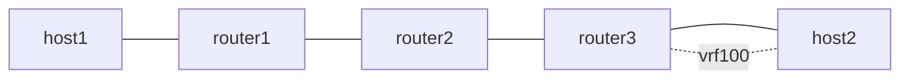

# end-udt4 — uDT4 (container 最終 uSID の End.DT4)

*(English: [README.md](./README.md))*

NEXT-C-SID container (RFC 9800、F3216) の最終 uSID として置いた End.DT4
を検証します。Vinbero に uDT4 専用の action はありません。zero-padded な
/128 (fd00:aaaa:b003:d004::) に既存の END_DT4 を登録すると、同一ノードの
uN /48 に longest-prefix match で勝ちます。この example はその性質の
end-to-end の実証で、まず Linux kernel を oracle として、次に Vinbero XDP
で確認します。

設計は [`docs/design/ja/usid.md`](../../docs/design/ja/usid.md) を参照して
ください。

## トポロジ



- router1 は Linux seg6 encap で forward container を付与し、返り方向を
  fc00:1::1 (End.DX4) で終端します
- router2 は素の IPv6 転送です
- router3 が uN /48 (fd00:aaaa:b003::/48) と uDT4 /128
  (fd00:aaaa:b003:d004::、vrf100 への End.DT4) の両方を持ちます。Phase 1
  は Linux seg6local、phase 2 は Vinbero が同じ SID を担当します

## 必要条件

- Linux kernel 6.1 以上 (seg6local next-csid flavor、VRF)
- iproute2 6.0 以上

## 使い方

```bash
sudo ./setup.sh
sudo ./test.sh
sudo ./teardown.sh
```

## 検証内容

1. Linux oracle: /48 と /128 を両方入れた状態で container
   fd00:aaaa:b003:d004:: が vrf100 に届きます。zero-padded /128 が uN /48
   に longest-prefix match で勝つことの確認です
2. Vinbero: native route を削除し、API で END_UN (/48) と END_DT4
   (/128、vrf100) を登録して同じ container が届くことを確認します
3. Vinbero のみ: 2 uSID の container fd00:aaaa:b003:b003:d004:: を使い
   ます。uN が 1 回 shift すると、shift 後の DA が同一ノードの uDT4 /128
   に着地します。Vinbero は XDP loop 内でこの引き継ぎを re-dispatch しま
   すが、Linux seg6local は shift 後の DA を自ノードの local SID へ転送
   できないため、oracle phase ではこの container を使いません

## 補足

uDT6 と uDT46 は inner の address family が違うだけ、uDX4/uDX6 は VRF
table の代わりに設定済み nexthop を使うだけで、いずれもこの END_DT4 と
同じく既存の End.* behavior を zero-padded /128 に登録する形で動きます。
