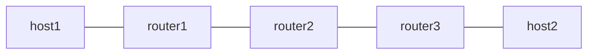

# end-un-usd — uN + USD (SRH なし decap)

*(English: [README.md](./README.md))*

SRH なし container の終端における uN (RFC 9800、F3216) の USD flavor を
検証します。H.Encaps.Red は単一 container のとき SRH を出さないため、
従来の USD 処理 (SRH あり、SL=0) は適用されません。そのパケットの DA が
bare uN SID で、エントリが USD flavor を持つとき、Vinbero は外側 IPv6 を
剥がして inner パケットを転送します。

Linux oracle phase はありません。kernel の seg6local End は "flavors
usd" を受け付けない (実装済みは PSP と NEXT-C-SID のみ) ためです。到達
すること自体が証明になります。USD がなければ encap されたままのパケット
が kernel に渡され、宛先には届きません。

設計は [`docs/design/ja/usid.md`](../../docs/design/ja/usid.md) を参照して
ください。

## トポロジ



- router1 は H.Encaps.Red で単一 uSID の container fd00:aaaa:b003:: を
  付与し (bare uN SID、SRH なし、IPIP payload)、返り方向を fc00:1::1
  (End.DX4) で終端します
- router2 は素の IPv6 転送です
- router3 が USD flavor 付きの uN です (Vinbero、fd00:aaaa:b003::/48)。
  外側 IPv6 を剥がして inner IPv4 を host2 へ転送します

## 必要条件

- iproute2 6.0 以上 (encap.red)

## 使い方

```bash
sudo ./setup.sh
sudo ./test.sh
sudo ./teardown.sh
```

## 検証内容

1. bare SID かつ SRH なしのパケットが router3 で decap され、inner IPv4
   が host2 に届きます
2. 返り方向が native の baseline として動きます

PSP と USP には SRH なしの対応物がありません。pop すべき SRH が存在しな
いためです。したがってこの経路で専用処理を持つ flavor は USD だけです。
SRH がある場合は 3 つの flavor すべてが従来の End への fall-through で
適用されます (`examples/end-un/` を参照)。
