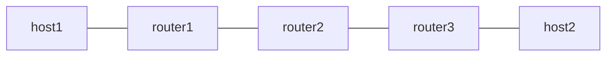

# uN (NEXT-C-SID) Example

RFC 9800 の NEXT-C-SID flavor による uN を検証します。F3216 の SID 構造を使い、locator block は 32 bit の fd00:aaaa、uSID は 16 bit です。router2 の uN が container の Argument を 16 bit 左詰めして転送する動作を、Linux kernel の seg6local next-csid flavor と Vinbero XDP の両方で実行し、同じトポロジで到達性を突き合わせます。パケット単位の bit 比較まではしていません。

## トポロジ



役割は次のとおりです。

- router1 は Linux の seg6 encap で forward 方向の container を付与し、return 方向の terminal SID fd00:aaaa:b001:d001::/128 を End.DX4 で受けます
- router2 は uN です。fd00:aaaa:b002::/48 の locator-prefix エントリで container を受け、Argument を shift して次の uSID へ転送します。Phase 1 は Linux native の next-csid flavor、Phase 2 は Vinbero の END_UN で同じ SID を提供します
- router3 は Linux の seg6 encap で return 方向の container を付与し、forward 方向の terminal SID fd00:aaaa:b003:d004::/128 を End.DX4 で受けます

container は forward が fd00:aaaa:b002:b003:d004::、return が fd00:aaaa:b002:b001:d001:: で、どちらの方向も router2 の uN shift を通ります。

## 必要条件

- Linux kernel 6.1 以上 (seg6local の next-csid flavor)
- iproute2 6.0 以上

## 実行方法

```bash
sudo ./setup.sh
sudo ./test.sh
sudo ./teardown.sh
```

## 検証内容

1. Linux native の next-csid flavor で host1 と host2 の双方向 ping が通ることを確認します
2. Linux native の local route を削除し、Vinbero を起動して同じ /48 に END_UN を登録し、双方向 ping が通ることを確認します

Phase 2 は neighbor table を flush してから traffic を流します。uN は FIB が NO_NEIGH を返したパケットを kernel に渡して neighbor を解決させるので、事前の NDP warm up なしで通信が立ち上がります。

## uN prefix の設計上の制約

設計の全体像は [uSID (NEXT-C-SID) の uN と uA](../../docs/design/ja/usid.md) にあります。

uN の trigger prefix は /48 の wildcard です。その prefix に入るアドレスは、uN SID 自身 (Argument が全ゼロのアドレス) を除いてすべて container とみなされ、upper-layer protocol に関係なく shift されて転送されます。したがって uN prefix は uSID 専用にする必要があります。classic SRv6 でよくある「locator の中にノードの loopback も採番する」構成にすると、そのアドレス宛の BGP や SSH が data path 側で書き換えられ、到達しなくなります。この example が underlay を fc00::/16、uSID block を fd00:aaaa/32 と分けているのはこのためです。

同じ理由から、uN SID そのもの (この example では fd00:aaaa:b002::) はノードのローカルアドレスとして設定してください。container が自ノードの uSID だけで終わる場合、shift 後の DA が uN SID になった状態で kernel に渡され、ローカル配送されます。設定していないと kernel は locator prefix の経路でルーティングを試みます。

## uA について

uA (End.X の NEXT-C-SID flavor) は `examples/end-ua/` で検証します。
