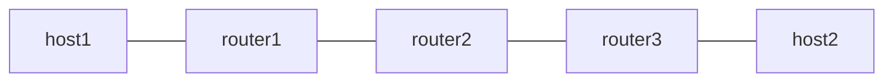

# end-un — uN (NEXT-C-SID)

*(日本語: [README.ja.md](./README.ja.md))*

Exercises uN, the NEXT-C-SID flavor of End (RFC 9800), with the F3216 SID
structure: a 32-bit locator block (fd00:aaaa) and 16-bit uSIDs. router2
shifts the container's Argument left by 16 bits and forwards on the updated
DA. The same SID is served first by the Linux kernel's seg6local next-csid
flavor and then by Vinbero XDP, so the two are compared on the same
topology. The comparison is reachability, not a bit-level packet diff.

See [`docs/design/ja/usid.md`](../../docs/design/ja/usid.md) for the design.

## Topology



- router1 pushes the forward container with Linux seg6 encap, and terminates
  the return direction on fd00:aaaa:b001:d001::/128 (End.DX4)
- router2 is the uN. The locator-prefix entry fd00:aaaa:b002::/48 receives
  the container, shifts the Argument and forwards to the next uSID. Phase 1
  serves that SID from Linux native next-csid, phase 2 from Vinbero END_UN
- router3 pushes the return container with Linux seg6 encap, and terminates
  the forward direction on fd00:aaaa:b003:d004::/128 (End.DX4)

The containers are fd00:aaaa:b002:b003:d004:: forward and
fd00:aaaa:b002:b001:d001:: return, so both directions cross router2's uN.

## Requirements

- Linux kernel 6.1 or later (seg6local next-csid flavor)
- iproute2 6.0 or later

## Usage

```bash
sudo ./setup.sh
sudo ./test.sh
sudo ./teardown.sh
```

## What is verified

1. Both directions ping through the Linux native next-csid flavor
2. The native local route is removed, Vinbero registers END_UN on the same
   /48, and both directions ping again

Phase 2 flushes the neighbor table before sending traffic. uN hands packets
whose FIB lookup answers NO_NEIGH to the kernel, which resolves the
neighbour, so the flow comes up without an NDP warm-up. A regression back to
dropping NO_NEIGH fails this test.

## Addressing constraint

A uN trigger prefix is a /48 wildcard. Every address inside it except the uN
SID itself (the one whose Argument is all zeros) carries a non-zero Argument
and is therefore treated as a container: it gets shifted and forwarded
whatever its upper-layer protocol. The prefix has to be dedicated to uSID.
Numbering a node loopback inside the locator -- the classic SRv6 habit --
makes BGP or SSH to that address unreachable, because the data path rewrites
it. That is why this example keeps the underlay on fc00::/16 and the uSID
block on fd00:aaaa/32.

For the same reason, configure the uN SID itself (fd00:aaaa:b002:: here) as
a local address on the node. When a container ends with this node's own
uSIDs, the shifted packet is handed to the kernel with the bare uN SID as
its DA for local delivery; without the address the kernel instead routes it
by the locator prefix.

## uA

uA, the NEXT-C-SID flavor of End.X, is covered by
[`examples/end-ua/`](../end-ua/).
