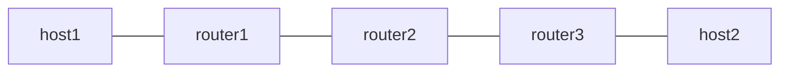

# uN (NEXT-C-SID) Example

RFC 9800 の NEXT-C-SID flavor による uN を検証します。F3216 の SID 構造を使い、locator block は 32 bit の fd00:aaaa、uSID は 16 bit です。router2 の uN が container の Argument を 16 bit 左詰めして転送する動作を、Linux kernel の seg6local next-csid flavor と Vinbero XDP の両方で実行し、同じトポロジで突き合わせます。

## トポロジ



役割は次のとおりです。

- router1 は Linux の seg6 encap で forward 方向の container を付与し、return 方向の terminal SID fd00:aaaa:b001:d001::/128 を End.DX4 で受けます
- router2 は uN です。fd00:aaaa:b002::/48 の locator-prefix エントリで container を受け、Argument を shift して次の uSID へ転送します。Phase 1 は Linux native の next-csid flavor、Phase 2 は Vinbero の END_UN で同じ SID を提供します
- router3 は Linux の seg6 encap で return 方向の container を付与し、forward 方向の terminal SID fd00:aaaa:b003:d004::/128 を End.DX4 で受けます

container は forward が fd00:aaaa:b002:b003:d004::、return が fd00:aaaa:b002:b001:d001:: で、どちらの方向も router2 の uN shift を通ります。

## 必要条件

- Linux kernel 6.1 以上 (seg6local の next-csid flavor)
- iproute2 6.0 以上

## 実行方法

```bash
sudo ./setup.sh
sudo ./test.sh
sudo ./teardown.sh
```

## 検証内容

1. Linux native の next-csid flavor で host1 と host2 の双方向 ping が通ることを確認します
2. Linux native の local route を削除し、Vinbero を起動して同じ /48 に END_UN を登録し、双方向 ping が通ることを確認します

Vinbero の uN shift 経路は neighbor 未解決の FIB 結果を fail-closed で drop するため、テストは事前に NDP を解決してから traffic を流します。
