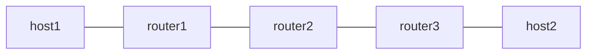

# end-ut — uT (NEXT-C-SID の End.T)

*(English: [README.md](./README.md))*

End.T の NEXT-C-SID flavor である uT (RFC 9800 Sec.4.1.3、F3216) を検証
します。shift は uN と同じ 16 bit で、shift 後の転送 lookup が default
FIB でなく SID に bind した VRF table で行われる点だけが異なります。

Linux oracle phase はありません。seg6local の next-csid flavor は End と
End.X だけにあり、uT に相当する native 実装が存在しないためです。代わり
に VRF binding を直接証明します。main table では shift 後の宛先を
blackhole しているので、ping が届くのは table 100 経由の場合だけです。

設計は [`docs/design/ja/usid.md`](../../docs/design/ja/usid.md) を参照して
ください。

## トポロジ



- router1 は H.Encaps.Red で forward container
  fd00:aaaa:b002:b003:d004:: を付与します。単一 container は SRH を出さ
  ないため、router2 の uT は SRH なしの dispatch 経路で動きます。返り方
  向は fc00:1::1 (End.DX4) で終端します
- router2 が uT です (Vinbero、fd00:aaaa:b002::/48、vrf100)。
  fd00:aaaa:b003::/48 への経路は table 100 にだけあり、main table は
  blackhole です
- router3 は forward 方向を fd00:aaaa:b003:d004::/128 (Linux End.DX4)
  で終端し、返り container を付与します

## 必要条件

- VRF をサポートする Linux kernel
- iproute2 6.0 以上 (encap.red)

## 使い方

```bash
sudo ./setup.sh
sudo ./test.sh
sudo ./teardown.sh
```

## 検証内容

1. SRH なしの container が router2 で shift され、table 100 経由で転送
   されます。main table の blackhole により、VRF table を引いたことが保
   証されます。素の uN の挙動 (default FIB) ならパケットは落ちます
2. 返り方向が native の baseline として動きます

uT は uN と違い NO_NEIGH で fail-closed です。VRF に属さない interface
に届いたパケットに対して kernel は VRF-scoped lookup を再現できないため
で、setup.sh と test.sh は通信前に NDP を事前解決します。
