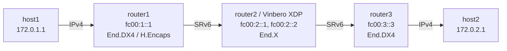

# SRv6 End.X Playground

*(English: [README.md](./README.md))*

Vinbero XDPによるSRv6 End.X (Endpoint with L3 cross-connect) のデモ環境です。

End.X はSRH処理 (DA更新とSL減算) のあと、通常のFIBルックアップではなく設定済みの明示的なnext-hopへ転送します。経路に依存しない固定next-hopのクロスコネクトを実現します。

## トポロジー



**パケットの流れ（host1→host2）:**
1. host1が172.0.2.1にpingを送信 (IPv4)
2. router1がLinux native H.Encapsを実行し、Segment List `[fc00:2::1, fc00:3::3]` でSRv6カプセル化
3. **router2 (Vinbero XDP)** がfc00:2::1でEnd.Xを実行:
   - SRH処理でDAをfc00:3::3に更新、SLを減算
   - FIBルックアップせず、設定済みnext-hop `fc00:23::1` (rt2-rt3リンク上のrouter3) へ転送
4. router3がfc00:3::3でEnd.DX4を実行し、内側IPv4パケットをhost2へ転送
5. 戻り方向は対称で、fc00:2::2のEnd.Xがnext-hop `fc00:12::1` (router1) へ転送

## クイックスタート

```bash
sudo ./setup.sh    # 環境構築
sudo ./test.sh     # テスト実行（Linux native → Vinbero XDP の2フェーズ）
sudo ./teardown.sh # クリーンアップ
```

`test.sh` はまずLinux native End.Xで疎通を確認し、native経路を削除してからVinbero XDPで再検証します。

## 手動実行

### 1. 環境構築とVinbero起動

```bash
sudo ./setup.sh

# router2のLinux native End.X経路を削除
sudo ip netns exec end-x-router2 ip -6 route del local fc00:2::1/128 2>/dev/null
sudo ip netns exec end-x-router2 ip -6 route del local fc00:2::2/128 2>/dev/null

# Vinbero起動（フォアグラウンドで動き続けるので & でバックグラウンド起動するか別ターミナルで）
sudo ip netns exec end-x-router2 ../../out/bin/vinberod -c vinbero_router2.yaml &
```

### 2. SidFunction (End.X) エントリ登録

`--nexthop` で転送先を明示します。

```bash
# Forward: fc00:2::1 -> nexthop fc00:23::1 (router3)
sudo ip netns exec end-x-router2 ../../out/bin/vinbero -s http://127.0.0.1:8082 \
  sid create --trigger-prefix fc00:2::1/128 --action END_X --nexthop fc00:23::1
# Return: fc00:2::2 -> nexthop fc00:12::1 (router1)
sudo ip netns exec end-x-router2 ../../out/bin/vinbero -s http://127.0.0.1:8082 \
  sid create --trigger-prefix fc00:2::2/128 --action END_X --nexthop fc00:12::1
```

### 3. テスト

```bash
sudo ip netns exec end-x-host1 ping -c 3 172.0.2.1
```

### 4. 環境のクリーンアップ

```bash
sudo ./teardown.sh
```
