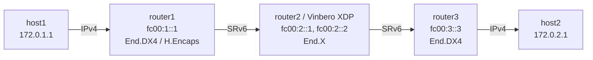

# SRv6 End.X Playground

*(日本語: [README.ja.md](./README.ja.md))*

Demo environment for SRv6 End.X (endpoint with L3 cross-connect) on Vinbero
XDP.

End.X does the usual SRH processing (update the DA, decrement SL) and then
forwards to a configured next hop instead of consulting the FIB, which gives
a fixed cross-connect that does not depend on routing.

## Topology



**Packet walk (host1 to host2):**
1. host1 pings 172.0.2.1 over IPv4
2. router1 runs Linux native H.Encaps with the segment list `[fc00:2::1, fc00:3::3]`
3. **router2 (Vinbero XDP)** runs End.X on fc00:2::1:
   - SRH processing updates the DA to fc00:3::3 and decrements SL
   - no FIB lookup: the packet goes to the configured next hop `fc00:23::1`
     (router3 on the rt2-rt3 link)
4. router3 runs End.DX4 on fc00:3::3 and forwards the inner IPv4 packet to host2
5. The return direction is symmetric: End.X on fc00:2::2 forwards to next hop
   `fc00:12::1` (router1)

## Quick start

```bash
sudo ./setup.sh    # build the environment
sudo ./test.sh     # run the tests (Linux native, then Vinbero XDP)
sudo ./teardown.sh # clean up
```

`test.sh` first checks connectivity through Linux native End.X, then removes
the native routes and repeats the check against Vinbero XDP.

## Running it by hand

### 1. Build the environment and start Vinbero

```bash
sudo ./setup.sh

# Remove the Linux native End.X routes on router2
sudo ip netns exec end-x-router2 ip -6 route del local fc00:2::1/128 2>/dev/null
sudo ip netns exec end-x-router2 ip -6 route del local fc00:2::2/128 2>/dev/null

# vinberod stays in the foreground, so background it or use another terminal
sudo ip netns exec end-x-router2 ../../out/bin/vinberod -c vinbero_router2.yaml &
```

### 2. Register the SidFunction (End.X) entries

`--nexthop` names the forwarding target.

```bash
# Forward: fc00:2::1 -> nexthop fc00:23::1 (router3)
sudo ip netns exec end-x-router2 ../../out/bin/vinbero -s http://127.0.0.1:8082 \
  sid create --trigger-prefix fc00:2::1/128 --action END_X --nexthop fc00:23::1
# Return: fc00:2::2 -> nexthop fc00:12::1 (router1)
sudo ip netns exec end-x-router2 ../../out/bin/vinbero -s http://127.0.0.1:8082 \
  sid create --trigger-prefix fc00:2::2/128 --action END_X --nexthop fc00:12::1
```

### 3. Test

```bash
sudo ip netns exec end-x-host1 ping -c 3 172.0.2.1
```

### 4. Clean up

```bash
sudo ./teardown.sh
```
