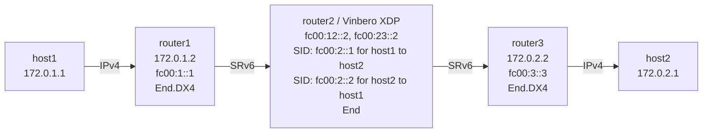

# SRv6 End Playground

*(日本語: [README.ja.md](./README.ja.md))*

Demo environment for the SRv6 End behavior on Vinbero XDP.

## Topology



**Packet walk (host1 to host2):**
1. host1 pings 172.0.2.1
2. router1 encapsulates with SRv6 (T.Encaps) and a segment list of [fc00:2::1, fc00:3::3]
3. **router2 (Vinbero XDP)** runs End on fc00:2::1: decrement SL, move to the next segment
4. router3 runs End.DX4 on fc00:3::3 and restores the IPv4 packet
5. host2 receives the ping

## Quick start

```bash
sudo ./setup.sh    # build the environment
sudo ./test.sh     # run the tests
sudo ./teardown.sh # clean up
```

## Running it by hand

setup.sh prefixes namespaces and veths with `end-` (namespace `end-router2`,
veth `end-rt3rt2`, and so on). Adjust the prefix if you override
TOPO_NS_PREFIX.

### 1. Build the environment and start Vinbero

```bash
sudo ./setup.sh

# Remove the Linux native SRv6 routes on router2
sudo ip netns exec end-router2 ip -6 route del local fc00:2::1/128 2>/dev/null
sudo ip netns exec end-router2 ip -6 route del local fc00:2::2/128 2>/dev/null

# Start Vinbero in the background
sudo ip netns exec end-router2 ../../out/bin/vinberod -c vinbero_router2.yaml &
```

### 2. Register the SIDs

```bash
sudo ip netns exec end-router2 ../../out/bin/vinbero -s http://127.0.0.1:8082 sid create --trigger-prefix fc00:2::1/128 --action END
sudo ip netns exec end-router2 ../../out/bin/vinbero -s http://127.0.0.1:8082 sid create --trigger-prefix fc00:2::2/128 --action END
```

### 3. Test

```bash
sudo ip netns exec end-host1 ping -c 3 172.0.2.1
sudo ip netns exec end-host2 ping -c 3 172.0.1.1
```

#### Packet capture

```bash
sudo ip netns exec end-router3 tcpdump -i end-rt3rt2 -n ip6
```

The SRv6 Routing Header (RT6) shows segleft going 1 to 0 and the DA going
fc00:2::1 to fc00:3::3.

### 4. Clean up

```bash
sudo ./teardown.sh
```
