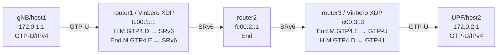

# SRv6 GTP-U/IPv4 (H.M.GTP4.D + End.M.GTP4.E)

RFC 9433に基づくGTP-U/IPv4とSRv6の双方向変換のデモ環境です。

## トポロジー



**パケットの流れ（gNB→UPF）:**
1. gNBがGTP-U/IPv4パケットを送信 (TEID, QFI付き)
2. **router1 (H.M.GTP4.D)**: GTP-Uを剥離、SRv6でカプセル化。Args.Mob.Session (IPv4Dst, TEID, QFI) をSIDにエンコード
3. router2 (End): SRv6 transit (SL--, DA更新)
4. **router3 (End.M.GTP4.E)**: SRv6を剥離、SIDからTEID/QFIをデコード、GTP-U/IPv4で再カプセル化
5. UPFがGTP-U/IPv4パケットを受信

## クイックスタート

```bash
pip3 install scapy  # GTP-Uパケット生成に必要
sudo ./setup.sh     # 環境構築
sudo ./test.sh      # テスト実行 (scapyでGTP-Uパケットを送信)
sudo ./teardown.sh  # クリーンアップ
```

### 手動でGTP-Uパケットを送信

```bash
# QFI=9 (5G) のGTP-Uパケットを送信
sudo ip netns exec gtp4-host1 python3 send_gtpu.py --teid 0x12345678 --qfi 9

# QFI=0 (4G/LTE, 拡張ヘッダなし) のGTP-Uパケットを送信
sudo ip netns exec gtp4-host1 python3 send_gtpu.py --teid 0xCAFEBABE --qfi 0

# router2でSRv6パケットをキャプチャ
sudo ip netns exec gtp4-router2 tcpdump -i gtp4-rt2rt1 -n ip6
```

## 手動実行

### 1. 環境構築とVinbero起動

```bash
sudo ./setup.sh

# router1でVinbero起動
sudo ip netns exec gtp4-router1 ../../out/bin/vinberod -c vinbero_router1.yaml &

# router3でVinbero起動
sudo ip netns exec gtp4-router3 ../../out/bin/vinberod -c vinbero_router3.yaml &
```

### 2. エントリ登録

```bash
# Forward: gNB -> SRv6 (router1: H.M.GTP4.D)
sudo ip netns exec gtp4-router1 ../../out/bin/vinbero -s http://127.0.0.1:8082 \
  hv4 create --trigger-prefix 172.0.2.0/24 --src-addr fc00:1::1 \
  --segments fc00:2::1,fc00:3::3 --mode H_M_GTP4_D --args-offset 7

# Forward: SRv6 -> UPF (router3: End.M.GTP4.E)
sudo ip netns exec gtp4-router3 ../../out/bin/vinbero -s http://127.0.0.1:8083 \
  sid create --trigger-prefix fc00:3::3/128 --action END_M_GTP4_E \
  --gtp-v4-src-addr 172.0.2.2 --args-offset 7
```

### 3. Args.Mob.Session

SID内のオフセット7からArgs.Mob.Sessionがエンコードされます:

```
SID (128 bit): [LOC:FUNCT (56 bit)][IPv4DstAddr (32 bit)][TEID (32 bit)][QFI(6)|R(1)|U(1)]
                byte 0-6              byte 7-10             byte 11-14     byte 15
```

各エントリの `--args-offset` でオフセットを指定します。
