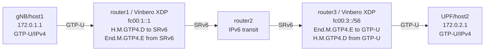

# GTP-U/IPv4 and SRv6 conversion

*(日本語: [README.ja.md](./README.ja.md))*

Demo environment for the bidirectional conversion between GTP-U/IPv4 and
SRv6 per RFC 9433.

## Topology


```mermaid
graph LR
    gNB[gNB/host1<br/>172.0.1.1<br/>GTP-U/IPv4] -->|GTP-U| router1[router1 / Vinbero XDP<br/>fc00:1::1<br/>H.M.GTP4.D to SRv6<br/>End.M.GTP4.E from SRv6]
    router1 -->|SRv6| router2[router2<br/>IPv6 transit]
    router2 -->|SRv6| router3[router3 / Vinbero XDP<br/>fc00:3::/56<br/>End.M.GTP4.E to GTP-U<br/>H.M.GTP4.D from GTP-U]
    router3 -->|GTP-U| UPF[UPF/host2<br/>172.0.2.1<br/>GTP-U/IPv4]
```

**Packet walk (gNB to UPF):**
1. gNB sends a GTP-U/IPv4 packet carrying a TEID and QFI
2. **router1 (H.M.GTP4.D)** strips GTP-U and encapsulates in SRv6, encoding
   Args.Mob.Session (IPv4Dst, TEID, QFI) into the End.M.GTP4.E SID as a single
   segment
3. router2 transits it as plain IPv6 (no localsid, and no End hop because
   there is only one segment)
4. **router3 (End.M.GTP4.E)** strips SRv6, decodes TEID and QFI from the SID,
   and re-encapsulates as GTP-U/IPv4
5. UPF receives the GTP-U/IPv4 packet

## Quick start

```bash
pip3 install scapy  # needed to build the GTP-U packets
sudo ./setup.sh     # build the environment
sudo ./test.sh      # run the tests (sends GTP-U packets with scapy)
sudo ./teardown.sh  # clean up
```

### Sending GTP-U packets by hand

```bash
# GTP-U packet with QFI=9 (5G)
sudo ip netns exec gtp4-host1 python3 send_gtpu.py --teid 0x12345678 --qfi 9

# GTP-U packet with QFI=0 (4G/LTE, no extension header)
sudo ip netns exec gtp4-host1 python3 send_gtpu.py --teid 0xCAFEBABE --qfi 0

# Capture the SRv6 packets on router2
sudo ip netns exec gtp4-router2 tcpdump -i gtp4-rt2rt1 -n ip6
```

## Running it by hand

### 1. Build the environment and start Vinbero

```bash
sudo ./setup.sh

# Start Vinbero on router1
sudo ip netns exec gtp4-router1 ../../out/bin/vinberod -c vinbero_router1.yaml &

# Start Vinbero on router3
sudo ip netns exec gtp4-router3 ../../out/bin/vinberod -c vinbero_router3.yaml &
```

### 2. Register the entries

router2 is a plain IPv6 transit, so the headend encapsulates directly to the
End.M.GTP4.E SID with a single segment. End.M.GTP4.E uses args-offset 7, which
puts Args.Mob.Session in bytes 7-15 of the SID, so it is registered as a `/56`
locator rather than a `/128`.

```bash
# Forward: gNB -> SRv6 (router1: H.M.GTP4.D)
sudo ip netns exec gtp4-router1 ../../out/bin/vinbero -s http://127.0.0.1:8082 \
  hv4 create --trigger-prefix 172.0.2.0/24 --src-addr fc00:1::1 \
  --segments fc00:3::3 --mode H_M_GTP4_D --args-offset 7

# Forward: SRv6 -> UPF (router3: End.M.GTP4.E)
sudo ip netns exec gtp4-router3 ../../out/bin/vinbero -s http://127.0.0.1:8083 \
  sid create --trigger-prefix fc00:3::/56 --action END_M_GTP4_E \
  --gtp-v4-src-addr 172.0.2.2 --args-offset 7

# Return: UPF -> SRv6 (router3: H.M.GTP4.D)
sudo ip netns exec gtp4-router3 ../../out/bin/vinbero -s http://127.0.0.1:8083 \
  hv4 create --trigger-prefix 172.0.1.0/24 --src-addr fc00:3::3 \
  --segments fc00:1::1 --mode H_M_GTP4_D --args-offset 7

# Return: SRv6 -> gNB (router1: End.M.GTP4.E)
sudo ip netns exec gtp4-router1 ../../out/bin/vinbero -s http://127.0.0.1:8082 \
  sid create --trigger-prefix fc00:1::/56 --action END_M_GTP4_E \
  --gtp-v4-src-addr 172.0.1.2 --args-offset 7
```

### 3. Args.Mob.Session

Args.Mob.Session is encoded from offset 7 of the SID:

```
SID (128 bit): [LOC:FUNCT (56 bit)][IPv4DstAddr (32 bit)][TEID (32 bit)][QFI(6)|R(1)|U(1)]
                byte 0-6              byte 7-10             byte 11-14     byte 15
```

Each entry sets the offset with `--args-offset`.
