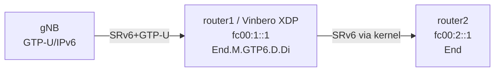

# SRv6 GTP-U/IPv6 Drop-In (End.M.GTP6.D.Di)

RFC 9433のDrop-Inモード: 既存のGTP-Uインフラに最小限の変更でSRv6を導入するデモ環境です。

## 概要

Drop-Inモードでは:
- SLの減算やDAの更新は**行わない**
- SRHのnexthdrを内部プロトコルに更新するのみ
- カーネルのSRv6スタックに処理を委譲

これにより、既存のGTP-U転送インフラをほぼそのまま維持しつつ、SRv6ドメインとの統合が可能になります。

## トポロジー



## クイックスタート

```bash
sudo ./setup.sh
sudo ./test.sh
sudo ./teardown.sh
```

## 動作

1. パケット受信: `[IPv6][SRH(nexthdr=UDP)][UDP:2152][GTP-U][Inner IP]`
2. Vinbero XDP: SRH nexthdr を内部プロトコル (IPv4/IPv6) に更新
3. `XDP_PASS` でカーネルに委譲
4. カーネルSRv6スタックが更新済みSRHで転送
